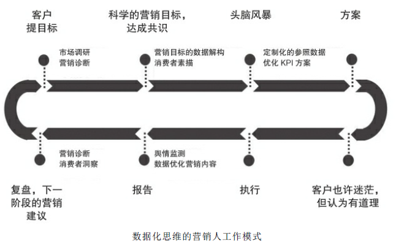
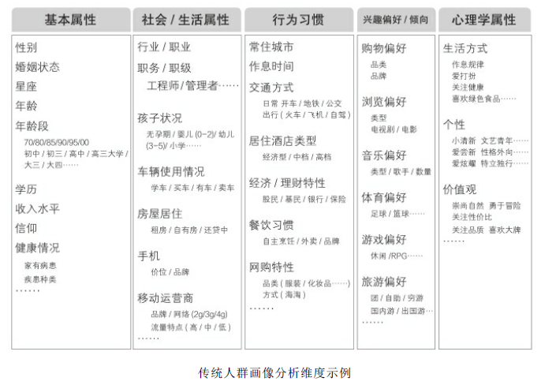
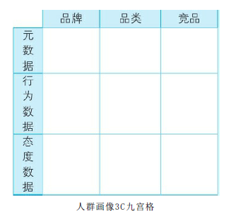
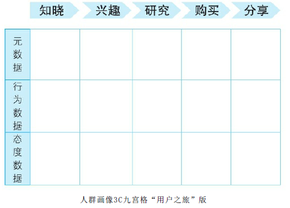
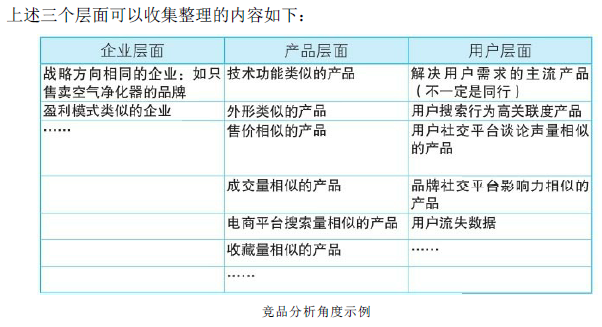
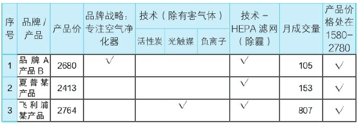
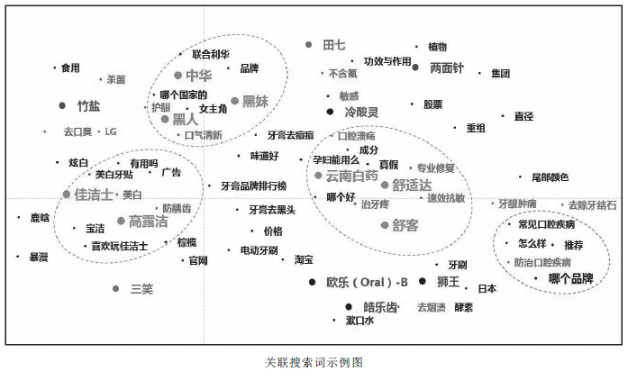

= (奥美)数据分析
:toc:

---

== 企业的商业目标

企业在不同的发展时期，会有不同的营销目标。有时，扩大销量是当下重要的任务; 但有时, 在市场上占位或构建行业影响力才是首要目标。

5C理论，是专门用来帮助企业探寻商业企图/目标的.

红星分为五个分析角度，分别是：

[cols="1,4a"]
|===
|Header 1 |Header 2

|1.企业/产品（Company）
|- 企业的商业模式 : 对比不同商业模式背后的数据趋势，来判断机会成本
- 产品的特点，优势、劣势 (通过针对目标人群的大样本随机抽样对照调研)
- 分析企业目前需要解决的核心问题. （而非领导的愿望）

|2.品类（Category）
|- 品类的发展状况 -- 成长/成熟/衰退
- 品类的商业价值 (从销售数据, 和消费者态度数据中能反映出来)

|3.竞争（Competition）
|- 竞品的圈定：企业方认定的同行企业;
站在消费者立场, 来寻找那些很容易被忽略的“跨界”竞争对手
- 竞品的营销分析：竞品都做了哪些营销活动; 用户和媒体的态度等。
- 找到可以与竞品争夺的差异化优势

|4.渠道（Channels）
|- 分析品牌或产品在通向消费者的过程中，通路的情况及变化 +
- 用户的主流触达渠道：

|5.消费者（Consumer）
|- 无论是目标消费者分析、现有用户/竞品用户分析还是潜在用户分析. (通过各种平台数据, 加传统调研的手段，精准地对人群做出画像。)
- 分析目标消费人群的需求和购买决策, 及发生了哪些新变化。
- 找到自身需求和消费者需求的交集

|===

---

== 传统营销方法的缺点 : 拿不到数据, 无数据的即时反馈, 就无从改进与提升能力.

[cols="1,3a"]
|===
|Header 1 |Header 2

|策略提出阶段: 缺乏数据分析
|
比稿时提出的营销策略/方向的制定(营销方向, 选择人群, 渠道, 营销的内容)，很少有数据分析的身影存在。 +
从战略到战术的推导, 存在标准和因果不清晰的情况.

|执行行动阶段: 双盲
|- "投放媒体"的选择 : 媒体影响力的真实程度, 很难知晓.
- "活动执行阶段" : 目标消费者的抵达数量, 消费者的感受如何, 内心态度是否有变化, 皆无法知晓.
- 没有清晰客观的数据评估的标准（KPI），对营销的效果是否实现了营销目标, 缺乏科学的判断工具和方法.

|事后
|重要的营销数据, 无法被有效评估, 以指导之后的策略执行。

|===

---

== 营销策略失败的原因

==== 1. 盲从老板.  而甲方下达的营销目标是错的.

老板们下达的营销目标其实经常不对。

心理学中有一副图片 <一只青蛙和一匹马>。图片到底画了什么？站在甲方老板的角度看到的那只“青蛙”; 而在消费者眼中看，也许根本不是青蛙，而是“马”。

为什么很多甲方老板觉得“完美”的推广计划，消费者却根本不买账呢？因为后者其实看不到甲方想表达的内容，只能站在自己的角度理解，而理解的结果往往是——并不觉得你说的内容有吸引力。

**因此，买卖双方视角的"交集部分"(C=A∩B)才是大家都有兴趣的. **虽然站在交集C的视角下，照片究竟在说什么，答案可能既不是青蛙也不是马，但这**个答案却能够保证双赢。**

在营销问题上，满足客户的一切要求，并不是专业分析师的表现。

客户无法明确正确的营销目标/问题是正常的，所以帮助其明确是我们的责任。

对于分析, 不要先入为主地预设答案. 坦然积极地面对“出错”。如果对待数据的态度主观武断，个人的时间精力，其实都花在了没有意义的分析上。个人也不会成长。

---

==== 2. 瞄错目标人群

更多的情况是，企业的目标受众人群是“小”. "精准"比"覆盖面广"更重要。

很多人之所以认为“目标人群”越多越好，是这么想的：目标人口数量越多，可以“买我东西”的人就越多。但这种推论遗漏了一个逻辑：虽然买东西的人数上升了，但每个人可以买的商品种类, 上升得更快。

[cols="1,5a"]
|===
|圈子越小的有利点 |Header 2

|营销费用浪费得越少.
|- 如果针对全国人做推广，营销费用再多，花起来也如同在一片汪洋大海中撒了一把“鱼食”。一把鱼食怎么可能捕获整个大海的鱼群呢？

- 对于新品牌来说更是如此。人们面对新品牌, 新产品, 会先观望一阵子。如果想反复影响他们，以便提升好感，企业却发现自己已经没有钱了。因为一开始盘子铺得太大，导致营销费用后继无力。

- 如果只针对一个特定的人群做定向推广。人数虽少，但同样的钱却可以反复影响他们。推广费的"投入产出"的有效性更高。

|更容易量身定做
|在当前这个追求个性和差异化的时代，“每一个人都适用的产品”的命运，往往是“每一个人都不想用”，因为觉得与己无关。只有那些“专门为某一类人设计的产品”，才会产生归属感和忠诚度。

|更容易精准来找营销渠道
|如果企业的目标消费人群是全部国人，要如何选择传播渠道呢？相当广泛! 但企业的营销费用是有限的.
|===

---

==== 3. “没有”竞品

竞品分析的目的，是为了找到最“正确”的方法, 去同最“正确”的竞争对手, 争抢目标消费人群。(先在茫茫人海中, 找对敌人, 再来打击敌人)

---

== 营销人不应对销售结果负责. 目标是通过数据分析来帮助企业提高营销效率

既然营销的终极指向都是为了销售，为何这么多年来，公关人却从不用为销售负责呢？

因为:

[cols="1,5a"]
|===
|原因 |Header 2

|购买流程的规律上
|品牌的建立实在是一个太漫长的过程。而在影响力和销量之间，并非一个简单粗暴的因果关系，尤其对于耐用消费品(购买次数少，消费者决策慎重。如家具、汽车等) 来说更是如此。

**消费者购买某产品, 必定要通过"用户之旅"的全过程.  好的推广只是条件之一，并且它只位于决策链的最前端。因此，让负责最前端内容推广的公关人, 直接承诺最后一个环节的销售，这是不公平的**, 并强人所难.

|甲方原因
|如果营销人应该对最终的销量负责，那么需要一个前提条件 —— 大权独揽. 即, “决定最终销量”的所有重要环节, 都应该由营销人负责。很明显, 营销人手里拿不到这个权力. 甲方也不会给. 否则让产品设计团队情何以堪，让销售渠道团队情何以堪，让甲方的市场及公关团队情何以堪？这些团队做的事, 同样能影响最终销量。

|消费者一方原因
|有时消费者不购买产品, 并不是推广的问题，而是其他原因: 比如, 支付系统出错不成功; 缺货等.
|===

*让生态链中的一分子(营销人)为全部结果(最终销售额)买单，合理吗?!*

---

==  ---------- ----------

---

== 大数据

Big Data is like Teenage Sex： +
Everyone talks about it， +
Nobody really knows how to do it， +
Everyone thinks everyone else is doing it， +
So everyone claims they are doing it...

大数据就像十几岁少年眼中的性行为， +
每个人都在谈论它，但没人真正知道怎么做。 +
每个人都以为除了自己之外每个人都在使用它， +
所以每个人都装作自己很了解它……

---

==== 大数据 / 缺点

- 能帮助制作方了解用户的过往内容偏好。*但是用户曾经喜欢, 不代表未来也会喜欢*, 人们未来的口味太难预估。

- *数据无法完全代替创意.* 一部电视剧的走红，关乎导演、演员，有创意有深度的故事, 与讲述故事的手法，但市场本身充满了偶然性，并非数据能够算出。

- **数据是死的，通过数据得出什么洞见要靠人。**同样的数据，不同的人可能会得出完全不同的结论。数据背后的价值能否被挖掘，以及能挖掘出多少，有很大的不确定性。

- 大数据**非常不擅长还原用户的态度**. 只能通过问卷调查来直接询问用户的态度.
.. 假设目标人群是在A台看到推广信息后，跳转至B平台下单. 用户的内心发生了怎样的转变？背后的购买选择是如何下的？流失的人为什么流失？两个平台的用户，之间有什么不同…… 很多对营销效果重要的信息, 依然不得而知。
.. 有几乎半数的答题者并没有选择我们提供的选项，而是手动填写了一个原因：专车不能开发票.

因此, 大数据和传统的问卷调研, 不是替代关系，而是相互补充关系。

---

==== “开始”or“做好”，哪个更重要?

1.不用完全准备好，先开始

**由于营销环境一直在持续不停地向前发展变化, 因此想要"理论做到完美才能开始实操”是非常不现实的事，因为环境总在变。**不管三七二十一先开始做，然后不断地通过效果反馈, 来优化数据营销的理论和算法，追求向最优无限趋近，才是最有效的做法。

2.小发现也有价值

奥美公关数据部刚刚成立的时候，说是一个部门，其实只有我一个人。我开始整理和分析市面上的热门营销事件，然后做成研究报告. 现在再回顾几年前做的报告，会觉得分析得太浅，使用的分析工具和算法也太过初级。
但在大的洞见产生之前，必然要先经历很多很多个小的洞见。况且，小洞见也有价值。

社交平台的日常运维是一件慢工出细活的工程，效果的发生都不会是一蹴而就的。每周的报告虽然做得很大部头，但提出的建议通常都非常的“鸡零狗碎”。

---

== 数据时代的营销方式

Holmes Report 2016年全球传播报告 : 在营销领域的四大技能是 : 1.策略,  2.数据分析, 3.沟通, 4.文案。

用户之旅的各个环节中, 越来越多的数据可以被获取和分析。

[cols="1,2a"]
|===
|Header 1 |Header 2

|确定营销方向阶段
|- 营销人将客户的商业目标, “翻译”成更科学的营销目标，双方达成共识.
- 将营销目标, 进行数据解构, 将营销目标拆解为可被有效评估的数据维度。 (变成 KPI 参数)
- 进行目标消费人群的调研，圈定合理的消费人群, 并进行数据画像.
- 再制订营销计划

|制订营销策略阶段
|- 为了事后能有对比判断和评估, 要收集和整理定制化的参照数据. 参照数据是指相关的行业数据、营销平台数据, 及竞争对手的数据，以避免未来企业只能自己同自己的数据作比较，而无法获知在行业中的地位变化。
- 如果不存在行业通用评估标准, 就自己跟自己比, 跟对手比.
- 根据参照参数, 来优化KPI

|营销执行阶段
|- 数据监测 : 品牌数据、产品数据、活动数据、舆情数据.
- 观察数据在“用户之旅”过程中是如何流动的，并针对表现不佳的数据深入挖掘背后的原因。
- 通过实时数据的反馈，对效果不佳的投放行为进行止损，对下一阶段的营销内容、推广方式等, 给出优化建议，甚至对整体的投放人群、投放平台、投放节奏, 和营销费用的分配等, 进行合理的优化，甚至是营销计划, 以提高营销效率。整个模式会成为一个闭环.

|事后复盘
|- KPI评估结果
- 营销推广过程中发现的问题和建议
- 为下一个阶段的营销方向, 提出准确的建议。
- 随着数据的不断累积和优化，营销人将越来越熟悉这个品牌/产品，不再是一个单纯的执行方，而逐渐变成了甲方的合作伙伴。

|===

---

==== 如何找到正确的 KPI (关键业绩指标)? -> 营销目标的数据解构

目标的达成, 由达成"关键业绩指标"来证明。KPI必须事先同客户达成共识.

案例 : 营销目标: 提升“ZTV”在粉丝中的公信力。

[cols ="1,4a"]
|===
|步骤 |Header 2

|确定定义
|- 什么叫公信力？
- “ZTV”客户自己希望展现的公信力是什么样子的？

|分解
|- 在哪个平台上来测量? 在该平台上(比如微博)的高公信力，呈现怎样的特点？
- 每个社交平台都有个性化特点，这意味着它们也有各自个性化的数据。
- 哪些数据指标是可以被量化评估的?
- 哪些KPI指标是无法被评估, 但却可以被有效跟踪的？

|
|高公信力，比如可以拆解为：

1. 内容本身 +
- 内容曝光量
- 转发数量
- 转发层级
- 内容在平台上的生存时长
- 对内容中的价值观, 网民的支持态度
2. 粉丝面 +
- 新增粉丝的质量
- 粉丝中是业内著名的高公信力账号的, 有多少?
- 调研粉丝心中最有公信力的微博账号，账号的无提示提及率
3. 圈层影响力 +
- 账号与多少业内高公信力账号彼此关注, 并且经常互动.
- 账号参与了多少社会热点话题的讨论，输出了观点，并被认可.
- 有多少社会热点话题是由“ZTV”率先引发的.

|===

---

==== 错误的参照物

在美国和西班牙交战期间，美国海军的征兵广告是 : 美国海军的死亡率是9‰，而同时期纽约居民的死亡率是16‰，因此“来参军吧，参军更安全！"

显然, 这是错误的对比. 9‰和16‰这两个数据并不存
在可对比性：当兵人都是年轻小伙，死亡形式一般只是战死。纽约居民却是各个年龄层和身份的人都有, 死亡原因也多种多样(疾病, 非命, 自杀, 寿终等)

所有, 寻找参照物进行对比, 必须遵守条件:

[cols="1,4a"]
|===
|Header 1 |Header 2

|人群样本的组成一致
|- 针对小学生的调研数据, 就不能同针对年轻白领的数据来对比；
- 某品牌19-24岁的用户数据, 就不能同竞品的16-22岁用户数据相比。

|数据来源一致
|- 微博平台的数据趋势, 不能跟百度平台的趋势对比

|时间区间一致
|- 某品牌的"年度"曝光量, 不能同竞品的"季度"曝光量对比

|计算方法一致
|- 某品牌500万预算下的活动曝光，不能同竞品3000万预算下的活动曝光对比；
- 某品牌的活动页面的PV（Page View 页面浏览量或点击量. 用户每1次对网站中的每个网页访问均被记录1次。用户对同一页面的多次访问，访问量累计）, 不能同竞品活动页面的UV（Unique visitor 独立访客, 即访问您网站的一台电脑客户端为一个访客）对比
|===

---

==== 常用的"参照物选择"类型

[cols="2a,3a"]
|===
|参照物 |Header 2

|- 企业历史数据
|

|- 核心竞品数据
|

|- 同一推广平台上、同一类型内容的某个数据指标的"均数"
|如, 某企业在豆瓣上做同城活动，可以以同行业其他品牌, 在豆瓣上做同城活动的相关数据的"均数", 作为参照物.

|- 基于同一个活动的相关品牌数据
|如, 在同一个赞助项目中，将其他同级别赞助品牌的相关数据, 作为参照物。

|===

---

==== 对KPI的理解误区

[cols ="1,3a"]
|===
|误区 |真相

|误区: 所有的营销目标都应该是可被准确测量和指标化的。并且，KPI是非常具体的数字，如35%，而不能是“10%～30%”。
|- 一个新领域在诞生伊始，是没有参照标准的。只有前人做过，后人才能根据前人的历史数据找到相对标准。
.. 某一些商业目标，在项目开始时，是难以制定一个准确的数据目标的。例如, 当一个新行业刚开始出现时，企业的商业目标是“教育市场，令大家接受这个新事物，并使用我的产品/服务”。但是，这样的一个目标，要做到怎样的数据才算实现了呢？是10%的中国人听说过这个品类？还是10万人使用了我的产品/服务？
.. 电动汽车刚刚问世的时候，特斯拉要怎么设定KPI？这个市场的教育周期、环境的成熟程度、价格的接受度、用户的心理变化……太多的变量，没人可以做出一个精确的评估标准。更不要提参照物的问题了。

- 就算不是新兴领域，很多指标也无法提前预设。
.. 提升粉丝好感度。但是好感度要提升百分之几才算合格？

因此, 有时将KPI的数字设为一个区间, 而不是一个具体的数字，反而更加科学。

|误区：KPI设定好后就不能变。 +
并认为, 如果不这样做,  岂不是只要营销做得不好，改改KPI就完了吗？
|- 正是因为KPI只不过是提前"主观预设"的目标，因此在之后的真正执行过程中，常常需要逐步调整方向的。(摸着石头过河, 根据问题反馈来调整路线)
- 粉丝好感度的提高, 还表现在了其他的行动上。这种情况，在面对新市场、新平台、新项目、新目标的时候会更加频繁地出现。

|误区：认为只要设定的KPI达到了，任务就完成了，营销工作就做好了。
| - 陷入“为了数据而数据” 中，反而忘了初心应该是实现营销的目标。
- 为了达成曝光的KPI，账号每天发布了30条内容。曝光总量是上去了，但其实内容和口碑却越做越差了。

|===

---

== 营销中"有价值的数据"的分类

分为三类：商业数据、广告数据、舆情数据。

[cols="1,3a"]
|===
|Header 1 |Header 2

|商业数据 (由企业直接触发)
|所有同销售相关的数据.

- 官网, 天猫店等的销售数据, 购买人群数据
- 行业、竞品的相关销售数据, 及购买人群数据。

|广告数据 (由企业直接触发)
|- 所有软硬广告的数据，如电商平台内部广告、搜索引擎广告、传统媒体广告、自媒体广告、线下媒体广告等.
- 相应投放人群的数据

|舆情数据 / 消费者的反馈 (由营销行为间接触发)
|- 产生&促发"传播行为"的数据.
- 相关社会热点数据
- 各平台上的声量数据. 讨论人群的数据。
|===

事实上, 日常接触最多的数据, 既不是大数据, 也不是调研数据，而只是一些碎片化的数据，它们最多也只能称为“大量的数据”。其中还有很多假数据(数据造假).

---

== 作分析报告

- 要清楚你做这个报告的目的是什么. 为什么要汇报这个，目的是什么？想得到什么样的资源支持？是为了展示阶段性的工作成果，还是为了讨论具体问题？

- 报告必须有有价值的见解产生。

- 如果只凭本能和天分随意说话，是很难避免逻辑错误的。有价值的观点背后一定经过大量的、系统的信息处理，单纯的简单信息罗列, 不可能成就一名优秀的演讲者。

---

==  ---------- ----------

---

== 得出人群画像

==== 无效的"人群画像"描述

1.拍脑门型

这种画像主要出自企业负责人基于自身产品特点和市场状况的“直觉判断”。
特点是：简单粗暴，一行说完。 +
如, 男性，中国一线城市，20—25岁，月收入2000—5000元。

2.类型二：人物传记型

通常操作方法是这样的：找十几个到几十个典型目标用户，一对一的做采访，详细了解对方的年龄、性别、爱好等等信息，然后从这些人中，找出几个典型中的典型，详细地对他们的生活做一个白描。

3.类型三：“事无巨细”型

花重金请教第三方的专业人士，先尽量全面地收集数据信息，并分了很多维度.

最后做出的人群画像报告甚至超过了100页PPT。所以叫“事无巨细”型。但是，
面对这样复杂的一个报告，企业依然会一筹莫展：然后呢？我应该怎么做？

"人群画像"的目的, 必须为品牌找到正确的目标人群，并了解正确影响人群的方式方法。

---

==== "人群画像"数据的类型

[cols="1,4a"]
|===
|Header 1 |Header 2

|元数据（属性数据）
| - 是指可以定义人群数据的数据.
- 比如：性别、年龄、地域分布、婚姻状况、学历、所在行业、职业角色、职位层级、收入水平、住房情况、购车情况等。
- 元数据的特点是：稳定度强，不改变或改变缓慢

|行为数据
|- 指特定人群可被记录的"行为痕迹"数据.
- 比如：媒体接触行为、页面停留时间、社交行为、打车行为、购买行为、收藏行为、社交账号关注行为、APP下载行为、健身频次、用餐行为、作息状况、观影行为、特定行为的完成度、特定行为的频次等。

|态度数据
|- 指特定人群对特定现象或品牌的态度、人群自身的消费态度、价值观、人生观、事业观等数据.
- 比如购买动机、商品满意度、品牌识别度、品牌忠诚度、口味偏好、交友观念、压力状况、话题偏好、兴趣爱好、消费观念、价值观、事业观、世界观等。
- "态度数据"能帮助营销人更好地理解"行为数据"背后的产生心理原因。
- 态度和行为常常不会同时发生，而是有一个不可控的延时。
- *众多效果不好的“人群画像”，背后有着一个普遍的共性 -- 对“态度数据”的重视不够。* 态度数据常常被混乱地摆放在很多不同的数据分类中，没有被区别对待和重点分析。但事实上，态度数据才是帮助营销人做判断的重要数据。

|===

---

==== 从 品牌, 品类, 竞品(即范围从大到小的)三个维度, 来查看它们各自的"用户画像"

[cols="1,5a"]
|===
|Header 1 |用户画像

|品牌
|

|品类
|

|竞品
|- 没有使用我产品的人们在用谁的产品？
- 竞品的用户是什么样的？
- 为什么选择这个产品而不是我的产品？
- 对比"品牌用户"及"竞品用户"的态度数据，探寻中间的差别和背后的原因。更重要的是，找寻如何能将竞品用户, 转化为自己品牌用户的机会点。
|===

---

==== “用户之旅”各阶段中的人群画像数据

具体的做法是，对于品牌、品类、竞品这三个维度，分别做一个15个维度的数据分类.

"元数据"和"行为数据"只是在识别人群; 只有"态度数据"能够解释背后的动机，了解大家的需求和不满。

综合三套“用户之旅”，我们就可以做出一个严谨和有洞见的人群画像了。

按照这个方法做事，以前那种直接将工作扔给第三方数据分析机构的甩手掌柜式的日子, 就不会再有了。你需要亲自劳心劳力地去分析和挑选数据维度，然后同数据公司一起进行数据的收集、整理和分析工作。

---

== 确认竞品

"寻找竞品"的方法: 从以下三个层面进行系统的分类

==== 1.企业层：品牌战略层

---

==== 2.产品层： 产品的外形、功能、盈利方式等角度

- 查找同产品x在产品单价、技术功能、月成交量等维度, 在同一个数据区间的其他品牌产品, 这样一经处理后，竞品的列表一下就被缩小了很多。

- 然后，在这个列表的基础上，进一步分析电商平台搜索引擎的关键词的搜索指数、点击指数、成交指数（分别指关键词的搜索量、点击量，及由搜索带来的成交量，并分别进行指数化处理）等数据，进一步缩小列表。

---

==== 3.用户层：用户关注、谈论、购买行为等。

1.用户搜索的数据 : 用户搜索行为高关联度产品.

上图是, 某国外的牙膏品牌计划进军中国市场, 该品牌购买了百度搜索半年内同牙膏相关的关键词.

- （关联度越高距离越近）。从相对距离看，可以将牙膏行业主要划分为三大阵营，即实线圈及圈内的牙膏品牌。
- 实线圈里出现的牙膏品牌词，因为相关度最高，各为彼此的核心竞品。
- 还有一些品牌（灰色）散落在三大阵营之外，这些品牌并没有高搜索关联度的竞品。
- *我们能一目了然地看出牙膏市场的阵营、用户对不同品牌的关注点，及不同品牌主要能解决的功能问题。同一个阵营中的品牌一般都擅长解决同样的功能问题。* 因此，对于该国外品牌来说，*从功能出发，可以直接从图中找到未来会遭遇的竞争对手。*
- 在右下角的虚线圈, 有一个被用户经常搜索的需求——防治口腔疾病，*这个需求的周围并没有品牌出现。* 即——防治口腔疾病是用户非常希望用牙膏解决的疾病之一，但是目前并没有品牌在这个问题上解决的很好。

2.用户在"社交平台"上, 对品牌讨论的数据.

其中有两个重要维度, 能帮助企业寻找竞品:

- (1) "用户谈论声量"相似的产品 : 在某一个时间区
间内，总体声量在同一个数量区间的产品。

- (2) "品牌社交平台影响力"相似的产品. +
不同的社交平台由于特点不同，影响力的表现形式也不同，因此评估标准也不同. +
**在同一套评估标准下，**营销人在特定的社交平台上，为目标品牌/产品找到影响力相似的竞品。 +
比如, 微博是 : 账号的整体声量、粉丝规模、互动质量、活跃度、活跃粉丝率等。 +
豆瓣则是: 内容的质量、深度，以及用户的匹配度等。

3.用户在"电商平台"上, 留下的数据.

- 即: 1.用户对产品的评论数据, 2.产品的评分数据, 3.用户流失数据.

- “用户流失数据”是另一个有效找寻竞品的渠道。当数据量足够大，用户流失的方向就是“竞品”。

---

== 热门话题借势

- 目的 : 借势热门话题，来展现自己品牌的特质. 如今越来越多的品牌走出了自身品类的“一亩三
分地”，热闹地参与进很多看似与己无关的话题中。

- 借势：企业及时地抓住广受关注的社会新闻、事件以及人物的明星效应等，结合企业或产品在传播上欲达到之目的而展开的一系列相关活动。

- 通过数据帮助企业找到跨界的热门话题，主要关键点有以下几个：
.. 第一，挖掘目标人群的"话题类型"偏好；
.. 第二，根据话题类型偏好，实时监测相关的"社会热门话题"；
.. 第三，结合品牌/产品特点, 及热门话题的内容，进行内容创作和推广。
.. 总之, *即: 目标消费者喜欢什么话题, 我商家就利用什么话题.*

---

== 明星代言问题

====  企业在什么时候, 需要代言&赞助?

1. 一个新品牌"建立伊始"，或者品牌急需快速建立起市场知名度，提升影响力，并在目标消费人群中建立正确的形象。

2. 当企业需要"战略转型"，或者开辟了新的产品线（品类），于是需要针对全新的人群进行营销时。 +
.. 2003年，中国移动推出主打年轻人的动感地带（M-Zone），就选择了周杰伦代言。“我的地盘，听我的”广告语如同为周杰伦量身定做一般。

3. 企业需要大举拓展业务的地域版图，比如开拓海外市场。签下一名在目标市场有高影响力的明星.

.. 可口可乐公司连续多年赞助奥运会。
赞助这类国际化热门赛事，虽然付出的资金多，但却可以迅速拓展品牌的地域影响力，令广大的国外消费人群迅速了解该品牌。如果计算赞助赛事的“千人到达成本”或“千人到达率”，会发现比起企业直接在国外设置多个分公司来按部就地做推广，投入产出比要合适多了。不少企业就是通过赞助国际化赛事来“走出国门”的.

4. 特别普遍的情况是——为了促进销售. +
为什么比起耐用消费类品牌，快消类品牌更喜欢请明星做代言，或进行赞助? 因为快消品的单价低廉，消费者购买时不会如耐用消费品一样慎重的对比和选择，就看哪个品牌有印象就购买(“冲动型”购买). (耐用品更愿意用实力派明星代言).

5. 战略目的.
.. 梅赛德斯奔驰与中国国家大剧院达成战略合作伙伴关系，其品牌不但持续出现在国家大剧院的场馆里、票根处、院刊杂志等处，还成为国家大剧院的专用接待用车。场馆虽然是固定的，但是每天进出的人群却常换常新，并且都是爱听剧、看剧，具备一定消费实力的中高端消费人群。 +
在这些常规的诉求背后，奔驰其实还有更重要的目的，*这次赞助，是一次针对其竞品宝马的防御性的占位行为。 由于针对高端人士的优秀宣传阵地十分有限，如果奔驰不赞助，其竞争对手宝马就一定会赞助。虽然国家大剧院, 对奔驰的自身的边际效应并不高，但却对宝马的边际效应非常高。所以奔驰一定要"卡位".*

---

==== 选谁来做"代言明星"的考量点

- 企业的目标消费人群, 和明星能影响的人群(粉丝), 是不是同一群人? +
.. 有的老板会因为自己钟爱某个明星，就选他。这样选出来的明星，对于品牌的意义，真的跟随机掷骰子差不多。

- 明星自身带有的风险(不要广告主没吃着鱼, 还惹得一身腥) : 需要针对该明星跟代言有关的历史声量进行分析。例如：探查明星是否代言过同类竞品、明星历史代言的效果如何、是否曾有负面代言事件产生等等。

- 必须做目标代言人的声量分析，看一看受众在提起这个明星时, 高关联度的词或者态度是什么? +
.. 任静和付笛声代言的女性卫生产品多年, 他们再去代言牛奶, 就会造成“每次喝这个牛奶的时候，都感觉怪怪的。因为常常会想起他们代言的那支卫生产品洗洗更健康的广告……”

- 一些企业喜欢从明星身上找关联度。比如如果给一个十分轻薄的笔记本电脑找代言人，就去找那些身材非常瘦的纸片明星。但有时候, 这些关联除了企业自己知道外，便没有人知道了。消费者通过短短的电视广告或平面广告，根本无从知道企业背后那些弯弯绕的想法。

---

==== 合作的内容, 并全称对代言效果进行数据评估

传统的“3+2策略”: 包括三项内容：拍广告片、出席新闻发布会及拍摄平面广告（如果合约谈得好，还会增加一些额外的合作，比如发布一定数量的微博等），代言合同一般是两年一签。故此叫作“3+2”。

但这传统的方式已经落伍了.

什么样的合作模式，选择什么样的触达渠道, 才能最大化的发挥明星的影响力？这需要通过数据分析来判断。

1.前期 : 制定科学的KPI计划。即，明确哪些数据达到什么标准，才能证明目标实现了。 +
*很多企业在设置KPI的时候，十分随意，导致KPI与其营销目标的关联度很差.  这样就算是KPI被实现了，这些数字是否可以支持最初的目标，却未可知。KPI成了一个摆设，最重要的营销目标却常被忘记。*

2.中期: 根据监测的结果，实时调整内容策略(甚至营销方向)。优化提高营销成本的ROI(投资回报率).

案例:

品牌A(科技类)，赞助了某地方台的一档音乐类真人秀节目。本来的计划是，通过借势节目的强大影响力，先解决新品知名度的问题。但该综艺节目遭遇负口碑. 影响力大大低于预期，负面声量也会影响到该新品。我们决定，之前做的计划需全部推翻.

既然影响力范围缩小，那么我们就这一小范围人群加大力度，提高营销比重. 以对同一群人多次影响为重。我们就把推广的重点变成了：深度深。放弃之前对“品牌A赞助该节目”的宣传方向，*转而重点宣传品牌A新产品的“核心功能强大”；寻找节目中同新的传播重点“核心功能强大”高关联度的节目热点，我们将内容的宣传重点调整成了——强大的内心。*

**“强大的内心”是品牌A新产品“核心功能强大”的拟人化表达。**也是该赞助节目当时用户黏性高的主要原因——很多参赛的选手虽然其貌不扬，身居社会底层，多次被周围人轻视，是名不见经传的小人物。但大家之所以还在不断追求梦想，是因为有一颗“强大的内心”。

我们用数据**挖掘出了大众心中公认的具有“强大内心”的几个参赛种子选手。然后结合新品特征和每一个选手的性格和故事，重新设计以“强大内心”为主题的推广海报。**

并寻找相关的社会热点，重新借势.

为了引发大家对于这个话题的参与热情，**我们跨界找到很多同期跟“强大内心”有关的社会性热门话题。**例如：在影视领域，当时的热播电视剧《甄嬛传》的主人公具备“强大的内心”；在体育圈，当时热播的篮球赛的当红球星科比也具备“强大的内心”；在动漫圈，当时的热播动漫剧《名侦探柯南》的主人公也具备“强大的内心”……

关于推广平台：将主要针对微博平台的原计划调整为以微博平台为主，豆瓣、腾讯、人人网等多个平台联动；为了激发大家的讨论热情，我们在文艺青年聚集的豆瓣平台，针对豆友们专门增加了征集“强大内心”主题海报的活动。大量来自豆友们的优质原创海报进入到了我们的内容库。这些内容，在授权后又进入了微博等人群聚集的社交平台，触发了更广泛的影响力。

在过程中，我们原先的想法很简单：帮助品牌A尽量避免受到节目负面的影响，争取不要让两千万赞助费亏得太狠。

3.后期

[cols="1,3a"]
|===
|Header 1 |Header 2

|看过程 : 先不考虑品牌的是否实现了独特推广目标，先仅来评估该营销活动的数据表现.
|- 评估方向包括：项目影响力、用户参与状况、目标人群到达率、品牌回想度等。
.. 项目（关联）影响力：品牌在代言&赞助活动中, 被关联曝光的情况。
.. 目标人群的（关联）到达率 = 广告想要的目标人群 / 所有被传播到的对象人数
.. 用户参与状况：包括关注情况、搜索情况、互动情况、参与时长、传播层级等。
.. 品牌回想度（无提示）：让受众回忆赞助品牌。
+
通过上述数据，营销人就可以进一步计算出 +
CPM(Cost Per Mille 千人成本) 、 +
CPA(Cost Per Action 每行动成本, A可以是注册、互动、下载、下单、购买等) 、 +
CPC(Cost Per Click 点击成本，每产生一次点击所花费的成本) 等数字， +
并与选出的参照数据作比较，得出代言&赞助这一部分的评估结果。

- 不要拿赞助项目(比如整个综艺节目)的整体数据, 都算作对品牌A赞助的提升的成绩。应该只计算品牌A自己被展示或提及的数据。

- 在选择参照标准时，可以根据具体的需求选择以下方向： +
1.同行业/竞品, 类似项目的普遍表现； +
2.所在的推广平台上, 类似项目的普遍表现； +
3.同一个赞助项目/明星合作中的, 其他品牌的普遍表现。

|看结果: 根据品牌预先设定的商业目标和量体KPI的指标，来评估目标的达成状况。
|- 评估方向主要包括以下几个方向:
.. 人群"匹配度"评估 : 比较品牌/产品的新增人群中, 来自于明星代言&赞助项目的人群数量和比例，判断新增人群, 同企业的目标受众人群的匹配程度。

.. 目标内容"接受状况"评估: 评估品牌/产品在推广过程中的核心内容, 被目标受众的认知和接受状况如何。这里既包括品牌希望用户接受的新特质、新形象、新个性，也包括产品希望用户了解的核心功能或特点等。 +
除目标受众的内容接受状况外，还需评估信息接受源是来自明星代言&赞助的比例。

.. 目标人群"行为"评估: 评估目标受众在代言&赞助前后, 针对该品牌/产品会有哪些行为上的改变，包括关注、声援、推荐、购买等。

.. 目标人群"态度"评估: 评估目标受众在代言&赞助前后, 对品牌/产品的认知状况及好感度的改变情况，判断品牌与受众情感关系建立的程度。

.. KPI中的其他关键数据也要做评估。

*市场的竞争格局也可能发生变化，很多新的问题会应运而生。当代言&赞助项目完毕，其实并非一个项目的结束，而更是一个新的时期的开始。* +
往往，在大手笔的代言&赞助结束后，企业的品牌/产品状况会发生很大程度的变化，消费的主体人群发生了变化，品牌/产品在人群中的知名度、好感度、忠诚度等也都大不一样。

|===

---

==  ---------- ----------

---

== 其他

==== 创意艺术家VS数据理性派

- 数据部解决的，是“yes or no”的问题；创意部解决的，则是“good or better”的问题。

- 幸运的是，评估一个分析师的工作时，不是用审美观(一千个人心中有一千个哈姆雷特)，而是用逻辑性和成败论。

---

==== KPI：Key Performance Indicator 关键绩效指标

是通过对营销"投放"及"产出"的关键参数, 进行设置、取样计算、分析，来衡量效果的一种目标式量化管理指标. +
即, 把企业的营销战略, 目标分解为可操作的工作目标。

KPI法使用“二八原理”。即 80%的工作任务, 是由20%的关键行为完成的。因此，必须抓住这20%的关键行为.

因此, 所谓的绩效考核，一定放在关键绩效指标上，考核工作一定要围绕关键绩效指标展开。

---

==== 用户之旅：CUSTOMER JOURNEY

也叫CUSTOMER JOURNEY MAP（CJM），是非常经典的营销工具. 用来还原用户从知晓产品/服务到使用、分享的整个过程。即, 用户从知道品牌A, 到真正购买之间，隔着多个步骤。

用户之旅全环节

|===
|知晓 -> |兴趣 ->  |研究 -> |购买 -> |分享

|寻找曝光量大的媒体进行投放
|针对人群的痛点, 进行内容营销
|寻找优质的垂直类和专业类的媒体，追求文章的质量度和互动性，同时给出大量的优惠福利，以促进大家试用
|对意向人群进行一对一定向突破
|通过营销内容和活动的引导，鼓励大家分享
|===

水平高的软文, 不写假话，只呈现片面的信息或
从逻辑上来进行误导。

---

==== 真爱

真爱就像鬼魂，人们都在谈论它，却从来没人见过它。

---

== 案例

==== 品牌A的专车APP

[cols="1a,1a"]
|===
|数据 |表明

|- 通过移动端打车的消费人群, 主要集中在一线城市。
|- 企业的营销费用有限，不应承担在二线水平以下的城市做产品的市场教育工作，而应该在已经教育过的市场来寻找商业机会。因此，将目标人群锁定在一线城市。

|- 一线城市, 当时大部分移动端用户, 主要是使dd打车。
- 其中打出租车而非专车的人占比很高，且这群人中, 大部分并未体会过专车服务。
- 即使在专车领域, 品牌A的市场份额依然不占优势.
- 专车用户未使用过品牌A的原因：没听说过。
|- 教育一个“体验过专车优质服务的用户”安装一个可以提供“更好服务”的专车APP, 比教育一个“没有用过专车的出租车用户”安装一个专车APP, 成本更低。(避开了)

|- 专车用户选择“专车”而非“出租车”出行的主要理由，是服务好和接单快.
- 而品牌A，正是在服务好和接单快上两点孜孜以求，数据上也证实，同经常使用其他专车品牌的用户相比，经常使用品牌A的用户忠诚度更高。
|- 因此, 品牌A的的主要竞争对手，不应该是dd打车，而应该是专车服务提供商。虽然，当下的专车用户数要少于出租车用户数。但对于品牌A来说，这个“小”圈子也足够大了，而且也更精准。

|===

---

==== 某品牌SUV汽车的目标人群

根据数据调研, 搜索美弗H9 SUV 的关联词竞品, 发现:

[cols="1a,1a"]
|===
|数据 |表明

|- 排行最高的前五名全部是美弗系的产品.
- 美弗H9的价格区间在23-30万，是美弗系列产品中是较贵的一款；和前五种美弗的高关联度车型的价格，相差贵近三倍.
|为什么消费者会把价格相差悬殊的车型, 放在一起作为竞品比较权衡? 这只能说明 :

- 消费者还不识货,  还没有认识到h9的价值, 所以把它和低档货归为一类. h9被消费者明珠暗投.
- 在大众心中，认为美弗品牌的产品都是低价的
- 与H9的高关联度搜索相关词里, 排名靠前的都是低价的美弗车型，这恰恰说明搜索H9的人希望购买的是低价的美孚车型.

|- 其他国产品牌, 价格均在10万左右，远低于H9；
- 国外品牌价钱均高于H9，并且高于30万。但是从性价比来看低于H9。
|- 受众心里有着“国产SUV便宜”和“国外SUV贵”的传统观念。
|===

那么, 目标消费人群, 就不应该是心中有着根深蒂固的“美弗品牌应该便宜”的观念的人了. (避开了)

---

==== 广告内容中的价值观传达

....
“你只闻到我的香水，却没看到我的汗水；
你有你的规则，我有我的选择；
你否定我的现在，我决定我的未来；
你嘲笑我一无所有，不配去爱，我可怜你总是等待；
你可以轻视我们的年轻，我们会证明这是谁的时代。
梦想，是注定孤独的旅行，路上少不了质疑和嘲笑。
但，那又怎样？
哪怕遍体鳞伤，也要活得漂亮。
我是陈欧，我为自己代言。”
....

- 广告画面，其传递的人物"属性、行为、态度", 全部都符合80后外地女青年在一二线城市的真实状况.

- 态度上, 切中了80后外地女青年心中的情感共鸣点——反抗。将其产品的功能利益点同消费者的产品诉求、情感痛点、价值观诉求完美地融合在了一起。让受众感同身受，觉得就是“在说我自己的故事”。

---

