= 系统动力学(简版)
:toc:

---

(笔记自刘润对系统动力学的解读)

== 构成系统的两个组成部分是什么? 1.要素, 与2.它们间的关系

系统动力学 System Dynamic

“本质”，被封闭在了一个“黑盒子”里。里面到底有什么?

[cols="1,3a"]
|===
|Header 1 |Header 2

|1. 系统
|比如手表里，无数紧紧咬合的精密齿轮；

系统，就是“一组相互连接的要素”。 +
这里面有两个关键词：1. 要素；2. 连接关系。

- 在斯坦福监狱实验中，这24名志愿者，就是“要素”；而“狱卒和囚犯”就是他们之间的“连接关系”。

*要素其实无法完全决定自己的行为*。把要素和连接关系放在一起，也就构成了整个“系统”，*是“系统”决定了个体要素的行为。*

|2. 动力
|比如发条、电池、太阳能.

|===

*所谓洞察力，就是透过表象，看清“系统”这个黑盒子里，1."要素"以及2.它们之间"连接关系" 的能力。* +
看透系统，找到动力，你就能够洞察万物，然后根据动力的方向，预测未来。

没人能看到未来，但有人能看到什么在影响未来.

---

==== 这个世上, 有哪四种系统?

罗素·艾柯夫(Russell L. Ackoff)是沃顿商学院的教授，他认为，这个世界上一共有四种系统:

[cols="1,3a"]
|===
|Header 1 |Header 2

|1.机械系统 (局部,整体, 都无意识)
|比如钟表。钟表作为整体，是没有意识的。 +
手表、汽车、飞机，都是机械系统。

说“我是老板，你必须服从”？这是把员工，当成了“机械系统”上的无意识的零部件，一定会遭遇反弹.

|2.生物系统 (局部无意识, 整体有意识)
|比如人体。人作为整体，是有意识的。但人体的器官，是没有意识的。 +
生物系统。局部没有个人英雄主义者，只有集体主义精神。

宣讲“集体主义精神”？这是把员工，当成了“生物系统”里随时可以牺牲的器官，只会激发求生欲。

|3.生态系统 (局部有意识, 整体无意识)
|比如自然。自然作为整体，是无意识的。但组成自然的生物体，是有意识的，鸟兽鱼虫. +
城市、自然、宇宙，都是生态系统。

|4.社会系统 (局部,整体, 都有意识)
|比如公司。公司作为整体，是有意识的。公司的每个员工，也是有意识的。
家族、公司、国家，都是社会系统。 +
社会系统，是唯一一个在系统、变量层面上, 都有意识的系统。
|===

image:img_readBook/刘润说系统动力学/简单系统动力学_19.jpg[]

而“要素”在这4种连接关系的作用下，也会持续变化，这时要素就是"变量"。

我希望，从现在开始，你眼中的商业世界，不再是商品、员工、客户、股东这些“要素”，而是“用数值表示的”商品年周转次数、员工平均在职时间、客户三月内重复购买次数、股东投资收益率，这些抽象出来的，跳动的“变量”。

---

== ---------- ----------

---

== 要素(变量)间的连接关系有哪4种 ?

“要素”间有四种“连接关系”：因果链、增强回路、调节回路，和滞后效应.

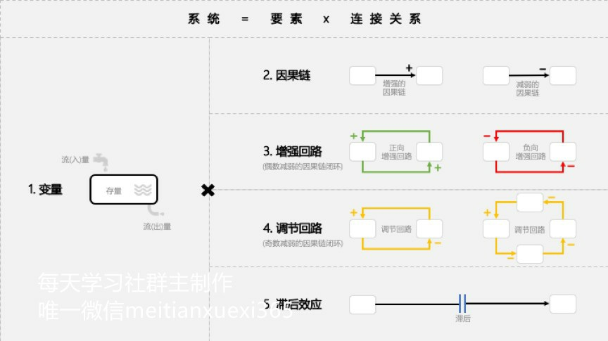

---

== "要素"间的连接关系: 1.因果链（连接关系）

因果链，就是变量之间增强, 或者减弱的连接关系。 +
“因果链”，只有增强（+），和减弱（-），没有第三种。

“带加号（+）箭头的线段”, 就是“增强的因果链”。 +
“带减号（-）箭头的线段”, 就是“减弱的因果链”。

---

==== 做出错误因果判断的原因之 : 总是在结果附近找原因

因为存在“滞后效应”，所以原因不一定在结果附近，可能在几天前，几个月前，甚至几年前。

- 学习今天谷歌为何成功，你要看15年前它做了什么，而不是今天有什么。

---

==== 做出错误因果判断的原因之 : 遗漏中间项

[cols="1,2a"]
|===
|Header 1 |Header 2

|喝咖啡 -> 精力充沛 ?  ×
|← 这里, 我们遗漏了“咖啡因含量”，和“新陈代谢”这两个中间项。

|喝咖啡 ->( + ) 咖啡因含量 ->( + ) 新陈代谢 ->( + ) 精力充沛 √
|这不是一个意思吗？精力充沛这个“果”，用“因果链”追溯到最后，不还是“喝咖啡”这个“因”吗？ +
不是一个意思。*中间项能为你带来解决问题的新切入点(新靶点).* 当你知道“新陈代谢”这个遗漏的“中间项”，才是直接原因时，也许就会找到更好的办法，比如“运动”，来提高新陈代谢水平。也就是说，*通过分析“因果链条”上的中间项，你可以发现那些藏得很深但至关重要的因素.*
|===

---

==== 做出错误因果判断的原因之 : 把"相关性"误认为是"因果性"

- 深圳警方接受采访时说：天秤座、处女座、天蝎座的人更喜欢违章。实际上，这是因为在北半球低纬度南部地区（比如深圳），9-11月是生育高峰。所以，在深圳，这三个星座的人口比率，就要高一些。

---

==== 做出错误因果判断的原因之 : 颠倒因果链

到底是销售价格决定了生产成本，还是生产成本，决定了销售价格？  +
事实上, 是销售价格，决定了生产成本。因为, 你花更多的钱生产，并不会导致用户愿意花更高的价格买。只有先确定了销售价格，才能决定生产成本。

---

==== "因果链断裂"的原因之: 原先的"隐藏的大前提"消失了

过去有效，现在失效了. 即, 原先的“方法→效果”的因果链断裂了。 +
原因之一就是 :  原先的"隐藏的大前提"消失了.

[options="autowidth"]
|===
||原先, 超市 |现在

|大前提
|
|信息流 <- 在超市获得 +
资金流 <- 在网上完成 +
物流 <- 通过快递完成

|结果
|80%～90%的顾客看中商品后，都会购买。
|只看, 少买
|===

*在画因果链时，我们不可能把所有大前提都列出来。但要知道，一定有一些我们看不见的东西(前提条件)是被默认存在的。一旦遇到“过去有效、现在失效”的问题，就要开始寻找“隐藏的大前提”是否发生了变化。*

问自己 : 你开的公司赚钱吗？你能还原三个，你公司能赚钱的“隐藏的大前提”吗？

---

== "要素"间的连接关系: 2. 增强回路（连接关系）->  “因增强果，果增强因”的循环 (即良性循环 / 恶性循环)

因果链，是线段。但是线段有头就有尾，能量从头传到尾，就结束了。

那么如果，我们把结尾和开头也用一条因果链连接起来，形成闭环呢？这就构成了一个“回路”（Loop）。它会一圈圈不断自我增强(包括正向增强, 和负向增强)，一圈圈不断自我调节。

增强回路（Reinforcing Loop）: 因增强果，果反过来又增强因, 互相循环增强.

[cols="1,3a"]
|===
|Header 1 |Header 2

|正向强化回路, 就是良性循环
| - 阿里的电商。平台上买家越多，卖家就愿意来卖东西；平台上卖家越多，买家就越愿意来买东西。一圈一圈循环增强。

- 亚马逊的成功是"模式驱动"的，亚马逊模式成功后会更成功. <- 大成就要靠增强回路。找到自己的飞轮。 +
*Facebook是"用户行为驱动"的，而用户行为一直在变，Facebook永远不安全。*

|负向强化回路, 就是恶性循环
|
|===

增强回路的别名有: 马太效应 / 赢家通吃 / 复利效应 / 指数型增长

创业公司CEO最重要的任务，就是找到自己的"正向增强回路"，然后不遗余力地推动回路，让公司一圈一圈循环增强。

---

==== 飞轮效应

[cols="1,3a"]
|===
|Header 1 |Header 2

|第一，找到自己的飞轮
|一位深度思考者，决定开始创业。他在纸上，写下了创业必须面对的一些变量：

1. 客户体验； ← 什么带来了客户体验？更低的价格(5)。
2. 流量；← 什么带来了巨大的流量？更好的客户体验(1)。
3. 供应商； ← 怎样才能向供应商进更多货？巨大的流量(2)，足够的用户。
4. 低成本结构；← 什么带来了低成本结构？规模效应。向供应商进更多货(3)。
5. 更低的价格。← 什么带来了更低的价格？低成本结构(4)。

从客户体验出发，经过因果链不断增强，最后回到客户体验自己，一个闭环的“增强回
路”,出现在纸上：
客户体验 ( + )<- 更低的价格  ( + )<- 低成本结构  ( + )<- 规模效应  ( + )<- 向供应商进更多货  ( + )<- 巨大的用户流量  ( + )<- 更好的客户体验

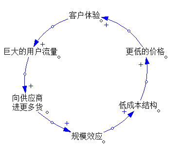

|第二，确定第一推动力
|推动增强回路中任何一个变量，都是在加速飞轮。但是回到最开始呢？*到底是先有鸡，还是先有蛋？第一推动力是什么？-- 一定是消费者获益。*

淘宝的“电商增强回路”，最开始，是先推动买家，还是卖家呢？ +
淘宝决定，先推动买家。 +
于是他们推出了支付宝。1）买家把钱打给支付宝；2）卖家发货；3）买家确认收货；4）支付宝把钱打给卖家。 +
这个流程，把无上的权力交给了买家。只要不确认收货，钱就是自己的。因为解除了担心，买家飞速增长。

但是，这个制度完美吗？当然不完美。会不会有买家，明明收到货，就说没收到，骗取卖家商品呢？肯定会有。
但是，*让买家放心，比卖家放心更重要。后面的问题，后面解决。*

|第三，坚持不懈地推动
|亚马逊的“飞轮效应”这几年非常有名，很多人在学，但为什么至今没有第二个亚马逊？因为“飞轮”推一天是没用的。亚马逊自己推了25年。 +
这25年里，亚马逊曾和书商翻脸，自己签约作者，就是为了给消费者“更低的价格”；亚马逊公司自己非常抠门，还是为了“更低的价格”。
|===

---

== "要素"间的连接关系: 3. 调节回路（连接关系）

调节回路 Balancing Loop : 就是因增强果，果反过来减弱因.

- 如: 公司规模带来管理复杂度，管理复杂度限制了公司规模。

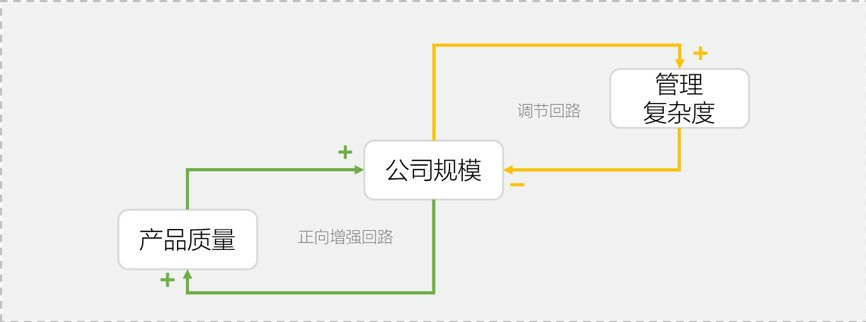

增强回路是追求极端；调节回路就是追求平衡。 +
当一个变化快速发生时，系统中总会出现一些变量，抵抗这些变化。

- 1965年，摩尔预测：集成电路上可容纳的元器件的数目，约每隔24个月便会增加一倍，性能也将提升一倍。 +
既然是滚雪球一样的指数级增长，为什么“滚的加速度”是42%？不是62%、82%，或者是120%呢？ 因为还有一条调节回路。摩尔之所以预测“年均增长42%”，只是因为太快、太慢，都不经济。 +
有一次记者问摩尔：什么可以改变摩尔定律？ 摩尔回答：当我们想不出新的花样可以玩，人们觉得一个电子产品可以用4～5年，不再需要每年更换时，摩尔定律将会明显放缓。

---

==== 对你有利, 你就来主动设置"调节回路"

- 2005年，盛大突然收购新浪19.5%的股份。一旦突破20%，新浪就要面临丢失控制权的重大风险。 这个风险，激活了新浪早已设计好的调节回路：股权摊薄反收购措施，也就是著名的“毒丸计划”。这个计划让剩余的80%的股东，可以用15美元，购买价格35美元的新浪增发股票，从而把盛大的股权稀释到20%以下。最后盛大知难而退。

---

==== 对你不利, 就打破"调节回路"的约束 -> 如: 让“阻碍变革者”，成为变革受益者

调整激励机制，让改革的利益受损者, 成为变革的受益者.

---

==== 遇到"边界墙", 就绕过旧领域, 重新寻找新领域的蓝海

“止步不前，无法跨越”的情况, 多半是撞上了系统的“边界”.

边界墙，就是刚性约束条件，设定的系统增长极限。 +
边界墙，其实就是一种特殊的调节回路。

边界墙(刚性约束)有哪些?

[cols="1,3a"]
|===
|边界墙 |

|1. 市场规模
|由"消费者总规模"带来的"市场规模"的约束.

- 如果你开一家便利店，你的市场规模刚性约束，大约就是方圆一公里的3000户人家。
- 你拍一部电影，你的市场规模刚性约束，就是全国电影院6万块屏幕面前能坐得下的观众。

这叫“最大可触达市场规模”（TotalAddressable Market）。 +
一旦接近你的最大可触达市场规模，开辟新的阵地。

|2. 资源限制
|你能掌握的资源或大或小，都是可以很快触达极限的。

-> 靠个人能力的创业者，比如我所在的咨询业，你的时间，就是你的“刚性约束”。 +
-> 靠"不可再生资源"(土地资源、稀有矿产资源，以及某个人的独家手艺等)创业的，刚性约束的边界墙, 也在不远处。

怎么办？试试把自己的商业模式，建立在高速"可再生资源"上。比如知识、流程、专利技术。

|3. 法规政策
|

|4. 技术限制
|
|===

因为“路径依赖”，你很自然地就会对“刚性约束”发起总攻。但是，绕行突围这堵“钢铁南墙”，也许才是正确的方法。

- 雀巢没有强攻受“刚性约束”的奶粉市场，而是绕开它，找到一个全新且巨大的“潜在用户”群，它发明了“速溶咖啡”。 +
雀巢先后开发或者收购了美极汤料、雀巢冰爽茶、爱尔康眼科、胶囊咖啡、巴黎水、奇巧巧克力、宝路薄荷糖、欧莱雅眼霜、徐福记、妙多乐猫粮、太太乐鸡精等数百家公司。

- 是什么“刚性约束”设定了椰树“增长的极限”？椰汁行业的“用户规模”。小环境，椰树在椰汁领域的市场占有率，已超过55%；大环境，整个饮料行业逐年疲软. +
那怎么办？找到新的有巨大潜在消费者的增长空间.  椰肉的市场，是不是还有很大的增长空间？那椰子酒呢？椰子面膜？椰奶沐浴乳？在任何一个远离"刚性约束"的市场上抓取潜在用户，都有机会带来新的增速。

---

== "要素"间的连接关系: 4. 滞后效应（连接关系）

滞后效应 Delay : 因果之间，有个时间差。这个时间差，就是“滞后效应”。 “滞后效应”带来的你的决策结果, 在时间维度上的复杂性，无处不在。

- 从投资到回报，会有漫长的等待，让我们无法快速验证自己的判断。
- 教育孩子，为什么至今没有完美“配方”？因为从教育到见效，有几年，甚至几十年的滞后效应。

滞后效应, 会带来以下后果:

[cols="1,3a"]
|===
|Header 1 |Header 2

|1. 原因不一定在结果附近
|

|2. 滞后效应, 会造成对结果的迷惑
|- 用户“按下开关”这个因，到“打开音箱”这个果，有6秒的时间差。因为这6秒的滞后，用户不断重复操作，最终迷失。

怎么办？减少滞后，增加确定性。按下开关后，先给用户一个信号, 比如先亮起一盏小灯，或者震动一下。就可以减少滞后，增加确定性.

|3. 滞后效应, 会引起结果的“剧烈震荡”
|- 一家欧洲日用杂货公司公布过一个数字，他们生产一件产品只需要45分钟，但把产品卖到消费者手上却需要150天。即, 经过“制造商、批发商、零售商、消费者”这条长链，要滞后150天，才能得到市场反馈。

那么在市场作出积极或者消极的反馈后，制造商就算立刻增产或者减产，也要再次150天后，长链才能触达消费者。150天后的需求早已变化。所以，整个供应链一会儿积压库存，一会儿供不应求，剧烈震荡。

人们把这种商业世界中的长链波动，称为“长鞭效应”，你拿着跳绳的一头上下甩动，弓起的波会慢慢传到绳子尾端。

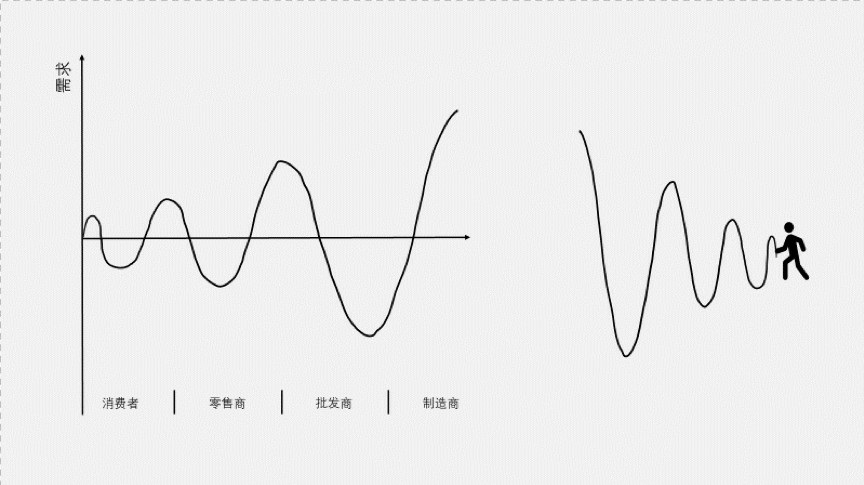

“滞后效应”的存在也说明了, 价格几乎永远不会等于价值。看不见的手调节时总有“滞后”。这个滞后，让价格围绕着价值震荡。而这个震荡带来的空间，就是创业者永不消失的机会。

|===

是“滞后效应”这个系统结构，而不是结构里的人，决定了结果。结构大于人。

那怎么办呢？两个办法，缩短(砍掉中间商)，和平滑(看长期趋势, 而不看短期波动)。

1. 缩短(砍掉中间商) : 指的是用“短路经济”砍掉中间商供应链环节，甚至用戴尔式直销、小米式预售的方式，缩短长鞭。
2. 平滑(看长期趋势, 而不看短期波动) : 指的是不要因为某天卖得多，就投机性生产. 而要根据一周、一月或者若干年的历史数据安排生产，平滑长鞭的抖动。

---

== ---------- ----------

---

== 为什么必须关注你的核心存量? -> 变量：流量改变存量，存量改变你的人生

在一个浴缸中，“水”这个“变量”，有两种不同的状态：

1. 流量（Flow）: 就是在一个“动态的时间段”，有多少水流入浴缸（流入量），有多少水流出浴缸（流出量）。
2. 存量（Stock）: 就是在一个“静止的时间点”，浴缸中积蓄了多少水；

流量确实是“必要”的，但只有能转化为存量的流量，才是“重要”的。

[cols="1,3a"]
|===
|Header 1 |Header 2

|第一，关注你的“核心存量”
| 有些存量，它的增长能明显提升你的实力，它的减少会迅速给你带来危机。这种存量，就是你的“核心存量”。

“核心存量”有哪些? 口碑, 社会信任, 回头客……
不断地注入流量, 并不遗余力地积累你的核心存量.

|第二，关注“流量增速”
|比如, 经济中, 6.5%的GDP增幅，就是“流量增速”。

流量增速, 是存量的“放大器”。 "存量"决定着你当下的实力; "流量"决定着你的潜力大小;  赶超要靠"流量增速"。

- 我有10万，邻居有100万。我们都投资了一个年收益5%的项目。年底我们之间的“贫富差距”，会从90万，扩大为94.5万。

你的邻居比你有更大的存量, 即使你们流量增速一样，你和邻居的差距，也会越来越大。落后者必须找到更大的流量增速，才有机会“赶超”。

|第三，关注“周转时间”
| *周转时间= 存量 / 流量*

- 你有1000件衣服的库存，是存量。每月能卖出500件，是流量。用1000的存量，除以500的流量，你2个月能把库存卖完。2个月，是你的周转时间。

周转时间，为什么重要？它是效率的刻度.

- Costco的销售毛利率，大约是6% ( 用1块钱进货，赚6分), 它的周转时间是1个月，这样一年就可以周转12次。6分钱乘以12次，一年能赚7毛2分钱。 +
而效率低的公司呢？用1块钱进货，不受欢迎，一年才卖出去1次。就算毛利率是50%，一年也就才赚5毛钱。

注意: 这里没有算进成本. 只算的是毛利润, 而非净利润.  周转次数越多, 是否成本也越高?

|===

---

== 如何搭建商业模型 ?

想要考察一家咨询公司或者商学老师说的是不是真的有用，就看他们用不用自己的理论和方法, 来经营自己。

我的第一个客户是自己。用咨询的术语说，是要帮"我"这个“客户”搭建有效的商业模型.

[cols="1,3a"]
|===
|步骤 |Header 2

|1. 找出对你最重要的"核心存量"是哪些?
|咨询行业有哪些核心存量，是关键？ 成功案例, 深刻的洞察(能治病), 声誉(咨询、培训、演讲、文章、写书) ....   +
哪个存量因素好像都重要，但是，到底哪个，或者哪几个才是真正的核心？

你光知道要素本身是不够的，必须要先找到它们之间的“关键因果链”。

|2. 找出关键因果链
|对创业时的我而言，最关键的因果链，就是通向"收入"的因果链。那么是哪些关键的“因”，导致了收入这个必然的“果”？

我从众多要素中提纯出了一个关键的“因”，那就是：声誉。 +
所有的公司声誉都很重要啊。没错，但对其他类型的公司来说，声誉未必是第一因。

成功的咨询公司各有各的成功，失败的咨询公司只有一条：客户不相信你的能力。 +
因为不相信，所以交易成本就很高：说说看，你能做什么？你比X好在哪里？比Y强在哪里？还能再便宜一点吗？你能来竞个标吗？我们只能先付30%的钱，等看到效果我再付尾款吧。 +
所以，声誉就是让客户相信的力量。只有用极好的声誉来降低交易成本.

找到“声誉 ->(+) 收入”的关键因果链后，我给自己定了一条铁律：绝不去客户现场做售前。不管你是多大的企业家，只要你不愿到我的小办公室来聊，就说明我的“声誉”还没有强大到让你挪步(向巴菲特看齐)。只要不是用“声誉”这个第一因赢来的客户，再有钱，也不是我真正的客户。

找到了关键要素“声誉”以及“声誉-(+)> 收入”的关键因果链之后，怎么启动这个系统呢？我的职责是不断增强“声誉”这个“势”。怎么做？建立“增强回路”。

|3. 建立"增强回路"：推动增长的飞轮
|-> 首先，是什么在推动“声誉”这个核心存量的提升？
作品。我必须有好的作品，比如醍醐灌顶的文章，透彻恢宏的书籍，才能提升声誉。 +
-> 然后，是什么在推动“作品”的出现？学识。我必须参与真实商业、解决具体问题、身处商业前沿，才能有真才实学、真知灼见。
-> 那么，是什么在推动“学识”的积累？声誉。你只有具备极好的声誉，才会有很多企业，允许你陪伴，让你获得大量真实体感。

“声誉 ->( + ) 学识 ->( + ) 作品 ->( + ) 声誉”，一条增强回路，浮出水面。

确定自己的“增强回路”后，我决定，只要不是推动“声誉、学识、作品”飞轮的事情，一律不做。

有钱不赚，是艰难的决定。**华为说：“不在非战略机会点上消耗战略性资源。”这句话很容易说，但是，诸多机会之中什么是战略机会点？你的资源里面哪些是战略性资源？这不是靠意愿和感受就能作出判断的事。
只有带上洞察力眼镜，确定自己的“增强回路”，你才会知道真实答案。**所有你以为的“突然出现式”的成功，背后都有其环环相扣的“增强回路”。

|4. 解决好"调节回路"：打破"增长的天花板"
|推动"增强回路"加速转动时，你也必须问自己：未来抑制增长的，最低的那块天花板是什么？ +
我知道，是我有限的时间。单价再贵，我的时间也终有卖完的一天。

看到低垂的天花板，我反而很安心。因为我知道，什么终将到来(即要突破天花板, 就一定要做成团队, 而非永远一个人干)。于是，我把团队、产品、资本都先放在一边。然后，低下头，继续推动我的飞轮。

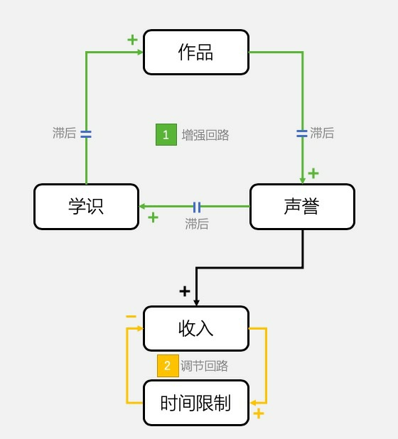

|5. 解决好"滞后"的问题：饱和式创业
|仔细研究我发现，从声誉，到学识，到作品，再到声誉，整个增强回路中，每一段因果链上，都严重滞后。我决定, 为每一个果，设计三个因:  +
→ 用公众号、微博，抖音这三个因，共同推动"声誉"这个飞轮； +
→ 用商业咨询、企业家社群、企业家私董会这三个因，共同推动"学识"这个飞轮； +
→  用线下大课、5分钟商学院线上课程、图书出版这三个因，共同推动"作品"这个飞轮。
|===

然后，我开始推动飞轮。

现在, 用5个结构模块，画出你自己的商业模型。然后回答：

- 你的核心存量是什么？
- 你的关键因果链是什么？
- 你的增强回路、调节回路是什么？
- 你的哪些努力，结果不在原因附近？
- 你在推动自己的飞轮吗？

---

== 对你的模型, 进行健壮度体检

我们搭建的模型脆弱吗？环境变化时，这个模型会自我适应吗？它僵化吗？它灵活吗？它内部沟通顺利吗？

检查"系统模型"是否健康的三个指标:

==== 1. 适应力（resilience）: 系统自我修复的能力

适应力（resilience）: 就是突然遇到外部冲击，系统自我修复的能力.

[cols="1,2a"]
|===
|提高"系统的适应力"的方法 |Header 2

|1. 用“存量”(缓冲器)这个结构模块，增强系统“适应力”，应对意外。
|比如你失业了, 在找到下一个工作之前, 你的储蓄存量, 能支撑你多久?

|2. 设置“调节回路”，来提高系统的适应力。
|做得再好的计划，只要开始执行，就会产生偏差。怎么纠偏? 开周例会，不断纠偏。 +
你呢？也设计了各种调节回路，应对风险吗？
|===

关于缓冲器:

为什么近代以来，我们能够抵御的洪水级别，能从十年一遇到百年一遇，越来越高？因为河流安装了缓冲器，也就是水库.

[cols="1,3a"]
|===
|Header 1 |Header 2

|没水库时:
|在过去，任何一段河床上水的流(入)量，都是上一段河床即刻的流(出)量，没有存量。因此，只要来自上游的水的流(入)量不稳定，下游就会时而旱灾、时而水灾。

|连接了水库:
|水库的存量，就是一个缓冲器。雨季水位高，旱季水位低，但是只要不见底、不溢出，下游就会获得平滑稳定的流(入)量。
|===

怎样让河流中的水量更平静？安装缓冲器(水库). 缓冲器，是专门用来平滑流(入)量波动的存量。 +
缓冲器的本质，是一个用来“缓缓释放瞬间冲击”的“存量”, 扮演着“稳定”的角色。

[cols="1,3a"]
|===
|Header 1 |Header 2

|有缓冲器:
|Column 2, row 1

|没缓冲器:
|- 很多对效率的极致追求，其实都是对缓冲器的放弃。没有库存当然能提高效率，但是就会有波动的风险.
|===

那么，应该安装哪些“必要的缓冲器”，对冲“波动和猝死”的风险呢？

[cols="1,3a"]
|===
|Header 1 |Header 2

|1. 安装应对“缺乏型波动”的缓冲器
|一旦缺乏，就会给系统带来风险的"流(入)量波动"，叫做“缺乏型波动”。

- 进行到关键阶段的项目，突然走了2个核心程序员，怎么办？这就是人才的缺乏型波动。可以稍微多招5%，用必要的“存量”，缓冲突然缺人又来不及招的风险。
- 银行要有强制的存款保证金制度; 共享单车公司应把至少一定比率的押金，存在第三方托管账户，缓冲波动的提款需求 (用户突然集体挤兑)。

|2. 安装应对“过剩型波动”的缓冲器
|上游流量的洪水一样倾泻下来，给系统造成无法承受的负担。这就是“过剩型波动”。 +
怎么应对“过剩型波动”？安装足够大的蓄水池。

- 软件公司闲下来闲死，没活干也要发工资，怎么办？这是人才的“过剩型波动”。 +
可以建一个“农闲项目”(屯田)，把所有不在项目上的过剩工程师，都投入这个项目，在“农闲”时，干点别的活。这样，就可以提高未来项目的效率。新项目(战争)来了，随时去做；一退出项目，就继续屯田。

|===

---

==== 2. 自组织性（self-organization） : 系统自我突变的能力

自组织性（self-organization） : 就是为了适应变化，系统自我突变的能力；

阿里有句话: 乱七八糟的生机勃勃，好过井井有条的死气沉沉。

一个不准越雷池半步的组织，这也是一个从此不再“生长”的组织，是一个“死于25岁，葬于75岁”的组织。那怎么办？你至少可以成立一个“特区”.

---

==== 3. 层次性（hierarchy）

层次性（hierarchy） : 是通过把整体切分为局部，来控制系统信息风暴的能力。

---

== 达到临界点后, 模型世界就转换了

“一直挺好，突然变了”这样的“突变问题”背后，很可能有一个"临界点"原因。

以互联网公司的“C轮死”为例. 在创投圈子里，绝大多数走到B轮融资的公司，是拿不到C轮融资的，因此，创业项目就会陷入困境而死。原因是什么?

互联网公司发展，最重要的资源是用户。用户越多，公司越值钱。一开始，公司A和公司B都拼命烧钱，获得大量用户；大量用户，带来更多投资；更多投资可烧，用户增长更快。A、B两家公司，各有一条“烧钱驱动”的“增强回路”，作为“主导结构模块”。

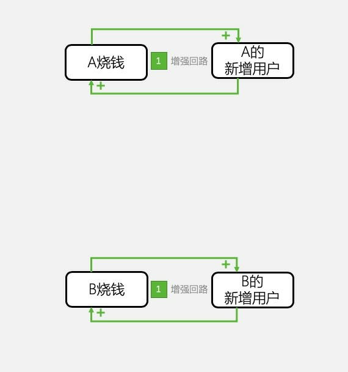

这种“烧钱驱动”的“增强回路”，很快遭遇了“总用户规模”这个“刚性约束”，撞上了“边界墙”。这时，公司A和公司B，都只能从对方的池子里抢用户。A抢到的越多，B就越少。甚至，当A抢到“足够多”的用户时，B的用户发现留在B阵营的价值越来越低，会主动投奔A。*突然，赢家通吃的“网络效应驱动”的“增强回路”，取代了“烧钱驱动”，成为系统的“主导结构模块”。*

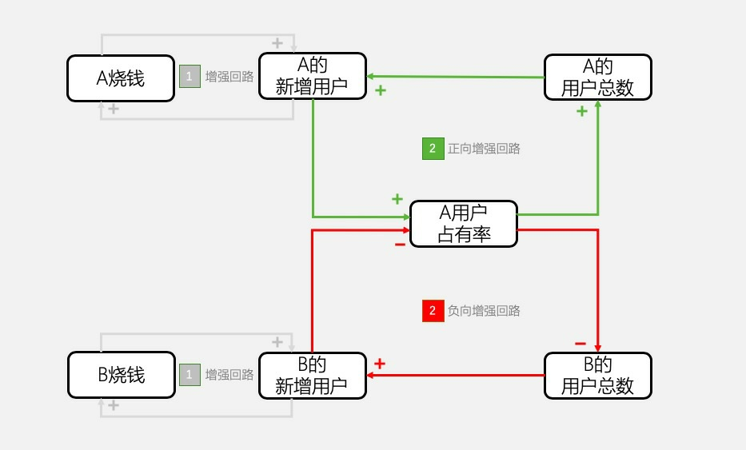

**公司A，和公司B之间比的，其实不是谁先到终点，而是谁先到达“足够多”这个“临界点”。**一旦到临界点，越多者就会越多，指数级增长；越少者就会越少，雪崩式坠落。胜负从此已分，之后的遭遇战，只不过是打扫战场而已。

投资人是不会再下注一个胜负已分的比赛的，他会果断认输离场。这就是为什么“投资人、媒体全消失了”。这个临界点，大概率出现在C轮融资。这就是互联网业著名的“C轮死”。

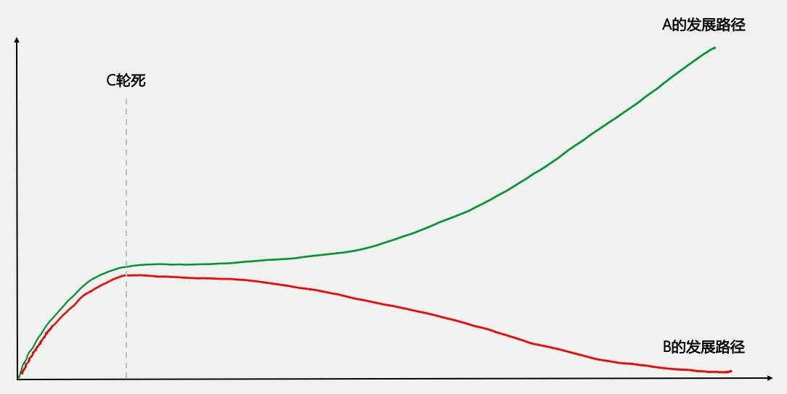

是的。系统中“主导结构模块”的切换，常常突然发生.

很多人在商业计划书中，会画一张直线型增长的预测图。其实，这个世界哪有什么直线型增长。在你前面埋伏的，是各种各样的“主导结构模块”切换带来的“临界点”，等你跨越。跨过去了，继续前行；没跨过去，换条命再来。

**达到临界点, 会带来主导结构模块的变化。 **

那么，商业世界有哪些“主导结构模块”的切换带来的“临界点”，需要我们跨越呢？

你要时刻关注这四种“临界点”，随时跨越:

1. 质变点，突然来临的“因果链”切换；
2. 引爆点，一条“正向增强回路”被激活；
3. 灭绝点，一条“负向增强回路”被激活；
4. 失速点，一条“调节回路”被激活。

---

==== 1. 跨越质变点 (从量变到质变)

所谓质变，就是“存量”超过一个阈值后，突然导致的“因果链切换”。

- 水在100℃时，会从液体变成气体，100℃，就是水的“质变点”。超过100℃这个阈值后，系统的主导因果链从“加热→水温升高”，切换为“加热→气温升高”。
- 当“客户抱怨→投诉”这条因果链，切换为“客户抱怨→离开”，爷不陪你玩儿了，就不可逆了。

---

==== 2. 跨越引爆点 (过了这个临界点, 之后一路兴旺)

所谓引爆点，就是“存量”超过一个阈值后，激活了一个“正向增强回路”。 +
跨越引爆点的关键，是向阈值冲刺。

- 比如，把产品做到多好，才是“足够好”？要好到“用户忍不住发朋友圈”。 +
1个用户忍不住发朋友圈，可能帮你获得了500个潜在用户 -> 其中也许有100人购买 -> 最终20个成为你的忠实用户 -> 其中有4个人又忍不住发朋友圈。一个正向增强回路走完，1条朋友圈变4条，如此往复，最终引爆圈层。

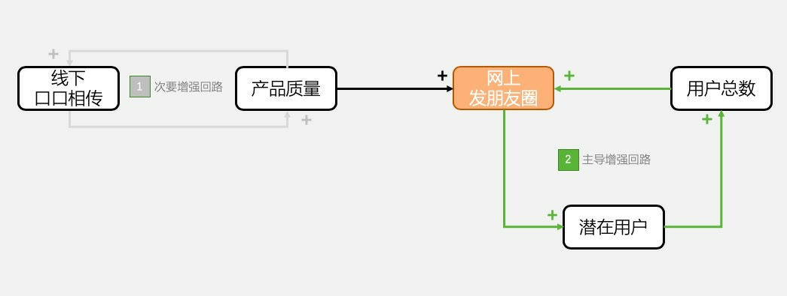

---

==== 3. 跨越灭绝点 (过了这个临界点, 之后一路衰败)

- 遗传学上有一个“最小可存活种群”(Minimum Viable Population) 的概念，意思是：在100-1000年内，一个物种为了有90%~95%的存活可能，所需要的最小个体数量。 +
有人经过计算机模拟，得出这个数量是：4169。一旦小于4169，因为代际叠加的交配难度，物种就会走向灭绝。4169，就是物种的灭绝点。

- 有的公司在不景气时，为了追求利润，砍掉研发人员。研发人员少于一个“阈值”，产品质量就会下降 -> 公司收入就会减少 -> 只能继续砍掉研发人员 -> 陷入恶性循环(负向增强回路)。 +
一旦研发人员少于“灭绝点”，公司就会加速衰败。

---

==== 4. 跨越失速点(即遇到边界墙之前的拐点) (过了这个临界点, 之后被逆转兴衰方向)

- 这家公司所在的赛道，市场规模非常有限，所以“存量用户”到达一个很高的阈值后，稀缺的潜在用户，开始像刹车一样限制着新用户增长，越来越慢，直到几乎失速。

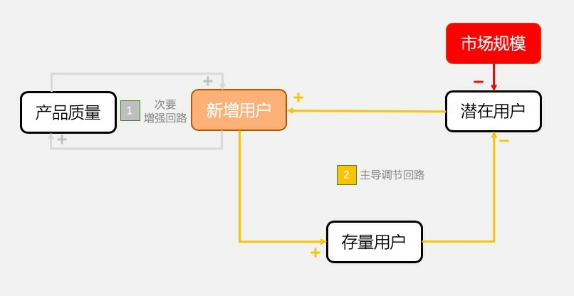

所有增长都会遇到“刹车式调节回路”，然后失速，只是有的赛道来得比较早。

怎么办？

1. 除了网络上, 还要通过发展线下，扩大“潜在用户”的规模，
2. “绕过边界墙”, 找到新的蓝海，才能重新获得速度。

---

== ---------- ----------

---

== 通过哪些模型, 来预测未来?

未来很难预测，但是我们必须去预测，即便准确率只有80%、60%，甚至20%，因为所有决策，都是建立在预测基础上。

我是商业顾问。我不是神。来找我咨询的都是行业专家，那我凭什么能给他们咨询，甚至建议未来呢？因为我手里有基模。这就相当于求解“未来”这道方程的公式，套进去，看答案。

模型的意义，不仅是解释过去，更是要预测未来，然后根据预测，作出大概率正确的决策。 +
-> 解释过去，是解决“Why”（为什么）的问题； +
-> 预测未来，是解决“What…if…”（如果……就……）的问题。

如何预测？4个模型组, 包含共9个基础模型：

[cols="1,2a"]
|===
|模型组 |其中的基础模型

|受阻模型组（Underachievement） +
“如果”期待中的增强回路，遭遇意外的调节回路，“就”会增长受阻.
|- 公地悲剧基模： +
“如果”双方的收益，都是建立在抢夺有限的公共资源上，“就”会导致彼此收益都最终降为零的悲剧

|
|- 成长上限基模： +
“如果”快速增长触发了一个抑制增长的调节回路，“就”会减缓、停顿，或者下滑

|
|- 成长与投资不足基模： +
“如果”快速增长导致研发、生产、投资等能力被忽视，“就”会更加导致减缓、停顿、下滑，甚至衰败

|失控模型组（Out of Control） +
“如果”期待中的调节回路，遭遇意外的增强回路，“就”会情况失控.
|- 舍本逐末基模： +
“如果”我们采取一个治标方案解决问题，“就”会离治本的方案越来越远

|
|- 饮鸩止渴基模： +
“如果”我们采取一个带有严重副作用的方案解决问题，“就”会出现情况越来越恶化的结果

|
|- 意外之敌基模： +
“如果”我们的行为误伤到盟友，“就”会双方对抗，然后两败俱伤

|通吃模型组（Relative Achievement） +
“如果”期待中的增强回路，遭遇意外的增强回路，“就”会赢家通吃.
|- 富者愈富基模： +
“如果”双方在一个资源有限的系统中激活了“增强回路”，“就”会导致富者愈富、穷者愈穷；

|锁死模型组（Relative Control） +
“如果”期待中的调节回路，遭遇意外的调节回路，“就”会零和博弈.
|-  恶性竞争基模： +
“如果”双方都以超过对手为目标，“就”会把竞争推到谁都不期望的程度；

|
|- 目标侵蚀基模： +
“如果”我们通过降低目标来完成难以实现的目标，“就”会导致目标越来越低，得过且过。

|===

---

==== 1-1 公地悲剧基模（Tragedy of the Commons） (受阻模型组) -> 一组多吃多占的增强回路，遭遇一条资源有限的调节回路

一群人在公共草地上放羊，每个人放10只羊，草地自我修复，羊群生生不息。可有个牧民贪心，悄悄放了20只，发财了。其他牧民眼红，也放20只。有牧民甚至开始放30只，越来越多。最后草地被破坏，所有的羊都饿死。这就是公地悲剧。

把这个现实故事，抽象为系统模型。*公地悲剧的本质，就是：一组多吃多占的增强回路，遭遇一条资源有限的调节回路。* +
个体收益在开始的“投机期”大幅上升，在遭遇公共资源瓶颈后的“崩溃期”蒸发为零。

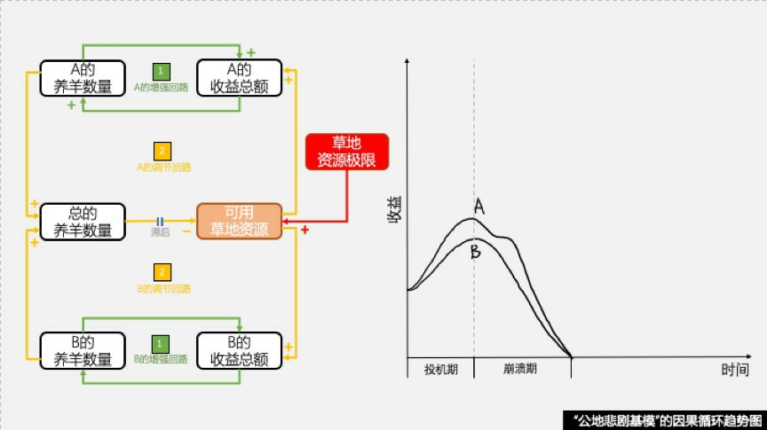

- 什么是矿机？就是用来“挖”比特币的计算机。*比特币网络，每10分钟会发放固定的12.5枚比特币（当时价值125万人民币）给全球参与记账的矿机。参与的矿机越多，平均收益越少。* +
比特币挖矿的收益分配模型，其核心，就是一个“公地悲剧基模”。 +
+
每10分钟能挖到固定的125万元人民币，是有刚性约束的“公地”。投资更多矿机，确实可以增加个体收益，但因为分钱的矿机猛增，平均收益率迅速降低。 *当所有矿机每10分钟消耗的电费，也激增到125万元，等于挖矿收益时，所有人的收益蒸发为零。* +
挖矿，就是一个“公地悲剧”。如果你不能确保自己在投机期套现离场，就千万不要进场。 +
+
2018年下半年，崩溃期如约而至。电费超过收益，60万～80万矿机拉闸关机，矿机价格跌去90%。

那如何破解“公地悲剧”呢？把公共资源私有化，或者竞拍收费，切断无限占用公共资源这个“增强回路”。

---

==== 1-2 成长上限基模（Limits to Success） (受阻模型组)

这个世界上，没有永恒的增长。你发展很快，只是因为你还小，小到尚未有“资格”触碰各种大规律的限制。比如市场规模的限制、人才数量的限制、管理能力的限制等等。

个体收益在“平原期”无所建树，在“爬升期”高歌猛进，在“高原期”重新停滞。这就是著名的“S曲线”。

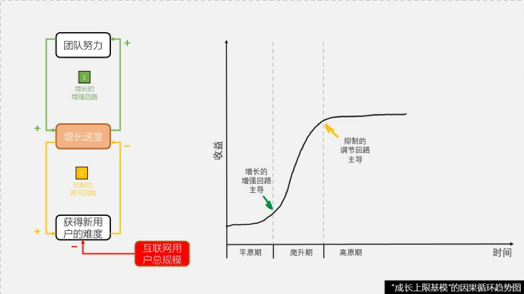

- 电商的增长回路，早晚会遭遇互联网总用户规模的调节回路，然后止步在平稳的高原。

那应该如何应对成长上限呢？尽早寻找“第二条S曲线”。当现金牛业务的增长，遭遇需求变化、技术瓶颈等抑制的调节回路时，你要告诉自己要寻找新的蓝海领域, 开发新的产品。

---

==== 1-3 成长与投资不足基模（Growth and Underinvestment） (受阻模型组) -> 一条飞速成长的增强回路，遭遇一条投资不足的调节回路

成长与投资不足的本质，就是：**一条飞速成长的增强回路，遭遇一条投资不足的调节回路。**如果忽视对能力的投资，饱和之后，就是匮乏。

- 布尔（Don Burr），美国人民航空的创始人。机票价格只有同行的6折，还能赚钱。 +
+
现在，你有两个选择：

1. 把利润拿去购买飞机，获得更多客户；
2. 把利润拿去培训员工，提升服务质量。
你选哪一个？真的布尔，选择了“1”，购买飞机。
1年后，人民航空破产了。
+
旅客不多时，人民航空的服务非常好，每个顾客都很满意。这是服务能力投资的“饱和期”。
+
但购买飞机后, 旅客的增长，同时要求更高的“服务能量”。过去一个空姐服务20位旅客，现在要服务100位，进入服务能力投资的“匮乏期”。旅客抱怨激增，转向竞争对手。同时导致新购飞机无法饱和运转，产生巨额亏损，最后破产。

企业发展到一定的阶段，就要“还以前欠下的债”. 这个“债”，就是今天看来的投资不足，对研发、对产品、对客户服务的投资不足。

---

==== 2-1 舍本逐末基模（Shifting the Burden） / 饮鸩止渴 /温水煮青蛙 / 治标不治本 (失控模型组)  -> 一条"根本解"的调节回路，因为见效慢，遭遇一条短视的"症状解"增强回路

舍本逐末的本质，就是：**一条"根本解"的调节回路，因为见效慢，遭遇一条被"症状解"打压的增强回路。**最终，问题依旧，甚至更严重，直至崩盘。

- 妈妈看见孩子的鞋带散了，怎么办？

|===
|Header 1 |Header 2

|-> 帮孩子把鞋带系好。这位妈妈眼中看到的是“没系好”这个结果
|帮孩子，是“症状解”。 +
用“症状解”解决问题，解决“是什么”（What）的问题；

|-> 观察到他系鞋带的方法有问题，然后手把手地教他。这位妈妈眼中看到的是“不会系”的原因。
|教孩子，让他自己系,  是“原因解”。 +
用“原因解”解决问题，解决“怎么办”（How）的问题；

|-> 孩子摔了几跤后，鞋带系得比妈妈还好。这位妈妈眼中看到的是“不想学”的模型。
|让孩子想学，是“根本解”。 +
用“根本解”解决问题，解决“为什么”（Why）的问题。什么是“根本解”？改变模型.
|===

- B越来越“舍本逐末”，在“政府出钱免费学”这个症状解的道路上越走越远，直到失去获得“打磨产品付费学”这个根本解的能力。 +
B公司的人告诉我，自从国家调整计划生育国策后，这笔补贴瞬间取消了。他的生意，从100楼摔到了1楼。他想改变商业模式，重新向新婚夫妻收费。却发现，因为他已经完全丧失了产品力，根本无人付费。

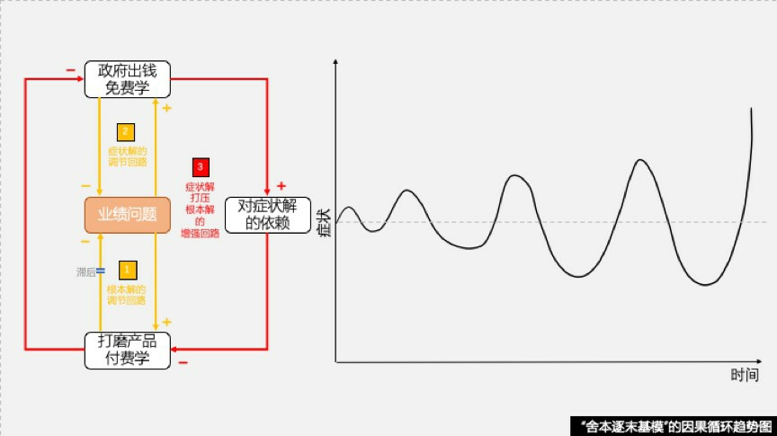

---

==== 2-2 饮鸩止渴基模（Fixes that Fail） (失控模型组) -> 一条短期见效的调节回路，激活了一条长期恶化的增强回路

饮鸩止渴，是舍本逐末的升级版。它和舍本逐末不同的是，“鸩”这种“症状解”，不是没有营养的“末”，而是杀人于无形的“毒”。

饮鸩止渴的本质，就是：**一条短期见效的调节回路，激活了一条长期恶化的增强回路。**回光返照之后，灯枯油尽，走向失控。

- 某知识付费平台的销售业绩比预计差不少。销售总监很着急，打算推出“一价全包会员卡”，只需支付365元，就能收听全平台所有付费内容。 +
谁会花365元买“一价全包会员卡”？当然是本来打算花500元、800元，甚至1000元购买单独课程的人。这个计划，相当于把未来的收入，提前打折兑现。下半年的业
绩问题，会因为上半年的吸血，而惨不忍睹。 +
另外，“一价全包”而不是按课程付费，会导致优秀的作者无法脱颖而出，不能获得有足够吸引力的报酬。于是，优秀作者流失。优秀作者流失，又加剧忠实读者流失，只好再降价。一个惊心动魄的负向增强回路被激活。

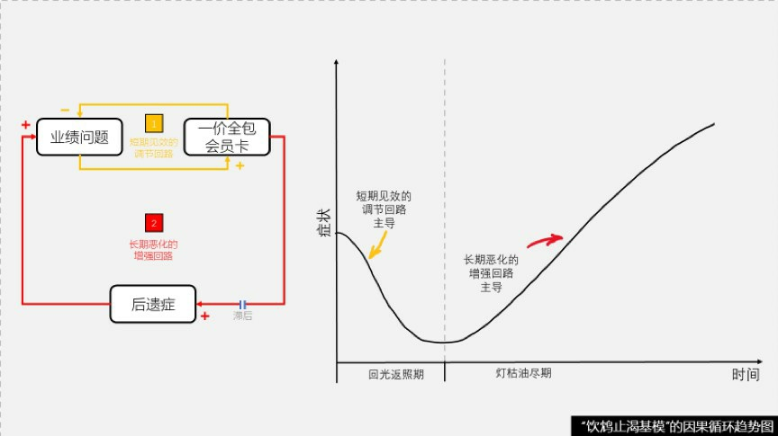

这个世界上，放在我们面前的，通常不是正确的选择，和错误的选择。而是正确的选择，和容易的选择。而容易的选择，常常有毒。

---

==== 2-3 意外之敌基模（Accidental Adversaries） (失控模型组) -> 改善自己业绩的调节回路，意外激活了一条伤及盟友的增强回路

意外之敌的本质，就是：改善自己业绩的调节回路，意外激活了一条伤及盟友的增强回路。

---

==== 3 “富者愈富”（Success to the Successful）/ 马太效应 (通吃模型组) -> 在"资源有限"的地方, 你抢到的越多, 别人能得到的就越少

它的本质是：*当资源总量有限时，抢到最多资源的正向增强回路，会激活所有其他竞争者的负向增强回路，导致“赢家通吃”*。

- 即便“足够优秀”如苹果，挑战“负向增强回路”20年，今天苹果电脑的市场份额依然不到10%，大量的人还是使用Windows系统。 +
那怎么办？ 苹果公司决定，不为打翻的牛奶哭泣，转战下一个战场，建立全新的“正向增强回路”,等待微软。这个战场，就是手机。 +
在iPhone的世界里，当App开发商和手机用户之间，你越多我越多、我越多你越多的“正向增强回路”正式浮出水面时，微软大吃一惊，赶紧加入战局。但是苹果的“富者愈富”模型已经成型. +
 +
那怎么办？
微软新任CEO萨提亚·纳德拉决定，不为打翻的牛奶哭泣，放弃手机业务，转战下一个战场，建立全新的“正向增强回路”，等待苹果。这个战场，就是云计算。

- 干掉微信的，可能是全新战场的抖音，可能是穿戴设备，可能是人工智能，但不会是一个比微信好10倍的x信。

在商业世界中，*有哪些“总量有限的资源战场”*，必须要跑步进入，以免别人成功构建“富者愈富”模型，激活我的“穷者愈穷”呢？你需要关注下面4点：

[cols="1,3a"]
|===
|Header 1 |Header 2

|1. 用户
|在“用户”这个“总量有限的资源战场”里竞争，用自己的“正向增强回路”，激活别人的“负向增强回路”。

|2. 资本
|资本金越大，投资收益越大；投资收益越大，资本金越大。这个“正向增强回路”一旦形成，也很难扭转。 +

人类的贫富差距，是越来越大，还是越来越小？ +
很不幸，是越来越大。 +
-> 2010年，全世界最有钱的388人所拥有的财富，超过最贫穷的那一半人口的财富总和。  +
-> 2014年，只需要85人。 +
-> 2015年，62人。 +
-> 2017年，8人。

为什么？*因为“资本”的总量是有限的. 在这个“总量有限的资源战场”，抢到最多资本的正向增强回路，必然会激活所有贫困者的负向增强回路，导致“富者愈富、穷者愈穷”。*

|3. 规模
|有些行业的竞争，本质是规模之争。比如插线板。

|4. 品牌
|正如定位指出, *消费者心智中的记忆空间是有限的.* 越有品牌，客户和优秀资源就越向你聚集，你就越光环四射，然后越有品牌。对个人也是一样。
|===

有人说，只要你愿意开始，什么时候都不晚。真的是这样吗？这句话成立，有什么前提吗？ --- 你不能身处"资源总量有限的战场"中!

---

==== 4-1 恶性竞争（Escalation）(锁死模型组)

- 1971年，在全球“禁烟运动”的声势下，美国国会通过了禁止在电视和广播里做烟草广告的法律。哪一家烟草公司的利润，下降得最快？答案出乎不少人的预料。这三家的利润不但没有下降，还都获得了不小的增长。 +
为什么？因为政府无意中，帮助烟草业打破了一个叫做“恶性竞争”模型的诅咒 -- 即它们的广告战。 +
它必将导致A、B的成本螺旋上升，最后两败俱伤。比如价格战、军备竞赛.
+
其实，禁止烟草业在电视、广播做广告的提案，就是烟草业自己提交的。他们谁也不会先放下枪，所以请求政府来数“1、2、3，同时放下”。然后，整个行业的利润大增。

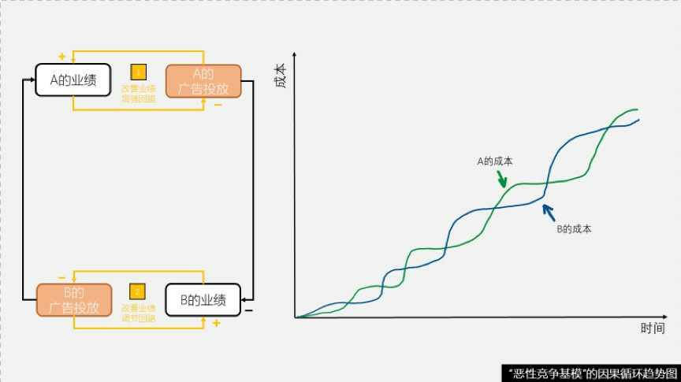

- 谷歌、百度、阿里的“竞价排名”广告，就是利用高效的“恶性竞争”模型(赛马机制)，让你“不提价，就出局”，收取最高可能的广告费。

那怎么破解“恶性竞争”呢？让合作收益大于背叛诱惑，构建某种默契的协议，稳定的均衡。

---

==== 4-2 目标侵蚀（Drifting Goals）(锁死模型组)

缩小现实与目标之间的差距，有两种方式：1.改进行为，和2.降低目标(即: 目标侵蚀)。

改为用"降低目标"调节回路, 来缩小差距的方法，就是“目标侵蚀”。 +
目标一点点被侵蚀，你越来越舒适，但却离真正的目标越来越远。正如英国小说家毛姆所说：*只有平庸的人，才总是处于最佳状态*。

- 航空公司找到了一条降低“延误率”的方法：通过延长"预计飞行时间"的方法，来侵蚀目标。只需要把预计飞行时间延长为24小时，就可以彻底消灭当天内的所有晚点。

- 那位互联网的创业者的问题是，目标数字过于模糊，“在产品上有长足的进步，销售上有巨大的提升”，给“目标侵蚀”留下了巨大的空间。

那怎么办呢？目标一定要明确。 +
5年、24小时、72小时。用非常明确的数字，把自己置于做不到的风险中，而不是说："线上线下稳步提升，国内国际共同加速"。

---

== ---------- ----------

---

== 如何培养你的洞察力?

洞察力（Insight Skill），是一种“越练习越强大”的“技能”（Skill），而不是“看一眼就获得”的“知识”（Knowledge）。

三步上篮的规则，是知识；但是像乔丹飞人一样的三步上篮，是他终身练习才获得的技能。洞察力，需要终身练习。

我会依次帮你建立“公式思维”、“层次思维”和“演化思维”，再给你三个剑法，让洞察力伴随你终身。

==== 1. 破除“散点思维”，建立“公式思维”

[cols="1,3a"]
|===
|Header 1 |Header 2

|什么是散点思维？
|散点思维有个典型的表达句式，就是："唉，对了，你看这样行不行？"

这种“灵光乍现”，是怎么出现的呢？他自己都不知道。万一灵光不乍现呢？ +
在拆解炸弹时，你说“唉，对了，你试试剪红线看行不行”，是要死人的。

这种靠灵光乍现获得点子的思维习惯，就是：散点思维。散点思维是偶得的，质量不可靠的，挂一漏万的。

|什么叫公式思维？
|一家明星开的火锅店倒闭了。首先，我们要找到能准确描述餐厅经营逻辑的“公式”。 +
公式从哪里来？高手可以从系统模型中提炼公式。但是对大多数人来说，学习高手提炼的、被验证过的公式，非常重要。

- “销售漏斗公式”：
*销售=流量 × 转化率 × 客单价 × 复购率*

用这个公式来分析餐厅经营逻辑. 你来想一想，明星的影响力，会在这四个变量上的哪一个起作用？ +
没错。流量。餐厅的短期的生意靠流量，长期的生意靠复购率。

你就可以说, 我有三个建议：

1. 你自己负责用影响力, 给餐厅带去"流量"；
2. 但一定要找到有丰富经验的经理人，帮助提高"转化率"和"客单价"；
3. 千万不要忘记持续监控菜品的质量，保证"复购率"。

*当你能破除散点思维，建立公式思维时，整个世界在你眼中，不再是一个个“要素”，而是它们之间的“连接关系”。*
|===

公式有很多

[cols="1,2a"]
|===
|Header 1 |Header 2

|碳排放问题的“分解公式”：
CO2 = P × S × E × C
|微软创始人比尔·盖茨，在一次TED的演讲中，给出了
一个解决碳排放问题的“分解公式”：
CO2 = P × S × E × C

在这个公式中： +
-> P，就是People，人口； +
-> S，就是Service Per Person，每个人使用多少项服务，比如开车、壁炉、烧烤等等； +
-> E，就是Energy Per Service，每项服务使用多少能源； +
-> C，就是CO2 Per Unit Energy，每单位能源，排放多少二氧化碳。

于是问题一下子清晰起来。解决碳排放问题，就是分别解决人口爆炸问题（P），提倡环保的生活方式问题（S），设备节约使用能源的问题（E），和产生单位能源的碳排放效率问题（C）。

|复利公式：收益=(本金+复合利息)^时间
|有了这个公式，你会同时关注本金、复合利息和时间，这三个要素，以及它们之间的连接关系。

|定倍率公式：价格=成本 × 定倍率
|从这个公式上，你就会明白，这个世界上从来没有什么“一分价钱一分货”，价格和成本之间相对稳定的关系，是因为"定倍率"暂时没变。

"定倍率"是商品的"零售价格"除以"成本价"的那个倍数。比如100块钱成本的东西，卖500块。定倍率就是5倍。

|用户忠诚度公式：用户忠诚度=(我提供的价值–他提供的价值)+转移成本
|
|===

为什么很多大型机构在招募真正优秀的人才的时候，会考你“上海有多少辆自行车”这样变态的、没有正确答案的问题?  +
因为**回答这种问题，你几乎必须建立公式，然后合理预估公式中的每个变量。这道题的目的，就是检验你是否有用“公式思维”.**

掌握最接近“要素”间“连接关系”的公式是关键。 如果你用错误的、不准确的、颗粒度大的公式解决问题，不但不能解决，还会死人。切忌买本《本草纲目》就去行医。

---

==== 2. 破除“局部思维”，建立“层次思维”

[cols="1,3a"]
|===
|Header 1 |Header 2

|什么叫局部思维？
|局部思维也有个典型的表达句式，就是："其他我不管，这才是最重要的！"

系统模型中，“要素”之间的“连接关系”，是有层次的。 +
局部思维，指的是只关注"低层次关系"(“局部思维”，如盲人摸象)，而看不见"高层次目的"的思维习惯。

- 细胞、器官、人体，就是三个从低到高的层次。

|层次思维
|拥有“层次思维”的人，可能会告诉你：是四个层次的要素，决定了企业的兴衰存亡。

第一层：时代。时代抛弃你的时候，连一声再见都不会说。 +
第二层：战略。不要用战术的勤奋，掩盖战略的懒惰。 +
第三层：治理。结构不对，什么都不对。 +
第四层：管理。

在这四个层次中，时代高于战略，战略高于治理，治理高于管理。
|===

- 柯达的失败，到底是什么原因？你有一个永远打败不了的对手，那就是时代。数码相机的新时代，必然取代胶卷相机的旧时代。 +
*“时代”挑战这个第一层次的问题，是无法用“管理”水平这个第四层次的能力解决的。* (正如营销策略中, 低层次的创意亮眼,无法解决高层次的战略失败)

- 《我不是药神》中, 我们用“层次思维”来思考这个问题:

[cols="1,3a"]
|===
|Header 1 |Header 2

|低层次
|- 患者的利益(使用仿制药)
- 药企的利益(商业利益受损)

|更高的层次
|- 站在政府的角度, 重构患者、药厂、保险三个“要素”之间的“连接关系”，才能找到问题的根本解。
|===

---

==== 3. 破除“静止思维”，建立“演化思维”

[cols="1,3a"]
|===
|Header 1 |Header 2

|静止思维
|静止思维的人，用不变的眼光，看待变化的事物。他们不知道的是，另一个阶段的蜜糖，可能是这一个阶段的砒霜。

|演化思维
|演化思维，就是给所有事情，加上一根时间轴，然后观察事情在时间轴上的变化。给万物装上时间轴，看过去，看现在，看未来。

- 我对谷歌今天在做什么很感兴趣，但我更感兴趣的是，谷歌是怎么走到今天的。
|===

- 给企业的发展装上一根时间轴的话，它大概有三个时间刻度：1.创业期、2.成熟期、3.转型期。 +
-> 明星经理人在外企担任管理者时，通常是在企业的“成熟期”，所以他积累的，都是企业在成熟阶段的经验、流程、制度、KPI考评等等。 +
-> 那今天的民营企业呢？很多都处于创业期。明星经理人，把“成熟期”企业的蜜糖，带入“创业期”的民企时，就变成了砒霜。

- 是创新好，还是模仿好？ -- 取决于你所处的阶段. +
*经济学家熊彼特，给“创新”这件事，装上了一根时间轴，并在上面画了三个时间刻度*：

[cols="1,2a"]
|===
|Header 1 |Header 2

|第一个时间段：创新
|企业家开发出全新的产品，或者大幅度提高现有效率.

|第二个时间段：熊彼特租金
|创新者享受一段时间受保护的超额收益.

|第三个时间刻度：模仿
|大量后进者不断追赶，终于可以做出一样水平的产品，竞争导致创新者丧失优势，收益摊薄，消费者受益。
|===

创新、熊彼特租金和模仿，是首尾相连的三个时间刻度。在第一阶段，你一定要在创新的道路上一路狂奔；在第三阶段，需要借助模仿，才能缩小你和对手的巨大差距。

*留给你的思考是 : 用演化思维给当下正在做的事情加上时间轴，分析，哪些事情现在时不我待，哪些事情最好的选择是等待？*

---

==== 4. 你必须在大脑中 储备(v.)模型

具有系统思维的人，通常这么是这样考虑问题的："你遇到的这个问题，主要出在产品、营销和渠道中的渠道环节。高效的渠道，是流量、转化率、客单价和复购率的乘法。广告给你带来了初期流量，但是品质没有给你带来复购率。你的产品的品质不错，缺的是让满意的用户向朋友推荐的工具。试试“社交裂变”吧。"

这里面有几个模型和因果链：

1. 产品能量模型：产品提供势能、营销和渠道，把势能转化为动能；
2. 渠道漏斗模型：销售=流量*转化率*客单价*复购率；
3. 广告流量因果链：广告，增强了流量；
4. 品质复购因果链：品质，增强了复购；
5. 裂变传播因果链：裂变，增强了传播。

所以, 要能洞察本质，主要依靠你储备优秀的模型库。

*各种被验证的、高质量的商业模型有很多*，比如企业生命周期模型、产品能量模型、销售漏斗模型、新零售模型、高效能人士的7个习惯模型、马斯洛需求理论模型、系统创新思维模型等等。

---

==== 5. 思考问题时, 你必须不断上溯追问

最关键的, 是你要自己能建立模型的能力。

哈佛大学的营销学教授西奥多·莱维特曾经说过一句著名的话：顾客不是想买一个1/4英寸的钻孔机，而是想要一个1/4英寸的钻孔！ +
我们继续追问：顾客真的是想要一个1/4英寸的钻孔吗？如果你能找到这条藏得更深的因果链，就可能会突发奇想：挂照片为什么要打孔呢？用不伤害墙面的强力胶，不是更好吗？用磁性墙呢？你可能会因此，找到巨大的商业机会。 +
继续追问：顾客真的是想把照片挂在墙上吗？ 其实也不是。顾客真正想要的，是留住最美好的瞬间，时时回味。这条因果链，继续往上延伸. +
留住美好瞬间的方法很多啊，比如....,  这又可能是一个巨大的商业机会。

逆着这条长长的因果链，不断向上追溯，你会不断提升磨练自己的洞察力，直到一针见血。

---

==== 6. 理解问题时, 你必须多打比方

在小米的生态链中，有很多既不“高科技”，也不“智能”的产品, 为什么要去做? 这类生意对小米来说，是“烤红薯生意”。小米的用户, 除了需要小米手机, 也需要毛巾、床垫等日用品。所以与其让这些流量白白耗散掉，不如利用这些流量来转化一些营业额。就像一个火热的炉子，它的热气散就散了，不如借助余热顺便来烤一些红薯。

*打比方其实就是洞察迁移的能力. 在各种表面看起来不相关的事物之间, 其实内核可能是相同的, 你要不断回归事物本质，看出内在规律的迁移性.*

---

== 限制人类洞察力的三个边界：1.复杂度灾难、2.概率性因果，3.认知力极限

[cols="1,3a"]
|===
|Header 1 |Header 2

|1.复杂度灾难
|变量间关系越复杂, 洞察越困难.

|2.概率性因果
|如果一个因果链, 建立在概率上(比如丢骰子). 这种概率性因果，就会导致模型的输出，充满不确定性。

洞察了系统本质，搭建了正确的模型，不代表你一定能成功。下面你要战胜的，还有概率。而商业世界, 也正是概率的世界.

|3.认知力极限
|每个模型被绘制出来，就开始等待被打破。*我们选择用一个模型解释过去、预测未来，不是因为它“永恒正确”，而是因为它“当下有用”。*
|===

---

== ---------- ----------

---

== 普通的人改变结果，优秀的人改变原因，有洞察的人改变模型

解决问题的办法有1000种，但 *最有效的那一个，一定是用洞察力改变模型。
普通的人改变结果，优秀的人改变原因，有洞察的人改变模型。* +
所有的难题，最终都是模型导致的难题；真正的解决，最后都是"改变模型"的解决。 +
*改变模型，就是改变系统中的结构模块之间的关系，让结果自己发生。*

**要“真正解决问题”，通常不是改变要素，而是改变它们之间的连接关系。**洞察力就是帮你找出连接关系，然后改变它。

- 两个和尚分粥，负责分粥的和尚，当然想给自己多分一些。
怎么解决? 改变“连接关系”。让一个和尚分粥；另一个和尚选粥。

- 旅游城市中的饭店宰客. 原因是: 几乎每个进店的客人，这辈子只会来一次。所以, “花式宰客”的行为，不是由餐馆老板这单个“要素”决定的，而是你们之间单次博弈的“连接关系”决定的。 +
**怎么解决? 改变这个系统中元素间的“连接关系”. 将"单次博弈", 改成"多次重复博弈" **-> 如, 口碑网站,  淘宝评分, 诚信记录. 实现餐馆与顾客的重复博弈。

- “一切不行，都是人的不行”，这句话对吗？人当然很重要，但是人从来无法单独决定行不行。是人这个“要素”，和它周围比人更强大的“连接关系”，共同决定着“行与不行”的结果. +
真正有洞察力的人会说：结构不对，什么都不对。

爱因斯坦说：白痴都可以让事情变得更复杂，只有智者才能让事情变得简单。

[cols="1,2a"]
|===
|普通的人只会观察表象 |优秀的人能洞察系统内部的元素间连接关系

|普通的人观察一只手表
|秀的人洞察几百个零件之间的“连接关系”

|普通的人观察一次合作
|优秀的人洞察协议背后利益分配、风险转嫁的“连接关系”

|普通的人观察一个团队
|优秀的人洞察团队里责权利错综复杂的“连接关系”
|===

---

==== 赛马

微软是有食堂的。很快，员工对食堂的口味厌倦了，希望改变。但是，供应商的动力不大。怎么办？改变模型。

微软行政部决定, 引入两家供应商来"赛马"：

1. 选2家供应商，A提供午饭(收入高)，B提供晚饭(收入低)；
2. 每3个月做员工调查，是喜欢午饭还是晚饭；
3. 如果喜欢晚饭的多，说明B更受欢迎,  就把B升级成去做午饭(从低收入变成高收入); 把A降级成去做晚饭(从高收入变成低收入).  即 : 让晚饭、午饭的供应商交换；
4. 如果连续6个月，午餐都胜出的话，更换晚餐供应商。也就是说, 如果B无论做晚餐还是午餐, 都受到欢迎的话, 就说明A无论做晚餐还是午餐都不受欢迎, 就把A裁掉.

因为午餐的消费量，远远大于晚餐，两家供应商都想做午餐。微软行政部的小姑娘，在“成本提升的调节回路”(单纯给单个马儿涨价, 来提升服务质量)旁边，增加了一条“收入提升的增强回路”(即让多个马儿来赛马, 而不让单个马儿涨价)。

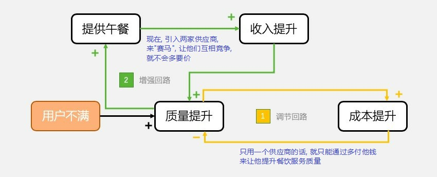

---

==== 群体压力之下,  如何让员工说出真实的想法？

省理工学院教授库尔特·勒温（Kurt Lewin），对此做了深刻研究：群体动力学。

[cols="1,3a"]
|===
|Header 1 |Header 2

|1. 魔鬼代言人（Devil's Advocate）
|就是故意唱反调的人。被领导安排“故意”而不是自己“有意”唱反调，他就没有了“群体压力”。就算这些反调，不着调。

后来很多人重复了阿希实验。结果发现，实验的6位助手中，只要有一位提供了不同答案（即使错误），受试者表达不同意见的勇气都会大增。

|2. 头脑风暴（Brainstorming）
|核心是：1）重量而不重质；2）提出而不反驳。

|3. 名义群体法（Nominal Group Technique）
|流程是：

1. 在进行任何讨论之前，每个成员先独立写下自己的观点；
2. 然后把观点交给群体，并逐一向大家说明自己的想法；
3. 然后开始讨论；
4. 最后，每个成员独立把各种想法排序，得分最高者作为群体决策。

“先写观点，而不是先讨论”是关键. 讨论依然必要，但没有一个观点被放弃。
|===

---

== 如何建立自驱力？

硅谷投资人本·霍洛维茨在他的书《创业维艰》里说：“在我担任CEO的8年多时间里，只有3天是顺境，剩下的8年几乎全是举步维艰。” +
如果你用财富、声望、滑雪、休假这些不知道有或没有的创业回报，作为激励自己的增强回路，很可能坚持不了8年。

*创业，是用不确定的风险，对赌不确定的收益。创业时，你无法收获确定的创业回报。你唯一能确定获得的，就是创业过程本身。*

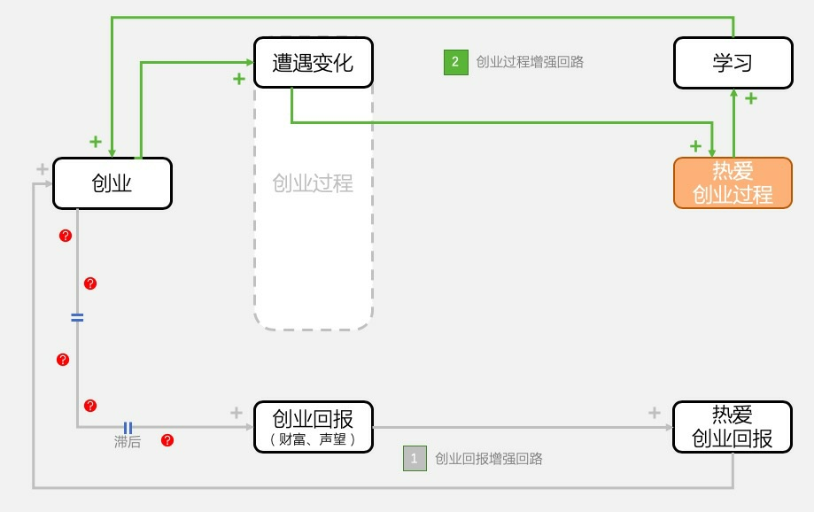

如何判断一位高管，是否有创业之心，心中有汹涌的“创业过程增强回路”，可以做“合伙人”，还是只有“创业回报增强回路”，只能打工呢？  +
用三个黑箱测试来筛选:

[cols="1,3a"]
|===
|Header 1 |Header 2

|1.变化黑箱
|遭遇变化黑箱，真正热爱创业的人会兴奋。天啊，又可以“学习”新东西了。

|2.挫折黑箱
|吴军曾说他判断一个项目能不能投，要看给这个人安排一些脏活儿、累活儿，他能不能坦然接受，这也是一种黑箱测试吧。

|3.动力黑箱
|
|===

*这种忍不住缩小期望与现实之间差距，否则就“如鱼鲠在喉、如芒刺在背”的力量，就是“结构性张力”，它就是增强回路系统里的“元动力”。*

---

