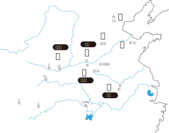
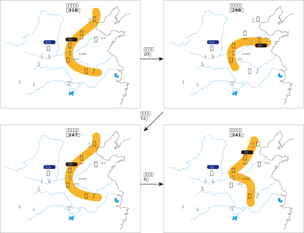
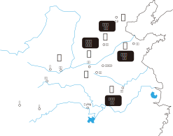

= 秦汉
:toc:

---

== ------- 秦 -------

== 秦穆公(在位 前660-前621年)

晚年称霸西戎

相关人物: 百里奚, 蹇jiǎn叔

---

== 秦孝公

各国国君, 为了控制贵族侵权, 就使用"法家"来约束他们. +

楚国 -> 吴起 +
韩国 -> 申不害 +
魏国 -> 李悝(虽然拼音是kuī, 但要念"克") +
秦国(秦孝公) -> 公孙鞅(商鞅)

==== 商鞅

商鞅变法: +

- 不立军功则无贵族身份
- 前352年,攻魏国, 胜. 检验了变法的实效性. 秦迁都咸阳. 借此机会, 公孙鞅将秦国分为31个县, 由中央派官吏直辖, 不分封给贵族(即, 中央集权).
- 前430年, 又伐魏, 大胜. 魏国被迫迁都大梁(开封).
- 反讽的是, 公孙鞅与封建制度敌对, 自己却被封到商县. 所以后人称为商鞅.
- 秦惠文王做太子时, 因犯法而累受商鞅处罚. 他即位后, 进行报仇, 诬告商鞅谋反. 商鞅逃回自己封地, 起兵抗秦, 兵败被杀. 尸体被车裂.

后人评析: 商鞅的变法, 重"术"(军事政治上), 而缺乏教育和文化上的变革, 也导致秦国世风颓坏. *这也与当时改革领袖理论的贫乏, 有很深的关系.*

---

== 秦惠文王()

宰相为公孙衍(绰号:犀首). 之后, 被张仪取代. 公孙衍愤而去东方, 鼓动其他各国一致反秦(即"合纵"), 秦国张仪则用"连横"来应对.

==== 公孙衍

公孙衍的事迹:

1. (前323年) 团结五国(魏, 韩, 赵, 燕, 中山)的国君, 互相承认为王. 即"五国相王".
1. (前318年) 联合五国(楚, 韩, 魏, 赵, 燕)出兵攻秦 (第一次合纵).

---

== 秦昭襄王(秦惠文王之子武王的弟弟)

秦昭襄王时代, 是秦人向东扩张的全盛时代.

他把楚国削去 1/4 +
把魏国削去 1/2 +
把韩国削去 2/3 +
把赵国削去 1/3  -> 长平之战(前260年. 秦白起vs廉颇/赵括(纸上谈兵))

合纵(东方各国): [南<-->北] 的联合 +
连横(秦): [西<-->东] 的联合

合纵的行动, 前后共有4次:

---

==== 战国四公子

|===
|Header 1 |Header 2

|齐 / 孟尝君
|- 鸡鸣狗盗 +
- 领导第一次合纵攻秦(前298年)

|赵 / 平原君
|- 前257年, 秦围赵国都城邯郸, 平原君率毛遂等赴楚求援.  +
毛遂威胁楚王"王之所以叱遂者，以楚国之众也。今十步之内，王不得恃楚国之众也，王之命县于遂手。"  +
(大王（你）敢斥责（我）毛遂的原因，是由于楚国人多。现在，十步之内，大王（你）不能依赖楚国人多势众了，大王的性命，悬在（我）毛遂的手里。)

|魏 / 信陵君
|- 前257年, 秦围赵国都城邯郸, 平原君也派人到魏国求援, 信陵君偷魏王的兵符, 领军救赵. +

- 前247年, 秦攻魏, 信陵君主持"河外之战"抗秦. +

- 领导第三次合纵攻秦

信陵君死后18年, 秦灭魏.

|楚 / 春申君
|
|===

---

====

84

image:./img_history/中国历史_1-00.svg[700,700]

