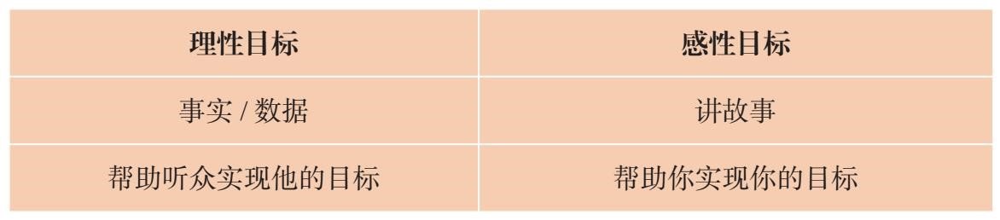
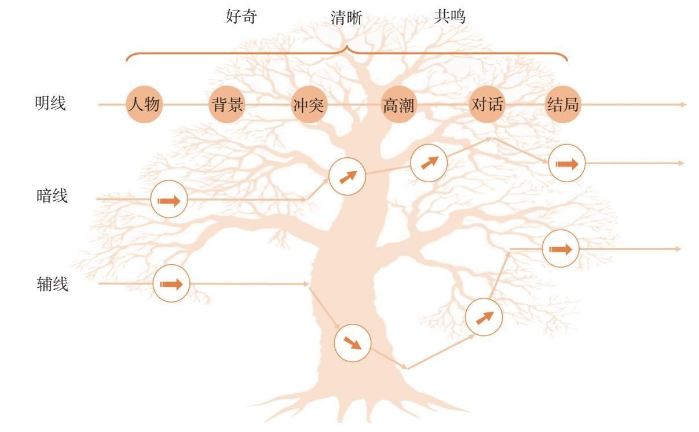
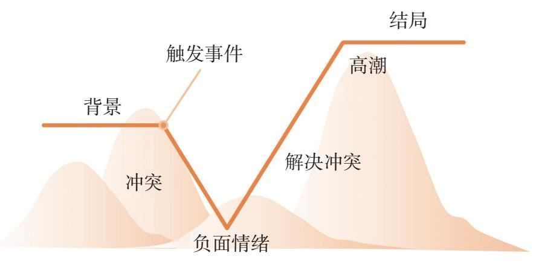
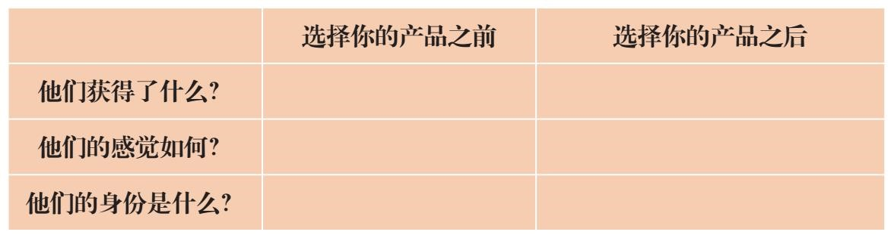

= 故事力 (问题 <- 解决方法)
:toc:

---

系统框架不重要, 解决问题才重要! 要以问题为出发点, "以终(解决问题)为始".

---

== 我们在做抉择的时候，大多靠的不是推理，而是直觉。 <- 则,解决方法 : 只有情感, 能带来直觉; 而只有故事, 能创造情感(感动; 煽情; 贩卖焦虑).

[cols="1a,1a"]
|===
|问题 |解决方法

|- 你用数据解释A方案比B方案好。你老板却提出其他奇奇怪怪的理由证明B方案更好. 现在你知道为什么了吧？ *你总想着用数据和事实说服他的“脑”，却并没有打动他的“心”。*  +
人类天生讨厌被别人说服。 *图表数据固然重要，但再多的数据也无法激发出情感和感受。正所谓没有心动，就没有行动！*（No emotion，no action.）

- 他的叙述线非常清晰，故事的6大要素也非常完整，*可就是没有打动人。因为他的故事缺了一条情感线，也就是他在这个事件中的情感波动。 你自己都没有调动自己的情绪，因此无法调动起听者的情绪感受。* (这就是新闻播音员, 和访谈类节目主持人, 带给人的不同感受. 明显后者要更打动人)

- 纽约大学社会心理学家乔纳森·海德特说：“*人类大脑是故事处理器, 而不是逻辑处理器。*” *我们在做抉择的时候，大多靠的不是推理，而是直觉。*

- 每天，职场上什么"对事不对人"？决策对的就是“人”. 选人用人、升职加薪的时候，都是"对人"的。

- 很多决策都不是非黑即白，非此即彼那么绝对的。给谁升职加薪，买哪个销售的产品都有很多不确定性。*当决策者面对不确定性因素时，大部分情况下会用直觉来填补这些未知。直觉就是一种“感觉”，并不是思考出来的。事实上，很多时候我们只不过是用数据和事实来证实自己的直觉。*

- *他们明明是用心做的决定，说出来的“走脑”理由, 只是为了给自己的决定找个合理化的解释。*

|- 我们无法通过智力去影响别人，情感却能做到这一点。而 *故事能承载很多情感.* 一个强有力的故事，能够激发我们的情绪.
- 房子是个冷冰冰的东西，是事实，没有故事. 而家是想象, 是有故事,有温度的.  +
家就应该要有家的感觉，所以那些鲜花啊，音乐啊，就是为了营造家的感觉。
- 如果他不为你的故事所动，就一定不会为你的主张所动。就像看电影，观众需要和他们喜欢的角色建立联结.

|===

[cols="1a,1a"]
|===
|问题 |解决方法

|-  “零散的知识和事实是非常难记忆的。”除非把一件件事情放进构造好的模型里，否则人很容易忘记。
|- 说故事, 比单纯的讲事实, 更能让人记住.  *故事就是一个很好的记忆模型。*
|===

---

== "影响人"的流程

==== 1. 解决问题: 吸引对方的注意力

只有先做到第一步(吸引对方的注意力, 让他们听到你说的)，才有机会做第二步(让他们记住、认同、埋单)。

[cols="1,3a"]
|===
|方法 |Header 2

|激发好奇
|好奇心来源于‘认知差距’.  +
即, 要给人制造十万个“为什么?”和“后来呢?”

|要不断制造冲突, 和出乎意料的转折. *无冲突，不故事*
|你是在讲故事还是在叙述? +
*只有“因为”+“所以”, 就不算一个故事*——因为我想融资（目标），所以我想见你（结果），这只能算是一个叙述。 +
那什么是故事呢？在“因为”和“所以”之间加一个“但是”，这个“但是”就是故事所必备的转折、冲突、矛盾。
|===

---

==== 2. 解决问题: 触发情感 (触发感动 / 贩卖焦虑)

任何关系，合作关系，都是建立在信任的基础之上的。*别人需要先相信你这个人(首先需要建立起双方的情感联系)，才能相信你后面想要向他们传递的观点。*

麦肯锡的信任公式: +
信任"（trust）=资质能力（capability）×可靠性（reliability）×亲近程度（intimacy）/自我取向（self centered）

[cols="1,4a"]
|===
|Header 1 |Header 2

|资质&能力
|资质: 也就是你拥有的资源。 +
能力: 别人选择和你工作，目的是产生结果。

|可靠性
|一个人做事的靠谱程度

|亲近程度
|你跟别人越不熟，赢得信任就越难。

|自我取向
|看一个人做事是否经常"以自我为中心"。而那些心里没有别人，说话、做事处处以自我为中心的人，是很难赢得他人信任的。
|===

一开始, 你无法用行动证明, 只能用说的, 则故事是建立信任的捷径 (好的演讲, 能立即令观众对演说者建立起好感).

[cols="1,3a"]
|===
|方法 : 如何触发情感 |Header 2

|只有冲突和解决冲突, 才能够激发情感。
|- 好的故事, 需要有"价值观"层面的冲突和挑战, 要让听众感觉到他们所关心的价值观受到挑战。
- 实验组的人在观看视频的时候, 体内被激发出两种激素，一种叫"皮质醇"，是由紧张和压力激发出来的；另一种叫"催产素"，是由爱和信任激发出来的，能够促进对别人的共情。 +
*这两个环节, 其实就是故事里的“冲突”和“解决冲突”。因为只有冲突和解决冲突, 才能够激发情感。*

- 有意义的冲突一定是基于选择的冲突。如果在一个问题上，摆在你面前的只有一个选择，那也就无所谓冲突。即, 必须是两难的境地.

- 有意义的冲突要足够有分量。换句话说，主人公如果无法克服这个困难，他的生活就会受到实质性的影响和打击。

- 选择能够突出这个冲突强度的背景。原理是, 需要有"对比", 欲抑先扬, 欲扬先抑 (喜尽才能悲来).

- *冲突不要一次讲完，而是要拆分开来一点一点说，* 吊着听众的胃口。*一系列的冲突, 应该是有层次的，有设计的，层层递进的。* +
<功夫熊猫>的第一个冲突，是梦想和现实的冲突。最后，在他找回自己的动力之后，再次面临能力的考验，观众又开始担心他到底能不能打败雪豹. *就是一波未平一波又起，不断地有新的冲突出现，吸引着人不断地想往下看.*

- 很多人的故事之所以讲得无趣，是因为他们太急于抖包袱、给答案，听众积累的好奇心还不够。

|创造"趋利避害"的想象感 (创造焦虑)
|- 我给老板讲小雯在日本做项目时遇到的挑战，以及她是如何最终解决问题的故事。我这样讲仅仅是为了让老板知道她是能干的人吗？如果是这样的话，那我就直接告诉他最终的结果就行，为什么还要绘声绘色地描述这个过程呢？ 我需要让老板想象一下，少了这样的一个人，有可能会有什么样的损失。

|产生共鸣
| - 好莱坞剧作家罗伯特·麦基说：“人们对权力毫无共鸣。*人们反抗权力，崇拜权力，但不会和权力产生共情*.

- 引起共鸣的第一步，就是了解对方到底关心什么，害怕什么。你希望你的故事能让听众有代入感，*你得站在听众的角度去思考问题(凡事都要做"换位思考")*。

- 怎样才能让听众关心主人公的命运呢？只有当听众意识到主人公在个性、能力、动力这三个维度有所不足的时候，才能感受到这个冲突真的很难克服。

- 戴夫的死深刻地改变了我。我终于明白了什么叫切肤之痛，也体会到痛失所爱的残酷。但我也明白了，当生活给你当头一棒，堕入悲伤之海，你能做的就是奋力游向水面，大口呼吸。*我明白了，即便悲伤至空虚，或是面对巨大挑战，你仍然可以选择快乐和有意义的生活。*

- 你要非常精准的选用, 能准确描述你情绪的词汇. 不同的词汇, 几字之差，表达出来的意思就完全不一样的。这要求我们在生活中提高对自己情绪颗粒度的认知。

|===

---

==== 3. 解决问题: 使他人做出决策

你讲故事的最终目的, 就是为了影响他人做出决策(或价值观上的改变) :  -> 吸引注意 -> 触发想象 -> 产生情绪 -> 做出决策

我见过很多员工，每次给老板汇报工作都是把事情说完了就结束，完全没有最后的总结. 总结有两种: 1. 总结经验教训; 2. 提出行动建议。

*如果你讲故事的本意就是要资源，要支持，那你就应该在最后明确地提出你想要对方做的事.*

[cols="1,3a"]
|===
|方法 |Header 2

|*用故事来树立观点, 而不点破观点，让听众自己得出结论.*
|- 说服他人做出决策是一个“推”的策略，讲故事则是一个“拉”的策略。 +
- 大道理谁不会讲? 这个世界不缺道理，缺的其实是那个能将道理讲成故事，并让人信任的人。
- 你讲好一个故事，不需要在前、在后、在中间提到这个道理，听众从故事情节中就可以领会它。

|**通过一明一暗、一虚(故事的理性目标) 一实(故事的感性目标) 的故事架构**来实现 -> 表现你的才干，表达你的需求.
|- 你的理性目标: 注重事实, 数据, 逻辑
- 你的感性目标: 你想从中获得什么? 比如, 让领导意识到事情的严重性和紧迫性从而能尽快做出决定，或者是让他意识到你的能耐有多大，你的态度有多积极等这些难以量化，甚至难以说出口但又非常重要的目标。 这个目标我们通常不会摆在明面上，而是让对方体会出来的.

那怎么才能在讲故事的过程中, 同时兼顾理性目标, 和感性目标呢？这就需要你的故事有三条线：明线、暗线和辅线.

- 明线 : 通常是故事的情节发展线，谁在什么背景下，做了什么，最后有什么结果。
- 暗线 : *故事的暗线可以有很多种—— 可以是故事中人物心理活动的变化，思维意识上的改变，或者人物之间关系的微妙改变. 这些改变像一条暗流一样在故事中涌动。 +
但无论这个暗流以什么形态出现，它都是围绕着“情感”变化的。*
- 辅线 : 演讲者的身体姿势, 语调等.

- 在工作中，如果我们做了100分，却只能讲出80分; 人家做了80分，却能讲出120分来，这个差距最终会体现在薪酬和职位上。

|===

---

== 应用 -> 面试

==== 公司为什么挑选你? 因为你就是最适合放进那个坑里的萝卜。

站在企业和HR的角度考虑，面试的唯一策略, 就是要让面试官认同你的能力、潜力、价值观, 是跟公司和岗位的要求是相互匹配的. +
至于你有什么爱好，对HR来说，根本不重要！

HR常用这样一个工具——STAR模型。

- S：情境（situation）: 要求求职者描述曾经遇到过的一个情境，讲清楚相关的背景信息，以及自己在这个情境中的角色。
- T：任务（task）: 说明在上述情境中承担了一个什么样的任务。
- A：行动（action）: 说明针对这样的情境和任务，你采取了什么样的行为。
- R：结果（result）: 说明所采取的行为取得了什么结果。

STAR模型不就是一个"故事"模型吗？冲突越强，体现的能力就越大.

我在面试之前仔细了解到这家公司目前处于变革阶段，因此，我给面试官讲了一个我自己经历过的变革故事。

---

==== 证明“我有资历”或“我很靠谱” <- 用“我是谁”的故事来表明

重点不是罗列出我曾经做出过什么丰功伟绩。而是要放在我遇到了多大的问题，即故事的冲突，之后我又是如何解决的。即, 讲述重点不在于成功的结果, 而是如何成功的过程.

.. *墙在那里不是为了阻碍我们，而是让我们有机会展示我们想要什么.*

.. *生命是一场盛宴，大多数人却活得像乞丐一样。*

---

==== 你的价值观 <- 用“我为什么...”的故事来表明

面试中常问的：“你为什么选择我们公司？为什么想要应聘这个工作？” 问的就是除了钱之外，还有没有其他的内在动力驱使你？你的价值观与公司的价值观和文化是否匹配？当公司遇到挑战的时候，你是否靠得住？
.. 面试是一个"双向选择"的过程，也是候选人对于"自己和公司文化是否契合"的判断过程。

*价值观跟免疫系统一样，只有在关键时候，尤其是面对"艰难选择"的时候才起作用。冲突越强，体现出你的价值观也越强。*

....
“我是谁”的故事模型（价值观故事）
_____（价值观）对我很重要
即使面对_____（冲突，困难）
让我感觉_____（负面的情绪）
我依然遵循_____（体现这个价值观的行为）
....

---

==== 你的学习和领悟 <- 用“我的改变”的故事来表明

你从中学到了什么，从失败中领悟到了什么.

....
当初/本来_____（背景，原本处于平衡状态）
后来/有一天_____（触发事件）
我面对_____（这件事的困难/冲突）
结果_____（失败或不好的结果，可能是因为你做错了什么，可能并不是你的错）
这让我感觉_____（负面情绪）
这让我意识到_____（领悟到的道理/学习到的经验）
后来，我_____（应用道理和经验做了什么改变）
从此以后，我_____（已经获得或未来有希望获得成功）
....

生活不是发现你自己，而是创造你自己。
——萧伯纳

---

==== 如何讲述"转行"的问题

在转行上, 一个特别难以突破的点就是让别人理解你的转变: +
(1) 这个转变对我很重要，为什么别人就是不理解？ +
(2) 虽然我看似没有相关的经验，但我真的可以做到，为什么别人就是不相信？

*从能力上来说，我们评判自己能做什么，依据的是我们认为自己能做什么，而别人判断我们，却是依据我们曾经做过什么。*

讲述转行故事的关键, 就在于要让听众理解“我是谁=我的过去+我的改变”. *重点就在于要突出“改变”的原因，“改变”的实力, 和“改变”的过程。*

1. “改变”的原因 : 多强调内因，少谈外因.
2. “改变”的实力 :
3. “改变”的过程 : +
(1)（内在动力驱使的改变：想要帮助他人） +
(2)（遇到的冲突） +
(3) 我和朋友尝试过群发短信，和不同的平台合作线下沙龙，向一些企业进行宣传，可现实无情地告诉我：能够为教练花钱埋单的人少之又少。在一个不成熟的市场里，我们得先让大家知道“教练是什么”，然后才能让别人知道“我是谁”，最后才有机会让客户为我埋单。（从中学到的道理） +
(4) (她的建议）

上面的案例中, 虽然她从来没有做过推广，也没有做过销售，但她在自己的故事中展现了：

1. 她对教练这项事业有热情和完善的认知；
2. 她学习了教练，具备做教练的专业技能；
3. 她努力开拓客户的尝试，虽不成功但让我看到了她的市场意识和行动力；

用英雄之旅的故事模型, 帮她重塑了她的蜕变故事。

---

==== “你最大的缺点/弱点是什么？” -> 可控的“弱点”

要找一个不致命的，经过努力已改进, 或可改进的、可控的弱点来讲。 +
在这个故事里，我看似在讲“弱点”，但是通过寻找冲突解决方案，我的这个“弱点”变成了一个可控的“弱点”。 +
.. 从那以后，每次我(身为管理者)脑海中冒出来“哎，我有一个新想法”的时候，我会在脱口而出前问一问自己：这是“方案”，还是“决策”？

讲的过程中要通过“换框”将听众的注意力转换到“解决方案”上。

---

== 应用 -> 创业者从投资人那融资

红杉资本的创始人沈南鹏，说过：“一个项目是否值得投资，我有三个判断标准：

1. 创始团队是否优秀， <- 是主观的判断
2. 产品市场空间是否足够大， <- 是基于事实和数据的想象
3. 公司未来的商业模式是否有吸引力。 <- 是基于事实和数据的想象

这个标准10多年来没什么变化。”

要想讲明白这三个标准，是不是哪个都离不开故事？

他说：“投资在早期更多的是一种艺术，不是数据，不是科学，是对这个行业的想象力。” 比如像外卖、团购刚起来的时候，我们是无法量化市场规模的。

---

==== 创始团队是否优秀? 本质是问: 你持久的动力来源是什么?, 面对困难阻力,你的靠谱性如何? <- 所以你要讲3个故事: 证明你动力, 能力, 承诺的故事.

是什么触动了你去创业？你的动力是什么？你有相应的能力吗？ 遇到阻力你能坚持吗?

公司创始人, 是投资者最大的风险之一。草根创业者画的大饼，**大饼只是基于完美的假设，现实比这个残酷得多。**所以投资人投的从来都不是公司，而是人。

---

==== 证明你"动力(来源)","景愿"的故事

- 你创办这家公司的使命是什么？换句话说，你因为谁需要你而存在？

.. 我靠打杂工维持生计的父亲躺在床上，他在一次配送途中把脚踝摔断了，从此他也失业了。由于没有医疗福利，家里的经济状况更加拮据。我永远忘不了这一幕，我父亲是个快垮掉的蓝领工人，父亲没有医疗保险，没有工伤赔偿，什么都没有。他的价值没有得到体现，他没有受到尊重，这让他感到愤怒。所以我下定决心，我决定创立一家成功的公司，为所有员工提供医疗保险福利。

- 当别人请你简单介绍一下你的公司时，他们问的不是一个“怎么”（how）或者“什么”（what）的问题，而是一个“为什么”（why）的问题。*投资人问的是 : 使命是：你为什么存在？愿景是：你要带着客户去哪儿？ 为什么要去那儿?*

.. 你要把你的顾客, 想象成一个搭顺风车的陌生人，他一招手，你把车停在路边要载他一程，**此时他心里最想知道的问题就是你这车要往哪儿开。**而如果你跟他说你这车是怎么组装出来的，有什么功能，他根本就不会关心，他只想知道你是否能带他去他想要去的地方。

.. 最简单的回答就是告诉你的投资人，*你所服务的客户有什么目标，有什么痛点，你的产品或服务如何帮他解决痛点达成目标。这就是你公司存在的价值。*

.. 徐小平说：“这个问题背后的问题是，我想找到一个买它的理由。你说的大数据、摄像头等，都不是买它的理由，简单易用，*改变中国人的烹饪习惯，才是买它的理由！*”

- 投资人是很现实的，**他们不在乎你的技术有多领先，有多少专利，他们只想知道客户到底愿不愿意为你的技术买单，**你的产品或服务可以用最新的技术来实现，甚至新到投资人都没听说过，这没问题。但**你要解决的消费者及客户的痛点或目标, 必须是投资人能听懂的.**

.. 对投资者来讲，越大的投资就会越谨慎，*如果他们听了几秒钟还不知道你的产品或者服务到底能做什么，就会格外警惕。如果听了几分钟之后还不明白，他们可能就放弃了*。

- 在介绍产品的时候，**最容易让别人听懂的故事逻辑就是“雪中送炭”的故事。**从一开始就把“主人公（目标客户）”和他们的“目标或痛点”讲出来，然后把“产品如何能够雪中送炭”这个逻辑点出来，让投资人一下子就能理解。

.. 在阿里巴巴的美国上市路演中，故事讲的是一位在四川德阳的“玻璃女孩”丁红玉，她是个画家，但是之前很难找到买她画的客户。然而，淘宝帮她找到好多客户。这就是阿里的愿景——让世界没有难做的生意。

- 销售的最高境界：让客户讲你的故事 +
口碑，是一个品牌最好的广告。**你的故事讲得再好, 都没有用户自己讲得好。**消费者更倾向于相信消费者，这就是为什么阿里巴巴在美国上市时，**马云的路演视频里大篇幅都是阿里的客户讲自己作为小企业的故事。**这些普通人，每个人讲的都是自己的冲突，**那谁来"雪中送炭"解决他们的冲突呢？阿里巴巴！**没有故事的品牌是没有灵魂的.

---

==== 证明你"能力"的故事

但无论哪个行业，有些通用的能力是必须的。
沈南鹏所说，以下4 种创业者，他不会投：

. 不会定战略的CEO
. 不懂产品的CEO
. 不会带团队的CEO
. 不会算账的CEO

他们用了我们的视觉识别技术。我们这个项目的经理每天在现场讨论，一个一个解决问题. 美国食品和零售行业最大的企业知道我们的服务能力之后, 也选择了我们。 +
这个故事简单地阐述了三点：第一，我们的团队都是懂技术的大学霸；第二，我们曾经征服过很厉害的客户；第三，我们的客户服务意识非常强。

---

==== 证明你"承诺"(可靠性)的故事

**财务报表看的是现在，而投资人更关心的是，后面无论企业遇到任何困难，你作为创始人是否能够坚持下去。**换句话说，他们更关心你是否豁出去了，并百分之百地投入这家公司。

---

==== 产品市场空间是否足够大?

---

==== 公司未来的商业模式是否有吸引力?

巴菲特有一个最基本的投资概念：“永远不要投你不懂的生意。”

---

== 应用 -> 领导的管理学

新的领导来了，团队会想知道:

[cols="1,3a"]
|===
|Header 1 |Header 2

|1.你是谁？
|我的现在= 我的过去 + 我的改变

|2.来干什么？
|你想带领大家进入一个什么新的状态?  你自己想获得什么? +
我的未来= 我的现在 + 团队愿景

|3.要去哪儿？(你的愿景 )
|你想为自己和世人创造什么新的生活状态?
|===

---

== 应用 -> 销售

销售是一个复杂的过程，每个阶段都会面临相应的挑战，因此需要讲的故事也不一样。

做销售必须脸皮厚，*你得时刻做好被拒绝、被挑战的准备。好的销售对于这些挑战应该是早有预期的，因此也应该为每个挑战准备相应的故事，来应对它们。*

---

==== 初次见面, 对方心里会对你有疑问：“这个人值得信任吗”? “这个人值得尊敬吗”?

没有一个客户会相信一个毫无权威的人讲的产品和品牌。你需要一些能够打造自己权威性的故事。

最好的办法就是讲你的工作是如何解决你所服务的人群的，讲你帮助他们解决了什么困难, 有困难就有冲突，有冲突就有了故事。

---

==== 如何"帮客户发现他的需求缺口"?

帮助顾客"发现出"到他可能有的潜在需求, 以及确定他到底想要什么。通过讲“我们都帮到了什么人”的故事，可以让客户在别人的故事中找到自己的影子，逐渐确定自己到底想要什么。

观众最大的愉悦就在于自行发现，而不是被动接受。
——亚里士多德

只有在客户知道自己想要什么之后，下一个问题才是“你这个产品/服务能帮到我吗”。当他和他想要的东西之间有一个缺口出现时，销售的机会就来了。

---

==== 你不是在"买产品", 你是在"帮客户成功"! -> *所有要先打破客户的"平衡的心理状态", 令其倾斜. 然后"雪中送炭".*

- 产品说明书只是"攻脑"(理性);  帮客户成功, 才是"攻心"(促动趋利避害).

- *怎样客户才会从平衡的状态中出来呢？这就需要有一个"冲突触发事件"的故事, 来激起负面情绪。(犹如古代的说客, 激发焦虑)* +
*因为很可能客户不会经历或者说还没有经历和你故事中一样的冲突。但是冲突中的情绪谁都有，也是最容易感染人的。 一旦潜在客户把自己和故事中的主人公联系在一起，就建立了联结，这种联结就是"共鸣"的基础。* 让他们边听边想：如果是我或我们公司，在这种情况下会怎么做。一旦他们把自己代入你的故事，你就成功了一半。 +
这个触发事件在个人层面可能是身体状况、就业状况、家庭状况，也可以是企业层面的，比如业绩的上升或者下滑。可以是内部的，比如招聘、供应链、信息安全带来的变化，也可以是外部的，比如竞争对手、投融资、并购、拆分、重组、政策法规带来的变化。

- 人类本能的动力有两种：趋利，避害. 如果讲故事的人没有清晰地让听众知道，假如他不克服问题，将有哪些后果等着他们(挖大坑)，或者虽然前路艰辛，但克服了困难就会有好的将来(画大饼)，那么听众就不会有动力做出改变。 +
常用的工具就是提问：“如果×××，会怎么样？” 让听众产生想象.  +
.. 如果我们团队拥有了最先进的人工智能技术，能够快速客户化用户的报表，您想一想会怎样？（画大饼）
.. 如果我们没有及时接受这样的培训，让竞争对手捷足先登了，他们开发出能够快速客户化用户报表的产品，您想想我们会怎么样？（挖大坑）

- 我们在教练高管演讲的时候，会提醒高管**在演讲中不要总把“我”作为主语。“我可以做什么……”“我可以解决什么……”，这样说只会把自己和听众孤立起来。同样一件事，当你换一个角度说“当你用了这个方法，就可以解决……”, “当你用了这个产品，就能成为……”, “当你用了这个服务，你的公司就能……”时，**不仅是听众听着好听，*你让他们认为你说的事情和他们有关，更是强迫自己站在对方的角度去思考问题。*

- 必须明确地告诉对方，无论你的产品或品牌是什么，最终都是帮助客户在以下几个方面有所收获：
.. 赢得某种力量或地位
.. 获得某人或某物
.. 实现自我

---

==== 让客户"记住你"

一个好的销售故事，一定能够讲到别人的心里。就算当下没需求，没立刻购买，客户也能够记得你。

---

== 应用 -> 做汇报

==== 不要想当然地以为“我的辛苦老板都知道”。其实，他们根本不知道。

所以"结果"要讲, "过程"也要讲!

小孙发现她的老板是典型的“以结果为导向”型人, 因此在对话的开头，小孙应该采用"结论"先行，然后再讲背景和遇到的困难的细节。

---

==== ppt上的数据, 只有事实, 没有结论, 也没有情感

所以你希望管理层从中得到什么结论呢？
当你呈现一份数据的时候，是为了比较、否认还是证明？

数字是静态描述，光看这些数字并不能给听众创造新的洞察(正如奥美那个数据分析师所言, 数据是死的, 从中的洞察才是你要做的)。你需要做的是把静态描述,转换成动态故事; 把数据转化成戏剧。

---

==== ppt上全是数据, 整个汇报缺乏一条清晰的故事线.

所谓 *"故事主线", 就是“一句话描述人是为什么和如何从一个情况变化到另一个情况的。*”(《故事》作者罗伯特·麦基)

*你要告诉听众，他们“为什么”以及“如何”从当前,到未来。如果你汇报的内容, 不能帮助任何人使其发生任何变化，那么这个汇报就是浪费时间。*

- 最近咱们部门面临的一个(...)挑战，这对我们造成了(...)影响。针对这个问题，我们这个新项目可以(...)，从而解决这个挑战，并为公司带来(...)更好的发展。 +
当你有了这样一个故事线，接下来就可以把数据放到这个故事线里支持你的论点了。

*所以, 要先有故事, 再找数据. 即, 用数据支持, 来证明你的提议与目的.*

反之, 如果是财务报表类分析, 就是反过来的: 先有数据, 再挖掘数据背后的故事，找出是什么成就了这样的结果. 同样存在一个故事.

---

==== "这和我有什么关系?" / “那又怎样？”

你以为很重要的事，在对方那里，就是一个“那又怎样”? 老板还没有认同“为什么”你需要这个培训呢，*这个培训有多好，价格多便宜，跟他有什么关系呢？没有解决老板所关心的目标、动力和痛点*, 为什么要花钱、花时间让你去呢？

卡耐基说过：“如何让对方心悦诚服？答案只有两点：（1）听对方说他想说的事情；（2）*站在对方的立场说他想听的*。”  +
*所以要站在老板的角度去看一看，他的KPI是什么，为了达成他的目标，你要想的, 能否同时帮助他实现什么？ 即，需要你在看似两个完全没有交集的故事中找到交集，这也就是我们常说的“双赢”。*

只有把“我想要”和“你需要”挂钩，让你的听众感受到你讲的故事“和我有关”.

很多事情在你和老板开会讨论之前, 就大局已定，开会就是走过场而已。如果你平时不注意和老板或同事建立并维护关系，不给他们讲你的故事，也不关心他们的故事是什么，他们的痛点是什么，总是一上来就要钱、要人、要资源，谁愿意听呢？

---

== "讲故事"的一些注意点

讲故事, 是凝聚了情商、沟通力、逻辑组织力、战略性思维等的综合能力。
故事力存在于“高概念”和“高感性”的交汇处。能锻炼以上所有能力.

在平时搜集、积累故事素材.
关键看你是不是有这几个心：用心发现，诚心反思，全心感受，精心收集，热心分享。

---

==== 背景信息太啰唆

好莱坞剧作家克里斯托弗·沃格勒在总结了上百部好莱坞电影后指出: 15%是一个相对不多不少的比例，即电影开始的前15—20分钟通常是用来铺垫背景的。 +
假如你给老板做一个10分钟的汇报，那背景顶多占1分30秒。 +
如果你给面试官用2分钟讲一个自己过去的经历，那背景顶多占20秒。

那么在短短的时间内，你需要铺垫什么信息，才不会让听众觉得摸不着头脑呢？
1. 时间。
2. 地点。
3. 人物的关系。
4. 与冲突直接相关的信息。

---

==== 避免故事啰嗦

为了避免过于啰唆，故事里的细节描述最好集中在三个地方：

1. 关键人物 : 细节对于引发共鸣来说, 很重要。
2. 关键动作 : 电影在关键之处，会用特写或慢动作来强调. 所以关键时刻,要通过细节去“呈现”那个时刻。
3. 关键场景 : 电影里，每当剧情发展到重要关头，会从音乐到镜头技巧, 演员动作, 都紧张起来，调动你的情绪和状态.

一个故事里如果有很多细节描述，那不会变得很啰唆吗？*回到我们的黄金原则：故事中任何一个元素 -- 包括细节，无论讲得多好，如果不能帮助听众体会到你讲故事的最终目的，也就是你想通过故事来传递的信息，那就都是多余的。凭这个标准，你就可以判断出，在故事中哪些细节是必要的，*

---

==== 语言越简单，情绪表达越纯粹.

在讲故事的时候，越简单的表达越能传递你的情绪。所以，你要学会用简单的词汇把自己的情绪表达出来. (听相声就能发现怎么用最简洁的语言, 在抖包袱的时候, 表达出各种情绪.)

---

==== 人物需要有: 代入感、认同感和辨识度

你说某人特别严苛，那他长什么样？骂人有多凶？你说某人特别难缠，究竟有多难缠？这些都是增加人物辨识度的描述。《红楼梦》里有多少个人物？你能想起来的人物有哪些呢？

用对话代替叙述, 能让你的故事更有活力。一个人用什么词，用什么语调说话，能马上让听众感觉到他是什么人。(如王熙凤)

好钢用在刀刃上 -- 不要让故事里的人物说任何废话, 对话只能用在关键时刻.

如果你的故事非常简练，就只有时间加两句话，那就让你的对手说一句，再让你的导师说一句.

- 戴伦说：“里克，我搞砸了。观众都恨透我了。”
里克说：“所以呢？任何一个喜剧演员，任何一个演讲者，任何一个获得一些成就的人，都有搞砸的时候。所以呢？有什么大不了？”

- 克雷格的女朋友劈腿了，这让他非常生气. “克雷格，从没有人是因为被蛇咬而死，血液里的毒素才是导致死亡的根本原因。你的怨恨就是毒素。你要解毒，就需要原谅她。”

---

==== 善用金句，让你的故事有一个记忆点

“It’s missing sound bite。”（它还缺少一些抓人的东西）. 老板的意思是这个演讲稿缺少金句，就是那些朗朗上口，听完能让人记得住的句子。比如奥巴马在2008年竞选时说的“Yes we can”（我们可以）.

金句不一定是华丽的辞藻，但一定是含义隽永、表达精妙的语句；也是你讲完这个故事之后，最希望听众记住的核心概念，最希望传播出去的观点。比如“生命是一场盛宴”,“成为你故事里的英雄”。

如何才能写出让人记得住的金句，其实是一个关乎心理学和语言文学的问题。

---

==== 清晰：没听懂都是白搭

在你试图影响他人想法的时候，不能将信息一股脑儿都丢给听众，听众不是你肚子里的蛔虫，他们不清楚你的故事的背景, 和你之后会如何发展的思路. 因此你需要带着听众一步一步跟着你走，就像征服一座山一样.

---

==== 自创"术语"问题

很多人在讲故事的时候喜欢用官话、套话、大概念、技术名词，以及一些自己创造出来的词(比如罗振宇)，以显示自己的"专业度"。这些词看似"专业且高深"，然而如果听众听不明白，你这个表达根本就是无效的。

维珍航空公司的理查德·布兰森说：“如果某件事不能在一个信封背面的范围内解释清楚，那它就是垃圾。”

不用庞大的数据和精准的专业名称，而是借用类比、比喻的修辞手法，也可以们把复杂的概念变得浅显易懂，深入浅出.

- “如果我告诉你们我们过剩的水泥有多少亿吨，你们也都没概念。我这么说吧，如果用这些过剩的水泥来建高速公路，那么，这条路可以绕地球4圈。”
- “2000年，全世界5岁以下儿童的死亡人数是1 200万，这个数字到底有多大呢？现在世界上客运量最大的空客A380，坐满时能承载550人。如果今天有个新闻说，一架满载着儿童的A380失事了，乘客无一幸免，那肯定是个惊天的大新闻。1 200万换算到每一天是什么概念呢？这就意味着这个世界上，每一天就有60起这样的事故发生。其实这1200万孩子里，有2/3的死亡是可以避免的，靠什么？疫苗！”

---

==== 讲故事的一个大忌：多个主线对听众来说就是没有主线。

“Lin，where is the red thread？”（你的那根儿红绳在哪儿呢？）“你想表达的整个内容需要有一条主线，就是你想要表达的中心思想. 其他的内容都是上面的珍珠，但如果没有那根‘红绳’，所有的内容就都是散的。” +

其逻辑简化的一条重要原则就是：一个故事，只表达一个观点。如果有多个故事，一定要确定输出的是统一的价值观. 根据逻辑关系，将这些故事有序地串起来，层层递进，让它们串在一根绳上, 而不是一盘散珠。

谨记：一个故事，只能表达一个观点。你不能指望通过一个故事证明你既有团队合作精神，又有创新能力，还吃苦耐劳，这么讲的结果就是，哪个点都没讲好。什么都想讲，反而什么都只是点到为止，什么都讲得不深刻。

---

==== 遵守"以终为始"的故事架构. 迪士尼的首席创意官约翰·拉萨特说：“你在构思故事的过程中，情节可以做大的调整，人物和背景也可以随时改变，唯一不能变的是故事的核心，因为它为其他的一切奠定了基础。”

很多讲故事的人, 一开始就没有想清楚他想表达的核心观念。

应该"以终为始"地来选择相应的故事素材。哪一件事(素材)最能突出你要表达的主题？

- 你是一个销售人员，你要讲一个故事证明你特别有坚持精神，你觉得以下哪个冲突更能体现这一点？
A. 客户说他不需要这个服务，我后来想了一个巧妙的办法让他意识到他有需求。
B. 客户嫌我们产品贵，我后来跟公司商务团队沟通，说服他们降价。
C. 客户说我们的产品不好，根本不见我，但我一直在楼下等他，等他下楼抽烟的时候，冲上去跟他继续说，最后说服了他。 +
+
=> C 最能体现这位销售的坚持精神.
A 的冲突体现的是他的创造力，
B 体现的是他的跨部门沟通能力。

---

==== 好故事，三分讲，七分演

我们是来讲故事, 而不是写故事的，那除了故事内容要精彩，你还得把它讲(演)得精彩。

一份研究指出，想通过沟通让对方感到友善，只有7%靠语言，即你说了什么; 38%靠语音语调; 剩下55%靠肢体语言及面部表情。这些“演”的方式加起来占沟通的93%。

克雷格·巴伦蒂内说过：“人们可能根本记不住你都说了什么，但他们会记住你说话时候的样子。”

这里有一个窍门，就是每说到一个观点，特别是当这个观点是你的“金句”或重点时，一定都要把目光锁定在一个观众身上，不要来回走动或左右乱看。目光锁定，能够起到提示的作用，好像你在告诉观众，我接下来讲的很重要，你们可要认真听了哦。

你演讲舞台上的每一个位置都是有代表意义的，都可以对应到你故事里的一个场景。

- 有一次做了一个《集结号》的场景复原——老班长在牺牲战友的墓碑前哭诉。每次当她说到和墓碑里战友对话的场景时，她都会去舞台上的同一个地点，呆呆地看着那个空的地方，再说她的台词。我在下面坐着，感觉好像那里真的有墓碑一样，特别真实。

戴伦·勒克鲁瓦把这个演讲的特定位置叫“内心视像”，这就是场景定义。在你上场前，就要对你的舞台进行定义和设计。你的人物有多高，哪里有墓碑，哪里有台阶等，都已经在你的脑海里进行了还原。

---

