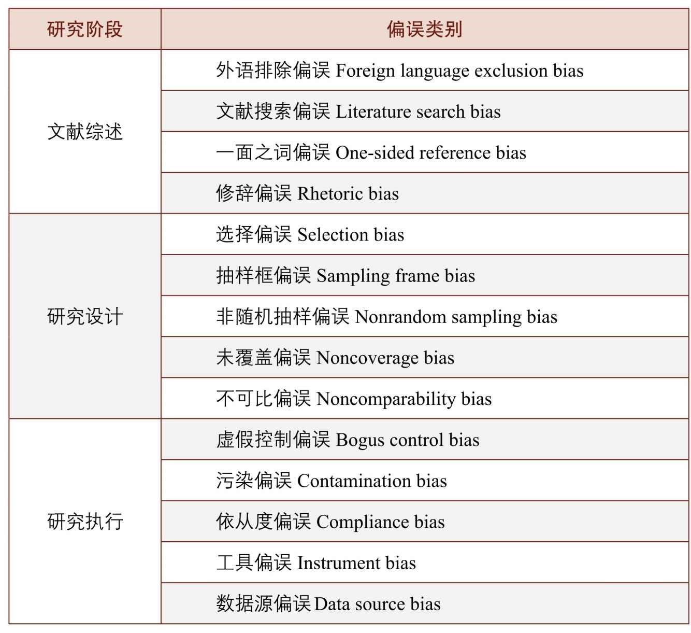
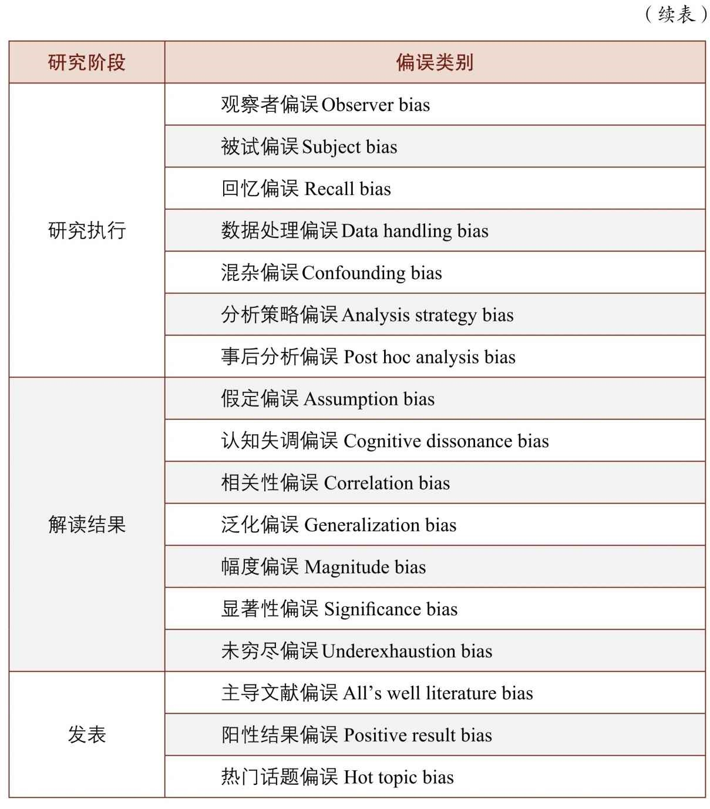
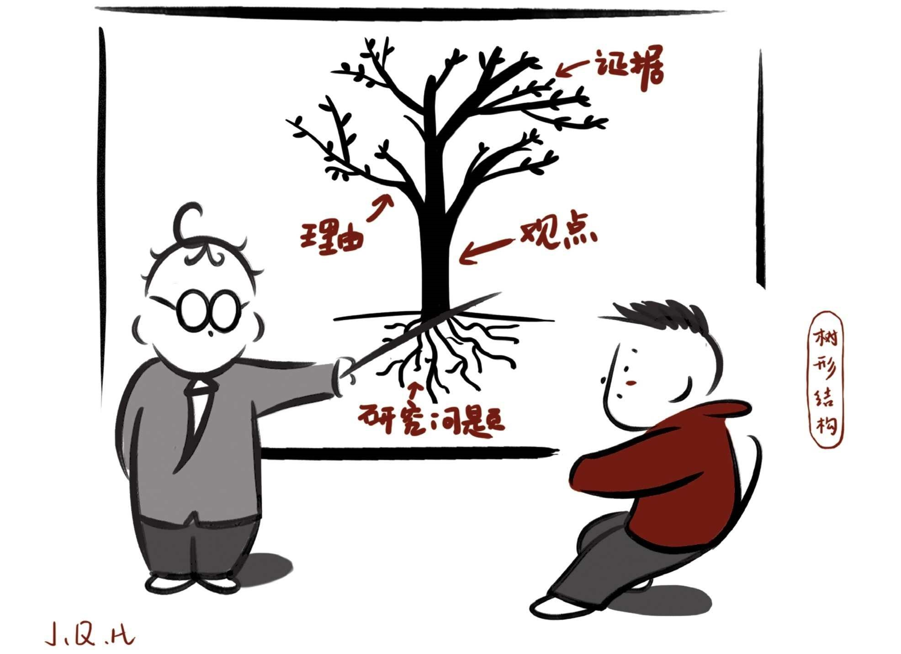
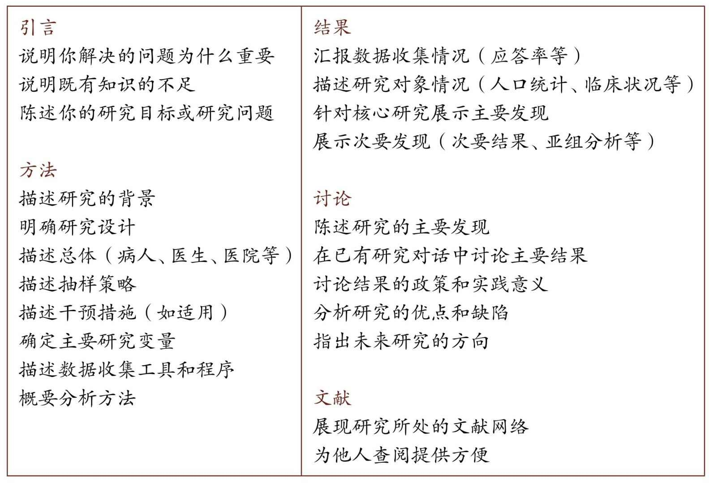

= 问题_(考量)_如何论证与辨识真伪 & 如何做研究(变量关系)
:toc:

---

== 为什么高考作文要被批判? -> 滥情; 空洞; 无论证

原因:

- 高中生的阅读数量少、品质差。
- 高中生被灌输的知识很多都是单维的、苍白的、二手的。

结果:

- 中国学生的套路：很爱用长句，喜欢用各种复杂的术语来重复同一种意思，喜欢诗意的、华丽的辞藻和句子。
- 充斥着泛滥的情感、空洞的表达, 和错误的事实。
- 他们把一些诗化的、一厢情愿的东西拿来说理，成为没有事实依据的强加说理。
- 中学作文"跑题"会得低分. *但真实世界中的生活和商业发展, 是没有一定方向的. 真实世界中, 论文是没有标准答案的，为了探索人类新知, 就要在思想上标新立异而不墨守成规、并能对研究结果自圆其说。*  +
*辩论性话题, 不要问我标准答案，因为这些论题压根没有标准答案。* +
论文研究写作不是请客吃饭，而是要直面问题，引起激烈争论是必然的附带。

---

== 对于书(信息或知识来源之一), 如何辨别其的好坏?

- 伪书: 各种“编著”,“编译”, 靠裱糊匠 Ctrl + C, Ctrl+ V 制造而来的, 都是伪劣书籍.

- 书单的问题: 书单就像药方，得对症才行。书单的人不会了解被推荐人的特点, 拿一张方子来"包治百病"。

---

== 讨论问题, 必须先界定清楚. 否则两人说的对象就不是一回事.

界定和限定（defining and delimiting）的能力非常重要。一个事物缺乏界定，讨论容易变成鸡同鸭讲。

界定时请注意：

1. 搞清概念是什么，不是什么。
2. 思考如何把这个概念变成一个变量。以缘分为例，何为有缘？何为无缘？缘分可以量化吗？

---

== "定义一个概念"的错误方式, 是什么? → 不定义这件事的本质，而只给你归纳这件事的特征.

不要把"对现象的归纳总结", 当成是"对原理的本质分析".

- 比如, 不能用"旧元素的新组合"来定义"创意idea"的意思. 因为"旧元素的新组合"只是创意idea的诸多特征之一，或者说是产出idea的诸多手段之一，单拎出来把它当成定义是不行的。

- 网上的很多文章比如“如何写好公众号文章”之类，给出来的往往都是流于表面的技巧，如“提问式引发思考”, “多做盘点归纳”, “用负面词汇激发好奇”之类。这些东西不是"如何创作"的更高一层的底层逻辑! 只是最肤浅的外在表现。

---

---

== 如何辨别书里所写内容的真伪和价值?

我们可以使用历史学家辨析史料的方法:

==== 1. 追本溯源（sourcing）

即, 对文献的史源（sourcing）, 分析其背景来源和价值几何. 我们要问:

- who : 谁写了这份文献？
- when : 什么时候写的？
- what : 它是一则日记吗？是一份符合〈自由资讯法案〉（Freedom of Information Act）规定下所取得的备忘录吗？一封泄露而出的电子邮件？
- how : 作者是第一手知道这个讯息，还是基于听闻而得？是什么类型的证据，是道听途说, 还是依据科学手段收集的数据？
- 作者的观点是否有证据支持，是信口胡诌还是严密论证？

我们探究这一系列问题的目的, 是让我们在阅读时, 由被动接受, 转为主动质问。目的是判断"材料"的属性和意图。

---

==== 2. 情境化阅读（contextualization）

即, 在情境(历史时空背景)中, 来理解作者言行的真实意图。 因为, 当事人的"语言, 话语"一旦脱离情景，便会遭到曲解.

- 林肯曾经有这么一段表态：“无意于在黑白种族之间引入政治与社会平等”。这是怎么回事？ +
我们要先探究一下, 林肯说这句话的背景时空环境.

---

==== 3. 对比阅读法 (兼听则明, 偏听则暗)

把相似主题的材料, 拿来对比来看.  +
对比阅读, 能让你深切体会到材料具有的“政治属性”.

- 民国风印证了一个道理：“一个时代结束的标志, 就是它开始被浪漫化”。

---

==== 4. 作者有没有介绍(透明化)自己的研究方法？(而非黑箱)

- 交代清楚自己的"材料来源", 和"分析方法", 会让人可以重复验证。没有根据来源的"数据", 和不清不楚的"研究方法", 就是"黑箱操作". 作者不公布这些方法，就无法排除它的结论是作假“炮制”出来的可能性。 +
清晰地交代方法是学界质量监控的一个必需环节。

- 你思考了他人的思考模式后, 可以自问: 在逻辑和方法方面，作者怎么解决他们的问题？如果我来做，我能回答得更好吗？ 这能让你从消极阅读转为积极阅读，从纯粹的接受转为批判性地看待。 +
没有完美的文献和方法，如果你了解足够的漏洞，你就能避开。*别人的漏洞就是我们的生计。*

---

== 最权威的专业文献, 来源有哪些? 你可以到哪里去看?

1. 查看"文献综述".

- 每个领域都有一些综述类杂志，如: 年度评论系列（Annual Reviews）。
- 有的学科有专门做文献综述的杂志，如经济学中的《经济文萃杂志》（Journal of Economic Literature）。

2. 你可以搜索综合文献数据库和专业数据库:

- 综合的例如 : JSTOR、EBSCO、PROQUEST、SSRN等，包含很多学科和杂志。
- 专业的文献库如: 心理学有PsycINFO（心理学文摘数据库），医学和公共卫生有PubMed。
- 中文文献数据库, 如 : 知网、万方等。

3. 顺藤摸瓜"论文"后面列出的参考文献。

---

==== 对于科学研究者来说, 查看参考文献的目的是什么? ->

- 功能是用于你自己的研究定位。在确认你的研究并未被“做滥”之后，你需要告诉大家, *你的研究跟前人的研究有何关联? 怎样推进这一研究?  +
这就需要对既有研究, 进行评头论足了：A研究存在什么不足，B研究存在哪些缺陷……因此本研究通过……, 来弥补这些缺陷。*

- 与优秀的人讨论, 并非只求一些答案，而是学习他们思考问题的方式(思维方式).

---

== ---------- ----------

---

== 如何进行研究 -> 1.数据收集方法, 2.数据分析方法

研究方法主要是指: 研究范式, 数据收集方法, 和数据分析方法。

[cols="1,3a"]
|===
|Header 1 |Header 2

|研究范式
|是研究方法和技术的综合。如同一顶大帽子，**不同范式往往包含着特定的假定和哲学理念，以适用于不同的情境。** +
社会科学的研究范式包括: 定量方法、定性方法、混合方法等。

| 数据收集方法
|问卷调查法、访谈法、参与观察法、档案法、实验法等。

|数据分析方法
|体现为一系列具体的分析工具，例如回归分析、话语分析、内容分析、结构方程、社会网络分析等。它们构成了我们的工具箱。

我建议每一个文科生都要学习统计学，学会基本的数据分析技术。
|===

---

== 如何发现因果关系? -> 变量

导致"谜题"的背后的原因是什么?  是变量.

世界万物通过变量相互影响。你的身高是一个变量，体重也是一个变量，这两个变量会影响第三个变量：身体质量指数（Body Mass Index, BMI）。BMI通常用于衡量身体是否超重，是一个非常有用的指标。BMI作为一个变量，又与其他变量相互联系着：

- 它和你的心脑血管疾病发病率（变量）密切相关。BMI超标的人，更容易发生一系列疾病。它是糖尿病、心脑血管等疾病的风险因子。
- 如果你想买一份商业保险，你会发现BMI会影响你的保费（又是一个变量）。

变量关系, 不仅是理解研究问题最关键的一把钥匙，也是理解这个世界运行规则的一个基础视角。
每一种存在, 都对应着一个变量的取值（to be is to be a value of a variable）。

==== 科学推理建立在两个最核心的思维环节上：控制和比较。

[cols="1,4a"]
|===
|方法 |Header 2

|比较
|通过比较现象之间的差异, 来认识事物间的关系. +
但比较之前, 要尽量加以控制，以使得比较对象之间“可比”。

|控制
|如果一个事物静止不变，就如同一只黑箱，我们难以发现它的运动规律以及和其他事物之间的联系。正因此，排查原因时, 首先被排除的就是那些没有变化的因素。

|===

---

==== 做实验时, 如何排除掉干扰因素? -> 随机受控实验"（Randomized Control Trials）

每个原因都是无限因果链的一部分。
因果链中的每一环都由无数个较小的环节组成。
一个原因要发生作用，需要无数前置条件。
每个原因都要发挥作用，前提是那些抑制因素不存在。

因果关系的识别, 需要非常苛刻的条件，需要用到"反事实推断"（counterfactual inference）：

- 你吃了一种药后病好了，这不能证明药物有用（事实）；你还需要证明，如果没吃这个药，病就没好（反事实）。这一正一反结合起来，才能算是因果关系.

但理想的"反事实"结果, 大多存在于人的想象之中。电影《生活多美好》（It’s a Wonderful Life， 1946）中，善良的主人公乔治被恶霸逼得想自杀，天使苦劝无效, 只好让乔治返回去看看如果他没出生的话，这个世界会是什么样的。一个小人物存在与否, 对世界的影响, 就通过这个对比显现出来了。

如果一件事情没有发生，我们怎样进行对比分析呢？答案是"*随机受控实验*"（Randomized Control Trials）。

比如**研发药物,  因为有用没用之间掺杂着无数干扰因素：**

- 个体差异：不同人的体质、基因、生活习惯差异。
- 自我修复：即使不吃药，身体也有可能自行好转痊愈。
- 心理暗示：即使药物没用，有人服用后也会感觉得到治疗了，从而促进痊愈。

*怎样鉴别呢？双盲实验, 将病人随机分为两组，当样本足够大时，就可以消除上述因素的影响。使得两组均值、方差和分布几乎一致。*

---

== 在社会科学上(如经济学), 因果变量的机制复杂的

==== 为什么经济学模型的预测力弱? -> 现实中变量太多, 模型中数量只能简化

经济学家不是物理学家那种意义上的科学家，他们往往无法给出绝对意义上的确定性。这意味着经济学家经常会犯错。

[cols="1,3a"]
|===
|原因 |Header 2

|模型只能用有限的变量来建立, 而非所有变量
|*在现实世界中，影响经济增长的因素错综复杂，多得令人难以置信，而为了便于论述，经济学理论都是尽可能地将影响经济运行的因素压缩为少量几个.*

|很多变量无法测量
|国家与国家之间的政策, 存在着多方面的差异，因此，*为了解释经济增长的动因，我们要纳入研究的因素, 甚至比研究的国家的数量还多，且其中很多因素是我们未曾想到或无法衡量的。因此，这些经济分析模型的价值, 在很大程度上取决于我们对自己遴选出来，并对纳入考虑范围的因素, 抱有多大的信心。*

|变量是人选出来的, 每个人的挑选考量都不同
|*不同的研究人员会得出不同的答案，很大原因是他们对每个问题做出的选择都不同：如何衡量贸易政策的改变？在众多造成因果的混乱的可能因素中，研究者愿容忍哪一个？* 因此，通过比较不同国家, 所得出的结果, 就很难让人信服。 *有无数种方法来进行跨国比较研究，究竟选择哪一种, 只取决于你愿意接受哪种大胆的假设。*

|经济发展不只取决于经济本身, 而取决于政治制度等
|经济政策只是整个社会制度的一部分，*几乎没有任何证据表明仅靠"经济政策"单个因素本身, 就可以超越整体社会制度，单独对"经济增长"施加影响。*
|===

因此, 尽管好几代经济学家付出了最大努力，*但经济持续增长的内在机制仍然难以捉摸。谁都不知道富裕国家的经济增长, 是否会再次提速，也没人知道如何才能提高实现这种事情的可能性。*  +
正如我们不知道如何实现增长一样，我们也不知道为什么一些国家陷入困境，而另一些国家却没有. 比如为什么韩国能保持增长，而墨西哥却不能。 我们也不知道一个陷入困境的国家, 应该如何摆脱困境。 +

*所以, 我们更有意义的研究重心, 不是"如何让国家变得更富有"，而是应放在"如何提高普通公民的生活质量"上。*

*经济学家就像在医学领域一样，我们永远不能确定我们已经掌握了真理。我们只是对一个答案有足够的信心并将之付诸实践，并在之后根据情形变化再做调整。*

(我的认识 : *每个人都以为自己能学到"定论", 但从来没有定论! 我们对世事的认识, 尤其是经济发展的认识, 永远是远远不够的, 认识永远在发展中. 所以, 任何人(自封的所谓大师专家)企图"传道", 就是假的.*)

---

==== 正统学院派经济学家, 和企业中的"首席经济学家", 不是同一批人

预测未来几乎是不可能的，因此大多数学院派经济学家, 对未来学都敬而远之。

被企业自封的首席经济学家, 只是私企中的利益代言人. 这些电视经济学家, 才更加愿意发表意见和预测.

---

== 单变量(单指标)的缺点

==== GDP的缺点有哪些? -> 无法衡量幸福

GDP 无法衡量幸福感. 当一棵树被砍倒时，GDP计算的是使用的劳动力和生产的木材，但没有扣除失去的树荫和美景。GDP只对那些能被定价和销售的东西进行评估。 +
归根结底，*GDP只是一种手段，而非目的。* 生活质量不仅仅只意味着消费. 大多数人关心的是价值感和被尊重, 父母的健康，孩子的教育。  +
更高的GDP或许是向穷人提供这种帮助的一种方式，但这只是其中一种方式，而且没人觉得这种方式总是最好的。

---

==== 如何衡量"幸福"的价值? -> 用机会成本

如何衡量"幸福"的价值? 可以用"机会成本"理论 (人们本可以用这部分时间去工作和赚钱).

---

== ---------- ----------

---

== 如何论证?

==== 论证的第一步是什么? -> 区分观点（opinion）与事实（fact）

分不清"事实"(真)和"观点"(或真或伪)，就会导致要么强词夺理，要么不讲道理，要么大讲情怀。这些都属于流氓逻辑。

[%hardbreaks]
流氓逻辑 ：
你跟他讲道理，他跟你耍流氓；你跟他耍流氓，他跟你讲法制；
你跟他讲法制，他跟你讲政治；你跟他讲政治，他跟你讲国情；
你跟他讲国情，他跟你讲接轨；你跟他讲接轨，他跟你讲文化；
你跟他讲文化，他跟你讲老子；你跟他讲老子，他跟你装孙子！
你跟他装孙子，他跟你讲道理。

所以你可以想想: 如何辨识情怀党？他们是否有论证？其论证套路是怎样的？  +
完全可以开发一套流氓逻辑检测、反击工具包。因为论证是高度结构化的东西，

---

==== 常见的论证谬误有哪些? -> 很多

- 人身攻击
- 循环论证
- 诱导性语言
- 扣帽子

- 诉诸无知
- 复合问题
- 复述结论
- 错置因果

- 诉诸怜悯
- 否定前件
- 不当结论
- 扯开话题

- 诉诸群众
- 偷换概念
- 以偏概全
- 稻草人谬误

- 肯定后件
- 错为因果
- 忽略其他可能性

- 乞题
- 假二难推理
- 劝导性定义

几十年来，心理学家对思维模式的研究为我们解释了大量的思维误区。
偏误在研究各阶段都有。Dorak制作了一份长长的清单:

---

==== 如何做论证? -> 论证的"树形结构": 1.观点、2.理由、3.证据, 4.三者的黏合剂.

论证展现出"树形结构".

论证包含四个要素：观点、理由、证据, 以及三者的黏合剂。如同树形结构。

[cols="1,3a"]
|===
|树形结构 |Header 2

|树根
|所研究的"问题"

|树干
|"观点", 建立在理由之上.

|树枝
|"理由", 建立在证据之上.

|树叶
|"证据".

|黏合剂
|在观点、理由和证据之间，论证还需要"黏合剂"来黏合。 +
这种黏合剂通常是我们大脑中的一些预设、原则、常识。它们的合理程度, 也会影响论证的质量。
|===

注意观点、理由、证据之间的"关键假设"及"相反观点"（counter-argument）。

---

==== 1. 观点(论断)可以分成几类? -> 5类

观点就是论断（claim），即你想证明的观点。论断分为五类：事实论断、价值论断、政策论断、概念论断和解释性论断。

[cols="1,3a"]
|===
|Header 1 |Header 2

|事实论断
|如，清代是中国最后一个封建王朝。这是一个事实论断，但首先要论证清朝是否符合“封建制”特征？

|概念论断
|如，什么是权力？马克斯·韦伯的定义是：哪怕是遇到反抗也能贯彻自己意志的能力。这就跟“说你行你就行，不行也行；说不行就不行，行也不行” 异曲同工。你觉得有道理吗？

|政策论断
|如, 提高对酒的征税, 可以降低酒带来的健康问题.

|解释性论断
|如，医生工作时间过长, 是导致医患关系恶化的一个原因.

|价值论断
|如，"最好的政府是管事最少的政府"。
|===

---

==== 1. 观点(论断)需要符合哪些标准? -> 细节具体; 带来新知; 不绝对化

不管什么类型的论断，都需要符合以下几个标准：

[cols="1,3a"]
|===
|Header 1 |Header 2

|1. 清晰表述，不含糊其词。
|人容易犯的错误是笼而统之。 +
例如医护比失衡问题。*你可能会觉得这是体制机制问题。这是一种偷懒的做法，因为这不会告诉读者任何新的内容。应该追问：什么样的体制？用人体制？薪酬体制？还是其他？*

威廉与科罗姆建议，对名词要问“何种……”（what kind of ...?）。对于动词，你需要问“怎样做”（how?），我称之为“追问下沉法”。

例如，如果读到“解决某某问题的有效策略, 是切实改善学生的精神状态”的观点，你认为它存在什么问题呢？

- *明确关键术语。* +
“精神状态”过于模糊。应追加明确：什么样的“精神状态”？

- *澄清关键动作。* +
“改善”这个动作如何落实？体现为哪些具体的政策行动？

- *界定时空范围。* +
具体针对哪些人群、哪些地区？何时完成？

- *明确主语。* +
中文常有“主语缺失”的问题，我们就要明确追问：责任主体是谁？谁来负责改善？

- 成本意识。 +
这样的政策要花多少钱？与其他备选方案相比的性价比如何？

通过这几个问号，那些空泛无比的论断就被清晰化了。

追问下沉是“空话套话”的解药。政治话语素以模糊著称。克林顿在竞选时针对福利改革提出了一句口号：终结人所共知的福利（end the welfare as we know it）。这句话极为模糊，每个人心中都有一个福利的版本，无论差异多大都能被包含进“人所共知”的范围。这句话什么都没说，纯属政客的语言花招。 +
同样，奥巴马的竞选口号就一个词：改变（change）。这个无比寻常的单词竟引起了广泛共鸣。但这个口号同样极为模糊：第一，什么样的改变？第二，如何改变？

|2. 观点要杜绝废话。观点不能四平八稳、老生常谈，最好能给读者带来启示或者新的信息。
|观点得是可验证的，无法验证的事情很难展开讨论。

评价观点是否值得一说，可以看它的反面是什么。“人需要吃有机食品。”这个观点有点意思但比较平淡，你把这个观点反过来说——“人不需要吃有机食品”，读者脑中会升起一个问号. 原因很简单： +
第一，有争议性，与他们的预期不符合； +
第二，可以验证，这一问题在公共卫生领域已经得到验证； +
第三，观点会对他们的生活方式产生影响。

|观点不能说太满。
|绝对化陈述往往是有问题的. 观点需要考虑论断发生的概率、频次和数量（probabilty, frequency and quantity）。恰当的表述, 往往需要对观点施以时间、空间、概率等方面的限制。
|===

---

==== 2. 理由

---

==== 3. 证据 : 各种证据类型的优缺点

证据的类型有:

[cols="1,1,3a"]
|===
|Header 1 |哪些领域更重视其 |

| 量化证据
|社会科学
|- 其实就是数字，即以数字形式存储的证据，例如天文学观测数据、水文资料、政府统计数据、问卷调查数据等。 +
- 量化方法在实证主义和统计学的支持下发展起来，成为目前主流的研究取向。 *实证主义主张研究者对研究对象进行分解、测量和计算，以发现其中的数据关联。*
- 实证主义主张知识必须以确定的、可感知的现象为基础。只有可以被观察到的、为人感官所感知的对象才是真实的存在。 *如果研究无法观察、无法感知的事物，研究将成为玄学.*

量化研究具有如下优势:

- 量化研究, 将知识的基础放在可以感知的经验之上，有利于扫除似是而非的知识。
- 量化研究标准客观、程序清晰、透明性高，而且研究结果可以复制，因此为学者间的学习和复现批评提供了便利。
- 借助恰当的抽样方法，量化研究可以用小规模样本推测总体情形。

| 定性证据
|社会科学
|- 定性证据包括访谈资料、口述史、参与式观察记录、焦点小组所获资料等，通常以文字形式储存。 +
- 其背后是另外一套哲学主张：阐释主义。社会科学的目的在于理解人类行动及其背后的意义。

定性研究和证据也存在很多缺陷：

- 研究过程偏重于个人反思、领悟，这使得研究程序的主观性偏强，研究难以验证。结果可能导致同一个研究得出若干不同结论，而且彼此之间难以衡量高下。
- 质化研究的结论难以推论整体，深描微观个体但不足以鸟瞰全局。

|实验证据
|自然科学
|

|文本证据
|人文学科
|在人文学科（文史哲等）中常见.

|权威专家
|所有学科
|何为权威并不是绝对的。 +
1.此时的权威不等于彼时的权威； +
2.此领域权威一旦跨界发言，可能沦为笑话。

|===

实际上，各类证据都有主观性。如布斯等所言：“资料总是被建构出来的，而且在某种程度上是由资料搜集者决定的——搜集者决定找寻什么数据、决定如何记录他们所看到的，并决定如何将数据呈现出来。”

---

==== 4. 粘合剂

在观点、理由和证据之间，论证还需要"黏合剂"来黏合。 +
这种黏合剂通常是我们大脑中的一些预设、原则、常识。它们的合理程度, 也会影响论证的质量。

例如：李同学身体很健康（观点），因为她是高水平运动员（理由），她曾经得过省举重亚军（证据）。 +
这个论证表面看是个完整的树形结构，但细究起来有很多漏洞：

- "观点"与"理由"之间有一个很强的假设：运动员很健康。但实际情况往往不尽如此。运动员中伤病情况非常严重，特别是那些参加竞技项目的队员。
- "理由"与"证据"之间也有一个前提：省举重亚军就是高水平运动员吗？水平高低如何去衡量？'

论证的黏合剂, 暗含在我们的推理之中难以识别，导致很多推理错误会在无形之中发生。我们需要留意与我们的假设相反的观点，并且尽量通过证据清除它们。

在医护比的例子里，我们假设编制导致了医护比失衡，因为医生比护士更能为医院创收，所以院长们更愿意把编制分配给医生而不是护士。但这个观点有一些暗含的前提：

1. 医生编制和护士编制, 可以相互调剂；
2. 院长们在医护人员配置上, 享有自主权。

一旦这两个前提不成立，我们的观点、理由、证据树形结构, 就轰然倒地了。所以，我们得留心论证树形结构中的"关键前提"，扫清陷阱，例如通过访谈或者查阅法规, 来确认这两个前提是否成立。

---

==== 4. 粘合剂 : 因果关系为什么不容易确定? -> 人脑在判定因果关系时, 有很多错误的倾向

因果关系的判定极为复杂. 人脑在判定因果关系时, 有很多错误的倾向 ：

- 我们倾向于将因果关系, 归因于紧邻结果的那个事件，而**实际上原因和结果可能时空相隔。**
- 我们倾向于将因果关系, 归因于发生过的事件，而不是没有发生的事件。但实际上，一件事情的发生, 可能是因为别的因素没有发生，例如你成绩不高，是因为你没有努力。
- 我们倾向于将因果关系, 归因于令人惊讶的事件，而不是常规事件。*常规事件其实可以解释80%以上的事件，但是它们太不引人注目了。*
- *我们倾向于找出那些可以证实我们假设的原因，这就是人脑偷懒的地方了。*
- *我们寻找与影响大小成正比的原因。原因和结果往往存在非线性的关系，大因小果和小因大果都可能存在。*

---

== 论证时如何结构化?

==== 论证时为什么要结构化? -> 每个观点相互关联、相互支撑, 浑然一体, 很难被攻击

结构极为重要。踢球一脚劲射，力量即使非常大，球的力量也会迅速被球网所消解。 +
有机论文是指论文的各个部分可以通过网状、立体结构形成非常坚固的连接体。任何一个观点都能够有理由来支持，理由则由证据来支持。每个观点相互关联、相互支撑。观点之间结实地绑在一起, 整体的论证结构浑然一体，因此很难进行攻击。

朱光潜说过: 在战争中我常注意用兵，觉得它和作文的诀窍完全相同。善将兵的人都知道兵在精不在多。精兵一人可以抵得许多人用，疲癃残疾的和没有训练、没有纪律的兵，越多越不易调动，反而成为累赘和障碍。 +
一篇文章中每一个意思或字句就是一个兵，你在调用之前需加一番检阅，不能作战的，须一律淘汰，只留下精锐，排定岗位就是摆阵势，在文章上叫“布局”。全战线的中间和侧翼，前锋与后备，为何如此摆放必须有目的。

---

==== 论文的典型结构, 被概括为TAIMRDR结构（简称TMD结构）

具体是指：题目（Title）、摘要（Abstract）、引言（Introduction）、方法（Method）、结果（Results）、讨论（Discussion）和文献（References）。 +
无论是物理学还是医学，无论是社会学还是管理学，学术论文的格式基本上就是这个架构。

从阅读角度看，读者读论文时心中可能产生五个问题：

1. 研究问题是什么？怎样提出来的？
2. 我为什么要关注这个问题？
3. 作者用什么方法和材料回答问题？凭什么相信作者？
4. 这个问题的答案是什么？有什么意义？
5. 如果我想进一步了解或者研究，应该看哪些材料？

TAIMRDR结构几乎线性地对应回答了上述问题。

[cols="1,3a"]
|===
|Header 1 |Header 2

|1. 头部：标题、摘要和引言
|头部是论文最重要的一部分。重要性在于：

1. 在上述五个问题中，它承担了两个问题的回答，分量最重；
2. 大部分编辑、评审人、读者一般只会看标题、摘要和导论，而不会看完全文。开头写不好，对一篇文章的打击是毁灭性的。

在引言中，你需要明确地提出问题，让读者知道你是在做什么研究。问题一定要摆在显眼的位置，表述清晰，不要让读者去寻找和猜测。他们连文章都不肯全部读完，你觉得他们会一句一句找吗？

**引言还需要做好渲染的工作，要让读者意识到这个问题的重要意义。这一块的“推销”工作。**你要说服读者花这个时间去读文章，需要激起读者兴趣，判断他们的疑虑并提前化解。 +
如果不能解释清楚，读者要么不读，要么会自己尝试性地提出各种解释，可能会造成各种误解。总之，引言要讲清楚研究问题是什么, 以及为什么要研究这个问题。

|2. 方法部分
|方法部分是为了回答读者第三个问题：凭什么相信作者？要说服别人，不仅要提供证据，而且要提供证据获得的方式。

作者需要告诉读者：

1. 回答所研究的问题, 需要什么样的证据和材料？
2. 这些材料的获得, 需要什么方法？
3. 这些方法是如何操作的？其质量监控措施是哪些？

简言之，方法论部分, 就是要把作者的后台, 展示给读者。就像很多饭馆的开放厨房一样，食客们可以清晰地看到大厨的每一步操作，吃的时候自然就放心多了。

作者把自己解决问题的步骤汇报出来，既是展示公信力，同时也是向读者展示自己的技术实力。如果一个公认很难的问题, 在你手里设计出了解决方案，收集到系统的数据，找到恰当的、先进的模型来进行分析，本身就是研究实力的表现。

研究方法会在学界最前沿的研究中, 一步步向前推进。因此想要了解最新的研究方法，最好的渠道其实并不在教科书中, 而是在论文中。经常浏览最新的论文，我们可以了解到目前学界都在关注什么问题，使用了什么方法及新方法。

|3. 结果部分
|结果部分，顾名思义就是汇报研究发现。费了那么多力气，你究竟把问题解决到什么程度？发现了什么有趣的结果？这些结果跟预期是否一致？

对于量化研究而言，作者可能会展示描述性统计和统计模型的结果（往往是一堆回归模型），从而展示变量之间的关系。

对于结果的总结和解读, 应当遵循恰当的原则，不能过度解读结果，更不能扭曲结果。当结果与预期不符合时（例如统计系数不显著，或者方向相反），你要像侦探一样探求原因：是不是数据有问题？测量有没有误差？统计模型是否恰当？反常的结果往往也能告诉我们很多有趣的内容，甚至会启发进一步的研究。

|4. 讨论与结论
|讨论部分不容易把握，原因在于：

1. 作者该说的都说过了。例如，研究发现在摘要、引言、结果中都说了，研究意义在导论中也说过了。如果在讨论中再重复一遍，也显得累赘。且同样的意思再次表述，要想语言不重样也挺困难。
2. 说实话，读者对讨论部分通常关注度也不高.

这一部分要做什么呢？

1. 回应引言中提出的问题, 以及你的发现如何回答了这个问题。这有点重复，但是重要的事情说三遍也不是不可以。这种又干又硬的论文，读者读得很辛苦，所以你替他们把研究发现总结为几点，为读者提供方便。
2. 研究发现跟既有研究、文献脉络的关联和区别是什么？你的研究对于回答和解决更高一级的问题, 有何帮助？这样的拔高, 会将你的研究提升到更高层次。
3. 陈述一下你的研究缺陷, 以及未来的研究方向。

你的论文，不管你投入多大心力，不管你自己多么喜欢，你要自知总是会存在某些缺陷。你可以坦率地自己表达出来(而提前杜绝别人的攻击).  而且，现在的缺陷也正好是未来研究的路向标。

|5. 参考文献
|任何研究都不是无源之水、无根之木。好的研究都有根有据，有来龙有去脉。所以，文献部分不容忽略。它呈现了所有数据、资料的出处, 以及研究问题所处的文献网络。对于想进一步了解的学者而言，文献是一个非常有用的梯子。

1. 参考文献大体上可以划定作者的知识范围，让人知道作者是在一种什么样的知识框架、知识背景里讨论问题。
2. 参考文献能告诉人们，*作者是在哪一条知识积累的脉络上，* 什么是作者的学术偏好和学术品位，作者的那些研究成果，都有哪些思想来源，因为任何研究成果，都是知识积累的结果，*前无古人、后无来者的东西，几乎是不存在的。*
3. 参考文献的作用，还有些像产品成分的说明书，读者可以根据著作成分的说明，去验证一下该著作是不是假冒伪劣产品，是不是抄袭或平庸之作。
4. 它具有节约做学问成本的作用，别人对你的书感兴趣，你的参考文献就成为进入该研究领域的一条捷径。……一个非常好的参考文献，那简直就是一个专门研究领域的必读书目。
5. ……对文献的掌握和熟悉，仍像雕刻家对刻刀和材料的熟悉，是手艺活的基础。
|===

---

== ---------- ----------

---

== 好的论文标题是怎样的？

怎样起出容易理解的标题呢？我建议：

[cols = "1,3a"]
|===
|Header 1 |Header 2

|短比长好
|主标题可以短促有力，副标题可以适度放长。 +
题目越来越长，不利于读者迅速把握主旨。

|直接比间接好
|我最初起的标题是：《医疗费用增长机制与医保制度的可持续性研究——基于医患共谋和监管失效的视角》。这个标题可为又臭又长。编辑建议改为《中国医疗费用持续增长机制》。

|具体比抽象好
|抽象的文字多了，读者读起来如同雾里看花。好的标题能给人画面感。例如《当一切土崩瓦解：20世纪末非洲国家的失败》，其次，它能够勾住读者，即产生读者黏性。如果不考虑受众的感受，没人看, 最终浪费的其实是自己的时间。

|===

怎样打钩子呢？

[cols = "1,3a"]
|===
|Header 1 |Header 2

|问比答好
|以问号形式提问, 可以直接激发读者的好奇心。如:

- 《谁来养活中国？》
- 何以几乎全欧洲都有完全相同的制度，它们如何到处陷于崩溃？
- 为什么封建权利在法国, 比在其他任何国家, 更使人民憎恶？
- 到18世纪中叶，文人何以变为国家的首要政治家，其后果如何？
- 何以减轻人民负担, 反而激怒了人民？

同样是问号，反问比直问更好。例如“中国人失去自信力了吗？”就比“中国人有没有自信力？”要好。反问更有力量，给读者更强烈的感觉。

|悬疑争议比平铺直叙好
|题目中有冲突和对比的元素，可以调动读者的好奇心。如:

- 《为无价的儿童定价》，就展现了一个冲突("无价"与"能定价")。
- 《强者的弱点》（The Weakness of the Strong），也包含对比要素。
- 《谁得到了爱因斯坦的办公室？》 这个标题可以勾起读者心，让人迫不及待地想把书翻开。

|借用通俗文化元素, 可以引起更大范围的共鸣.
|- 《真的有“七年之痒”吗？——中国夫妻的离婚模式及其变迁趋势研究》 +
这个标题借用通俗文化的元素（电影《七年之痒》），把大众关心的话题引入严肃的学术讨论，自然能引起广泛的注意。

|适度使用文学化的表达
|类比和比喻等, 可以适度地用于标题。

- 原名《社会基础设施的发展与治理》, 后改为：《沙滩上的大厦：中国社会保险发展与治理的跟踪研究》。
|===

安·兰德认为, 起标题时，90%要考虑恰当（appropriateness），5%考虑清晰（clarity），最后只有5%才考虑戏剧性（drama），不可舍本逐末。

---

