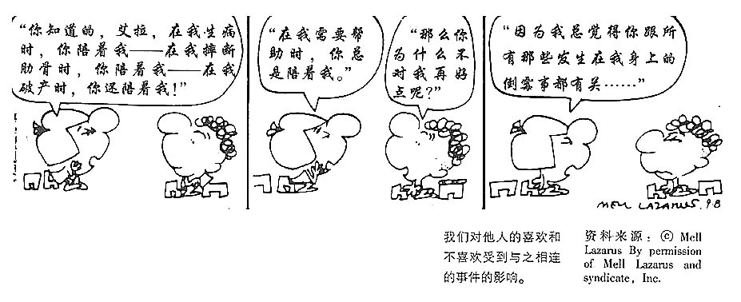
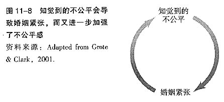

= 问题_(人的关系)_如何加深关系
:toc:

---

== 如何产生喜欢

==== 接近性 -> 接近性能使人们更易于发现共性, 并交换回报

两个人能否成为朋友，接近性（proximity）是一个强有力的预测源。

[cols = "1,1a"]
|===
|原因 |Header 2

|事实上，地理距离并不是关键，功能性距离一一人们的生活轨迹相交的频率一一才是关键。
接近性能使人们更易于发现共性并交换回报。
|- 大多数人更喜欢他们的舍友，更喜欢隔壁的人，而不是隔了一个房间的人。

|雏鸭的印刻 : 莱肯和特利根猜测，浪漫的爱情常常更像雏鸭的印刻，只要是经常与我们在一起，我们会爱上几乎是任何一个与自己有着大致相同的人格特征并且会回报我们感情的人。
|

|===

---

==== 爱屋及乌 : “联系一喜欢”（1iking—by—association）现象

[options="autowidth"]
|===
|试验 |结果, 这两张照片被选择的比率是

|从两张女士的照片（A或B）中选出一个看上去比较友善的
|50：50。

|在选择照片之前，先与一位热情、友善、长相像A的实验者进行了交往
|结果他们选择A、B 照片的比率为6：1
|===

---

==== 曝光效应 -> 熟悉能诱发喜欢

[cols = "1,2a"]
|===
|原因 |Header 2

|对于各种新异刺激——无意义音节、汉字、音乐片段、面孔一一的曝光，都能提高人们对它们的评价。
|广告商和政治家们充分利用了这种效应。

- 即使人们对某一商品或候选人没有什么强烈的感情，仅仅通过简单的重复，也可以增加商品的销量或得票率。
- 如果候选人不为人们所熟悉（也就是不知道他们的真正为人），那么，一般而言，那些在媒体上曝光最多的候选人更容易获胜（人们只能依据有限的信息来做出判断）。
- 在两个陌生的人之间被迫做出选择的时候，大多数选民偏向于选择让人感觉更舒服、更熟悉的名字。

|===

---

==== 仅仅是对相互交往的期待, 就可以引发喜欢

---

==== 喜欢与自己相关的事物

不同国家、不同语言和不同年龄的人，都偏好他们名字中的字母，以及那些在母语里频繁出现的字母。

我们喜欢与自己相关的事物，这其中还包括潜意识中与自己有关的人、地方和其他东西。这种偏爱会对我们生活中的重大抉择，包括我们的住址、职业等产生微妙的影响。

---

==== 投入资源即带来情感 -> 我们在某种事物上投入的劳动越多，对它的感情越深。进行那件事的难度越大，感情越深

人类本性中, 有三大非理性的心理存在：:

1. 我们对已经拥有的东西会产生依恋。而且**我们在某种事物上投入的劳动越多，对它的感情越深。进行那件事的难度越大，感情越深。**
2. **我们总是把注意力集中到自已会失去什么，而不是会得到什么。**因此，那些得到球票的学生, 只注意到自己会失去看球的经历，而不去想象卖掉球票所赚的钱，可以买到什么的享受。
3. 我们经常假定, 别人看待交易的角度, 也和我们一样。

实验, 研究人员当一回票贩子。从有球票的学生手里买票，再卖给那些没得到票的人。

[cols="1,3,3"]
|===
||问买家(无票者) |问卖家(有票者)

|出价
|170美元左右
|大约2400美元

|理由
|用这175美元，可以到一家运动酒吧免费看比赛实况电视转播，喝几瓶啤酒，买点吃的，还可以剩不少，可以再买几张CD盘和几双鞋。花在看比赛上当然令人兴奋，但175美元花在其他地方也是一大笔钱啊。
|球赛将成为他的杜克时光中特别的记忆，他将来可以把这一美好回忆与他的儿子、孙子分享。“这怎么可能用价格来衡量呢？”
|===

无论有票者和无票者，他们都是一群球迷，照理应该对球赛(球票)的看法应该是一致的。但为什么一次偶然的摇签（决定球迷有票还是无票）就完全地改变了他们对球赛(球票价值)的看法呢？原因就是上面的三个心理.

- 很多公司经常开展“试用”促销。就是利用了人类的这些心理——短暂拥有也可能会产生感情。 +
- 同样的把戏还有: “30天不满意保证全额退款”。

---

==== 喜欢那些喜欢我们的人

喜欢通常是相互的. 一个人喜欢他人的程度，可以反过来预测对方喜欢他的程度。

实验研究证实了这一点：告知某些人他们被别人喜欢或仰慕时，他们就会产生一种回报的情感。

很久以前我们就认识到，我们喜欢那些我们认为是喜欢我们的人。

- “当我不能接近我爱的人时，我便去爱那个离我近的人。”一一E Y Harburg，Finian’s Rainbow，London：Chappell Music，1974
- “一般来说，男性会对对自己感兴趣妁女性感兴趣，而不是对拥有修长大腿的女人感兴趣。”一一女演员玛琳·黛德丽（1901—1992）

但注意: 低自尊的个体A倾向于低估同伴B对他们的欣赏程度，并且也不积极给予同伴B回报性评价, 因此难以让B产生对A的喜欢. 因而A对与同伴关系的满意程度也较低。 +
若你对自己信心不足，你也可能会对你们的关系持悲观态度。

---

==== 外表吸引力

我们说吸引力很重要，是在假设其他条件都一样的情况下来谈论的。并不是说, 任何时候外表的吸引力都比其他任何特质更重要。

[cols = "1,2a"]
|===
|原因 |Header 2

|外表吸引力的刻板印象——“美的即是好的”
|令人遗憾的现实，是所谓的“巴特·辛普森效应”（Bart Simpson effect）一一大多数人都认为，长相一般的孩子，他们的才干和社交技能都不如那些漂亮的同龄人。

- 在相同的信息之下，老师们倾向于认为那些有吸引力的孩子在学习上更聪明、更成功。

- 孩子很小的时候就形成了这种刻板印象 : 白雪公主和灰姑娘是美丽的一一也是善良的。女巫和继母是丑陋的一一同时也是邪恶的。

|我们也以为漂亮的人拥有社会所需的某些其他特质。
|- 罗瑟尔等人（Roszell & others，1990）在加拿大全国范围内进行取样，让面试考官对样本的吸引力进行了五点量表的等级评定（1表示相貌平平，5表示非常有吸引力）。结果发现，在吸引力上的得分每增加一个单位，每年平均能多赚l988美金。

|在其他各方面条件都相同的情况下，我们仍会猜测漂亮的人会更快乐、性感热情，更开朗、聪明和成功。
|研究表明，有吸引力的孩子和青年，在某种程度上来说，他们不那么拘谨、更加外向，而且社交技能更好。而这种现象的产生，很可能来源于自我实现的预言。有吸引力的人通常更受重视，更讨人喜欢，他们中大多就因此而变得更自信。

|===

---

==== 匹配现象（matching phenomenon） : 相似性导致喜欢。 -> “我喜欢权力．因为它能吸引女性。”一一亨利·基辛格

人们一般与跟自己具有同等吸引力的人结成伴侣。研究表明，夫妻、约会对象，甚至志趣相投者之间的吸引力，都表现出了高度的一致性。 +
人们选择朋友，尤其在选择终身伴侣的时候，通常倾向于选择那些不仅在智力上，而且在外表吸引力方面都能与自己匹配的人。

[cols = "1,3a"]
|===
|原因 |Header 2

|相似性导致喜欢
|**我们有一种偏好一一错误的一致性偏好一一倾向于认为别人与我们拥有同样的态度。**当我们发现某人与我们的态度不一致时，我们就会不喜欢这个人。

- 同一政党的人之所以在一起，与其说他们喜欢那些与自己志同道合的其他成员，还不如说他们讨厌那些与自己意见相左的人（Rosenbaum，1986；hoyle，I993）。

但我们仍然要问：我们真的就不会被那些需要和人格品质正好与我们互补的人吸引吗？一个虐待狂和一个受虐狂在一起能否找到真爱呢？ 这种观点听起来似乎具有说服力，但令人惊奇的是，它未能得到研究者的证实。

|===

"接近性"和"吸引力"影响我们最初为谁所吸引，而"相似性"会影响长期的吸引。

---

==== 自尊遭受打击者, 更喜欢"能够看中他们的人"

....
一个很有魅力的男性——他在实验之前与每名女生被试热情聊天，并邀请每个被试去约会（无一人拒绝）。 +
然后, 研究者先价值肯定了一部分被试(女生)，又价值否定了另一部分被试(即遭受自尊心打击)。 +
现在, 要求她们评价几个人，包括一开始那位魅力男性.
....

*你猜哪些女生最喜欢这位男士呢？答案恰恰是那些自尊心刚刚遭受了暂时打击, 并极为渴望获得社会承认的人。*

这有助于解释为什么人们有时在一次自尊遭受很大创伤的拒绝之后，会表现出反弹行为一一陷入充满激情的恋爱当中。

---

==== 当你逐渐赢得了别人(敌人)对你的尊重和喜欢, 你也会喜欢他们

如果从不被承认到之后获得到承认, 是一种有力的奖赏的话（就如上面个实验中的女生），那么，我们是否更喜欢那个起初不喜欢我们，后来又喜欢我们的人？还是更喜欢那个从一开始就喜欢我们（因而也给了我们更多承认）的人呢？

....
阿伦森和林德设计了一项精巧的实验，他们让80名明尼苏达大学的女生“无意中”听到了另一位女生对她们的一系列评价。 +
-> 有些女生听到的是持续的对自己的积极评价； +
-> 有的女生听到的是持续的对自己的消极评价； +
-> 还有的女生听到的评价是从消极到积极，或从积极到消极。
....

结果发现，**当个体获得了目标人物的尊重，尤其当这种尊重的获得是逐渐发生的，并且还推翻了目标人物先前的批评之词时，个体就会更加喜欢这个目标人物。**由于先前对美言的吝惜，才使得最后听到对方的赞赏后特别自豪。

---

==== 吸引的回报理论 -> 我们喜欢那些回报我们、或与我们得到的回报有关的人

吸引的回报理论（reward theory of attration）：我们喜欢那些回报我们、或与我们得到的回报有关的人。*如果跟某人交往, 所得到的回报, 大于付出的成本，那我们就喜欢并愿意继续维持这种关系。尤其当我们在这种关系中的收益大于其他可能的关系时更是如此。*

当一方满足了另一方没有得到满足的需求之后，就会产生相互吸引。

---

==== 回报理论的第二种原则 -> 我们还喜欢与那些能让我们心情愉悦的人交往

对那些与回报性事件有关的事和人, 人们会对这种积极感受, 形成条件反射。

- 在紧张工作之后．当我们围坐在篝火前，享受着可口的食物、醇香的美酒和美妙的音乐时，就可能觉得身边的一切都那么温馨（这就是一种条件反射。我们看到的任何事物，都能给人一种情感性的条件反射，这都是基于你以前从它身上获得的体验积累）。

---

==== 舒适的环境, 能激发被试对被评价者的好感

- 让大学生对陌生人进行评价时，在舒适房间中的大学生做出的评价, 要高于在燥热难耐的房间中的大学生的评价。

结果再次证明，舒适的环境能激发被试对被评价者的好感。这也解释了情侣间“浪漫的晚餐、在剧院观看演出、在家共度夜晚、度假，这些都很重要…” 如果你希望维系与伴侣的关系，那么你和你的伴侣, 都要继续把你们的关系, 跟美好的事物联系起来。

---

==== 模仿相爱的行为, 也能够激发爱情

- 研究人员要求不相识的一对男女专心地彼此凝视两分钟。一种实验条件是凝视对方的手，另一种实验条件是凝视对方的眼睛。当两人分开后，**凝视眼睛者报告了触电般的感觉且被对方所吸引。**模仿相爱的行为也能够激发爱情。（演戏的演员, 更容易这样了。）

网络沟通其传递的信息相当贫乏。它无法反映目光交流、非言语线索、身体接触等微妙的变化。电子信息缺乏手势、面部表情、语调等信息，难怪它们容易让人产生误会。比如，语调的细微差别可以表示一个陈述是严肃的、开玩笑的，还是神圣的。

---

== 吸引力来自何方?

==== 来自"完美的平均"

当男性评价女性的时候，他们关于吸引力的一致程度非常高; 但是当男性评价男性的时候，这种一致性就降低了。

真正的吸引力其实就是完美的平均。与几乎所有的真实面孔相比，人们认为用数字化合成的面孔更具有吸引力。*这也就解释了为什么当我们看到那些具有吸引力的人，会感觉比那些非典型的、没有吸引力的人看起来更熱悉。*

- 无论何地，男性都认为那些腰部比臀部窄30％的女性最有吸引力.

---

==== 取决于你的比较标准（参照系，比较出认识）

吸引力并不只是取决于生物特性。什么对你是有吸引力的，这还取决于你自己的比较标准。

[cols = "1,2a"]
|===
|原因 |Header 2

|性唤起可能暂时地使异性看起来更具有吸引力。
|- 对于那些刚刚看过杂志中裸体照片插页的男性而言，普通女性，甚至他们妻子的吸引力都会减小。观看诱发强烈性欲的色情电影，同样也会降低对自己伴侣的满意度（Zillmann，1989）。
- 观看完美得可以打10分的、或非现实的性描写，其所产生的持续影响，会使伴侣吸引力降低一一更有可能被评为6分而不是8分。

|男性进行自我评价的愿望，会因为接触了一个更有权力、更成功的男性而变得不强烈。
|

|===

古铁雷斯等人（1999）认为，拜现代传媒所赐，它使我们在—小时内能看到“很多更有吸引力、更成功的人，而我们的祖先则要花费一年甚至是一生的时间才能看到那么多有吸引力的人”。

---

==== 人们爱得越热烈，他们就越不觉得其他异性吸引人了

“草坪的另一边可能更绿”，米勒和辛背森（Miller ＆ Simpson，1990）说，“但快乐的园丁却很少能注意到。”

---

==== 由任何来源所引发的生理唤醒，都可以增强激情的感受

实验让一位魅力十足的年轻女子，站在位于英属哥伦比亚卡普兰诺河（Capilano River）上230英尺高、450英尺长的一座狭窄而摇晃的吊桥上。请求过往的单个男性帮助她完成一份课堂问卷。当对方完成问卷后，这名女子会留下自己的姓名和电话，然后告诉他如果想了解更多该项目的信息就可以打电话找她。结果大部分的男性都收下了她的电话号码，而且有一半的男性确实打了电话。 +
而与此相对，在低矮、坚固的桥上遇到这位女性的男性当中，以及在高吊桥上遇到男性调查者的男性当中，则很少有人打电话。 +
这一研究结果证明，生理唤醒促进了罗曼蒂克式的反应。

当处于兴奋状态的男性, 对女性做出反应时，他们很容易就把自己的某些生理唤醒原因, 错误地归因于是来自于这位女性的影响力 (归因错误)。

[cols = "1,1a"]
|===
|Header 1 |Header 2

|
|- 观看恐怖电影、乘坐过山车，以及体育锻炼等也都有同样的效果。

|这种效果也存在于已婚夫妇中。那些经常在一起做一些可以提升彼此兴奋度活动的夫妇，所报告的婚姻满意度最高。

在一个浪漫的情境中，任何刺激（甚至疼痛）造成的唤醒水平, 都可以被解释为激情。
|- 相对于完成一般的实验室任务，如果夫妻双方能共同完成一项提高激活水平的活动（比如两人的绑腿赛跑等）的话，往往会对其关系的总体情况报告较高的满意度。肾上腺素使两颗相爱的心贴得更近了。

|===

---

== 如何营造与维系婚姻关系

==== 婚姻是很多阶段, 而不是只有一个阶段 -> 维护是全阶段的, 而不是只一开始的恋爱阶段.

完美的爱情(比如梁祝, 罗密欧与朱丽叶等并不意味着完美的婚姻。一段完美的爱情，仅仅是一个好的开局，但并非完美的全过程。

==== 那些相互理想化的伴侣, 过得最开心

对恋爱的情侣和已婚的夫妇进行的研究表明，那些相互理想化的伴侣过得最开心，他们看待自我伴侣的态度甚至比伴侣看待自己的态度更加积极。

---

==== 吸引的公平（equity）原则 -> 你和你的伴侣从感情中所得到的，应该和你们双方各自投入的成正比

[cols = "1,1a"]
|===
| |Header 2

|如果两个人的所得相同，那么他们的贡献也应该是相同的；否则其中的一方会觉得不公平。

公平原则在那些持久的感情中更是如此。

|- 大部分的丈夫会觉得他们自己做的家务, 比妻子认为的要多一一**那些“占了便宜”的人对于不公平较为不敏感。**）

- 谢弗和基思（Schafer &K eith，1980）调查了几百对各个年龄段的夫妇，他们发现，那些觉得自己婚姻不公平的人大多是因为某一方在烹调、家务、照顾孩子等工作中贡献过少。

|===

格罗特和克拉克（Grote & Clark，2001）根据他们对结婚伴侣的长期追踪研究结果，得出结论 : *不公平与紧张的关系是双向的：知觉到的不公平引发了婚姻紧张（marital distress）, 而婚姻紧张又会加剧知觉到的不公平*（下图）。关系不佳时，我们尤其会觉得不公平，自己付出得多收获得少。

---

==== 痛苦和争吵并不能预测离婚, 真正能够预测婚姻危机的因素是：冷漠、希望破灭和无助

在成功的婚姻中，积极互动（微笑、触摸、赞美、欢笑）与消极互动（讥讽、反对、羞辱）的数量之比至少为5：1。

戈特曼和他的同事对130对新婚夫妇进行了为期6年的追踪研究。发现如果丈夫能够接受妻子的批评,他们的婚姻通常能够继续下去。如果丈夫反唇相讥，他们离婚的可能性就会增大。

休斯顿等人（Huston & others，2001）对新婚夫妇的追踪研究发现,痛苦和争吵并不能预测离婚（大多数新婚夫妇都经历过冲突）, 真正能够预测婚姻危机的因素是：冷漠、希望破灭和无助。斯旺等人（Swann & others，2003）发现，当羞怯的男性找了挑剔的女性为妻时（违背传统的性别期望），情况更是这样。

深入而长久的依恋关系很难快速地分离。*分离是一个过程，而不仅仅是一个事件。* 同样, 关系是一个建构物(也是过程)，如果没有得到维持和改善，就会随着时间而衰退.

他们无视另一方的存在并任由婚姻关系继续恶化。当他们将痛苦和不满忽略掉，情感上的分离便随之而来。*伴侣之间谈话更少, 并开始重新定义他们没有彼此的生活。*

---

== 如何控制"他人对你产生负面想法的预期"? ->

[cols = "1,3a"]
|===
|Header 1 |Header 2

|不要接受任何不合理的deadline.
|不要随口承诺时间。因为它会导致不良后患 : 久而久之，大家都会觉得你做这个东西花不了多长时间; 等到你争取正常的工作时间的时候，客户就会觉得你在偷懒，在拖延。

|不要随口说出未经深思熟虑, 及团队讨论的idea或解决方案。
|因为:

- 即时的反应未必是最佳方案
- 灵机一动的次数多了，会让客户及他人对我们的作业方式产生误解。如果客户认为每次你灵机一动就能解决问题，他又为什么要雇用一个团队来服务他？
- 如果你不是团队的负责人，就没有权力给出未经团队集体确认过的想法和创意。

|不要随口推卸责任，指责、非议同事。
|尤其在客户面前，有很多人错误地用这样的方式跟客户去套近乎。

- 这种指责是在破坏团队的协作关系，也会让客户积累对这个团队的负面认知: +
-> 客户听到这种话, 会认为这个组织里有些人（被指责的人）的能力有问题. +
-> 客户听到后, 会觉得这个团队的合作有问题（因为指责别人的人）.
- 最重要的是，这根本换不来真正的真诚与信任。“来说是非者，必是是非人”.

*不要错把"信任"与"热络"相混淆。热络永远不代表信任。*
|===

---

[cols = "1,2a"]
|===
|原因 |Header 2

|
|

|===

