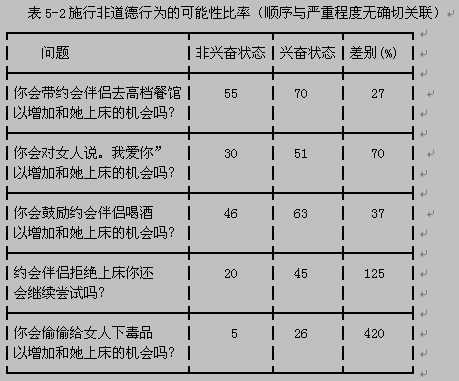

= 问题_(影响力)_如何引导他人干你想让他们干的事
:toc:

---

== [锚定]

==== 锚点影响人的下一个抉择

早在19世纪，心理物理学家就发现，*人们对相对差异非常敏感，对绝对数值则不怎么敏感。*

- 写下社会保险号后两位数影响了他们的最后出价，学生中社会保险号后两位最大的（从80到99）出价最高，那些后两位最小的（1到20）出价也最低。

同时, *一旦参与者愿意出某价买某物，他们此后购买同类产品也会参照他第一次的出价（锚）来决定的出价意愿。* 首次的价格大都是“任意”的，并可能受到任意问题答案(即"锚")的影响；可是一旦这些价格在我们大脑中得到确立，它形成的便不仅是我们对某一产品的出价意愿，还影响了我们对其他有关产品的出价意愿（这使它们一致）。

不过价格标签本身并不是锚。它们是在我们深入考虑后，想用某一特定价格购买某一产品或服务时才会成为锚。从此以后，我们愿意接受的一系列价格——就像蹦级绳的拉力，总是需要参照原先的锚来决定。因此，*第一个锚不仅影响我们当时的购买决定，而且影响后来的许多决定。*

- 搬家到另一城市的人购房时, 总是被原住城市的房价所锚定。(宾夕法尼亚大学经济学家尤里•西蒙森和卡内基•梅隆大学教授乔治•勒文斯坦发现)

---

==== 第一个锚（往往是任意决定的）不仅影响我们当时的购买决定，而且影响后来的许多决定。

[cols="1,1,2,5,3"]
|===
| |实验|第1阶段: 再听一遍噪音 |第2阶段: 新锚50美分 |第3阶段

|第一组被试
|听噪音
|锚出价:10美分 +
被试要求: 33美分
|锚出价:50美分 +
被试要求: “这次的噪音和上次差不了多少，既然我对上次听的那一段噪音出价很低。那么我估计，这一次出同样的价格，我也能够忍受。”
|锚出价:90美分 +
被试要求: 接受了较低的价格

|第二组被试
|听噪音
|锚出价:90美分 +
被试要求: 73美分
|锚出价:50美分 +
被试要求: “既然我对上次听的那一段可厌的噪音出价较高，这次的噪音和上次也差不了很多；既然我上一次出了高价，那么让我忍受这段噪音，我需要出同样的价格。"
|锚出价:10美分 +
被试要求: 仍然坚持高得多的价格
|===

这表明 : 过去我们遇到的任意的锚, 在形成初次决定之后, 仍会长久存在，伴随我们左右。

---

==== 如何改变锚点对你的影响

1. 你应该首先从质疑自己的这种习惯开始。问自己, 它是怎么开始的？你能从中获取多大的快感? 这一快感真的就如同你预期的那么大？你能不能把预算压低一点？（降低或抬升一开始的锚点）. 即, 置疑自己一再重复的行为。

2. 我们应该特别关注我们所做的首次决定，它会影响以后的一长串的其他决定。*首次决定至关重要，我们必须给予足够的重视。*

---

== ---------- ----------

---

== 对人的本性只能因势利导 -> 攻击其"情绪", 攻心(弱点)

"*故善者因之，其次利道之，其次教诲之，其次整齐之，最下者与之争*。"  +
人喜欢好听的音乐和美色，喜欢美食，喜欢享受，喜欢炫耀，这种习惯已经很久了，无法改变它。因此，好的统治者就随国民去了，差一点的（统治者）动之以利引导他们，再差一点的试图教化他们，更差的约束管理他们，最差的要和他们作对。

今天，上至很多政府领导，中到公司老板，反而不懂这个道理。他们幻想着既要马儿跑，又要马儿不吃草的社会，这种做法非常有悖于人性。

---

==== [以利诱之] / 收益函数 <- 员工会不自觉地朝着收益最大化的方向努力

- 如果一个公司认定技术最重要，产品的稳定性最重要，那么久而久之，"工程师"就成了这个公司中最有权势的群体，那么工程师文化就成为公司的显性基因。谷歌就是这样的公司。

- 如果一个公司认定技术不是最重要的，用户体验最重要，那么在这样的公司里"产品经理"就是最有拍板权势的，工程师只好围着产品经理转. 苹果、Facebook和腾讯就是这样的公司。

- 如果一个创始人只看重销售业绩，一切以商业为先，那么这样的公司就是一个"销售导向"和"结果导向"的公司，无论是产品经理还是工程师，都要围绕着销售目标转，阿里巴巴就是这样的公司。

---

==== [免费化] / 虽然免费的是最贱的, 但免费依然会诱使我们做出不明智的选择

免费最大的问题在于，它引诱你在它和另一件商品之间挣扎——并引导我们做出不明智的决定。原因是: +
-> 你付出价格, 你就面临风险和损失的衡量。 +
-> 而免费的物品，你不会有显而易见的损失。在这种心理之下，人们往往就落入了圈套。

但如果不是免费价格，而是免费交换，又会怎样呢？

- 对一个9岁的小孩做实验, 实验者手里有5块巧克力, 重量分别为 : 0.16 盎司(ounce,下面简称o)*3块; 2o一块; 1o一块

[options = "autowidth"]
|===
||选择1： |选择2：

|
|给小孩3块0.16o的,  +
然后: 返还1块0.16o的, 得到1块2o的 +
(即: -0.16+2 = +1.84o) <- 显然,这是明智的选择
|给小孩3块0.16o的,  +
然后: 再免费拿1块1o的 +
(即: +1o = +1o)

|结果
|
|大约70%的孩子都放弃了更好的交易， +
而仅仅由于免费做了这个较差的选择。
|===

- 真实案例:

[options = "autowidth"]
|===
| |亚马逊总店 |亚马逊法国分店

|促销方式
|购书超过某一金额即免费运费。
|不免费，无论买多少书，都只收1法郎邮费。

|结果
|销售额大幅增长.
|法国的销售没有增加。
|===

1法郎的邮费实际上够划算了，但法国人几乎毫无反应，而免费邮寄却引起了热烈的回应（事实上多花钱了——多买了书）。

---

==== [让其机会难得] / 要让人们渴望做一件事，只需使做这件事的机会难以获得即可 (人的心理: 得不到的才是最好的; 免费的是最贱的)。

- 研究者举办一个诗歌朗诵会, 亲自朗诵 :

[options = "autowidth"]
|===
| |A组被试 |B组被试

|锚点
|被试付给实验者10美元, 来听朗诵
|实验者付10美元给被试, 来听朗诵

|被试的实际支付
|(短篇朗诵): 1 美元 +
(中篇朗诵): 2 美元 +
(长篇朗诵): 3 美元 +
|(短篇朗诵): 1.3 美元 +
(中篇朗诵): 2.7 美元 +
(长篇朗诵): 4.8 美元 +
|===

结果表明, 人的心理就是 :"免费的就是贱的; 花了钱的才是最好的".

- 汤姆把粉刷篱笆的枯燥工作, 变成一种特权活动, 来操控其他小孩, 对他们说 :“哪个孩子能有机会天天刷篱笆？”. *汤姆把负面体验, 转变成了正面的 -- 把粉刷篱笆的性质, 由受惩罚做工，改变成人们需要付出代价来参与的一种娱乐。*

---

==== [让其遭遇"坏事"] / -> 坏事总是比好事更有影响力，而且影响更持久

- 一件坏事（创伤）比一件好事能产生更为持久的效应。
- 坏事变坏要, 比好事变好, 对我们产生更大的影响。
- *破坏性行为对亲密关系的伤害程度，要比建设性行为的促进作用更大。*
- 一个不好的名声比起一个好名声更容易获得，而且更难以摆脱。 （仅仅一次说谎就可以毁掉一个人“诚实”的美誉）

- 日常生活中发生的坏事，比好事更能引起人们的注意和思考。(死亡比出生更能引起人们对生命意义的探寻。)

- 坏心情比好心情, 更能影响我们的思维和记忆。

---

==== [让其陷入兴奋/激情] -> 在兴奋状态和冷静状态下,人会做出不同选择 (激将法与色诱的确有效)

实验的结果是一致而明确，无可争辩地——每一个案例中，这些睿智的年轻参与者，在"兴奋状态"和"冷静状态"下, 对问题的回答有非常大的不同。即, 你想要在自己的一种情绪状态中观察另一种状态, 是困难的。

- 在兴奋状态下，被问及是否会施行某些"非正常性行为"，他们这时预测“是”的可能, 是他们处于冷静状态下的近两倍（高72%）。
- 在关于施行”非道德性行为倾向”的五个问题中，他们在”兴奋状态下”预测的倾向程度，是”冷静时”的两倍多（高出136%）。
- 同样的，在使用避孕套的一系列问题中，尽管多年来一直向他们大力灌输避孕套的重要性，他们在"兴奋状态下"预测“不用”的可能, 也远高于(高出的比例是25%)他们"冷静时"的预测。
- 还有，他们在"兴奋状态"下, 也没能正确预测"性兴奋"对"安全性行为"的影响。

结果表明:

[cols="1,3a"]
|===
|罗伊和其他参与者 |Header 2

|处于冷静，理性，由“超我”驱使的状态时
|对女性是尊重的. +
在非兴奋状态中，他们不知道自己在兴奋状态下会怎样。他们没有能力预测激情会把他们改变到什么程度。

|在"兴奋状态下"
|他们对自己的反应完全估计不足。
|===

对于那些想保证让青少年远离性接触的人来说，**比较好的办法是教育他们在欲火焚身之前就赶快离开。 +
**我们的研究结果表明，对于青少年，在诱惑膨胀之前与之斗争比较容易，身陷其中再企图自拔就难多了。 *换言之，抗拒诱惑困难，身陷诱惑之中与之斗争则更要难得多。*

同样的，我们需要教青少年们（和其他所有人）在情绪激动时不要开车。造成青少年撞车事件还受荷尔蒙影响。

- 最近的一项研究显示青少年单独驾车的事故概率比成年人高40％。 +
但是如果车上还有一个同龄人，事故概率就会翻上一番。 +
如果还有第三个，事故概率就会再翻上一番。

== ---------- ----------

---

== [内化成道德] / 将行动的理由, 归因于是对方的内在原因, 而非外在原因(比如为了金钱报酬)

- 社会心理学实验, 问: “为什么你要和你的女/男朋友出去约会？”. +
-> 内在的原因, 如, 因为我们拥有共同的兴趣和关注点.
-> 外在原因 : 如, 因为他／她认识很多重要人物.

结果发现，那些注意力被引到外在原因方面的人，比那些关注了内在原因的人，对他们的恋人表示出较少的爱恋，认为结婚的可能性也较小。

---

==== 一旦市场规范（谈到钱）进入了我们的考虑，社会规范(道德)就随之而去。

- 美国退休人员组织, 问一些律师：

[cols="1,3,3"]
|===
| |谈价钱 |免费

|问题
|是否愿意**低价**(30美元/小时)为一些需要帮助的退休人员服务?
|是否愿意**免费**为需要帮助的退休人员服务？

|律师们的回答
|"无法接受"
|说"行"的律师占压倒性多数

|原因
|提到了钱，律师们用的是市场交换规范，认为报酬与他们的实际工资标准相比太少。
|没提到钱的问题，他们用的就是社会规范（责任，道德之类），所以他们愿意免费贡献时间。
|===

- 哥伦比亚大学经济学教授纳恰姆·西歇曼，在日本学习武术时, 也有类似的经历。日本的大师不收他们这一组人的学费，说，如果真的收学费，他们未必付得起。

---

==== 但把酬金换成礼品, 则依然会保留在社会规范(道德)中

那么，如果我们把酬金, 改成礼品会怎么样呢？礼品这种交换方式能把我们保持在"社会规范"之内吗，还是会导致对方的判定从"社会规范"转入"市场规范"？

- 试验: 我们把50美分现金改为一块士力架（约合50美分），把5美元的激励改为一盒高迪瓦巧克力（约合5美元）。

结果是：赠送礼品（而不告知价格）并没有引起他们的不快，因为即使是小礼品, 也能把我们保持在社会交换环境里，脱离市场规范。

---

==== 如果你言明礼品的价格, 则礼品不再唤起"社会规范"——它越过边界进入了"市场规范"的领域。

- 如果我们明确告诉他们礼物的价格，说要给他们一块“50美分的士力架”或者一盒“5美元的高迪瓦巧克力”，被试们会怎么样呢？

结果是，参与者拿到"50美分的士力架”以后一点也没有受到激励，事实上他们干活出的力和拿50美分的时候一样。他们对明码标价的礼品的反应与现金完全相同，礼品不再唤起社会规范——它越过边界进入了市场规范的领域。

- 问过路人, 是否愿意帮我们从卡车上卸一个沙发。人们愿意免费帮忙，也愿意拿相应的报酬来干活; 但如果我们给的报酬太少，他们就扬长而去。

---

== ---------- ----------

---

== [硬性约束]

==== [限定时间] / 治疗拖沓病(没做成成绩)最有效的手段 -> 是严格限定他们的最终提交时间

我分别对三个班（实验对象）说：“这学期共12周，你们要写3篇论文。这3篇论文在期终成绩中将占举足轻重的分量。”

[cols="1,3a,1"]
|===
|Header 1 |Header 2 | 结果

|A班
|没有最后交卷期限，在学期结束前哪天交都行，**由学生们自己决定交卷日期。**但是，如果学生食言，将按他迟交的天数扣分，即**每晚一天扣罚总成绩的1%。提前交卷无奖励。**

学生们写下： +
我保证于第 () 周交出第一篇论文 +
我保证于第 () 周交出第二篇论文 +
我保证于第 () 周交出第三篇论文
|成绩在二者之间

|B班
|*不设交卷期限*，只要在学期最后一节课结束时交上论文即可。同时，**也没有罚分风险。**完全的自由。
|B班成绩最差

|C班
|我给三篇论文都**规定了交卷期限**，分别定在第四周、第八周和第十二周。
|C班成绩最好
|===

---

