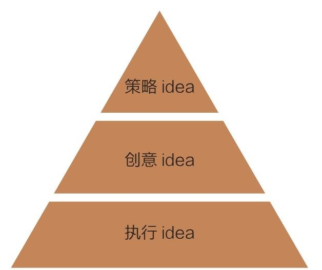
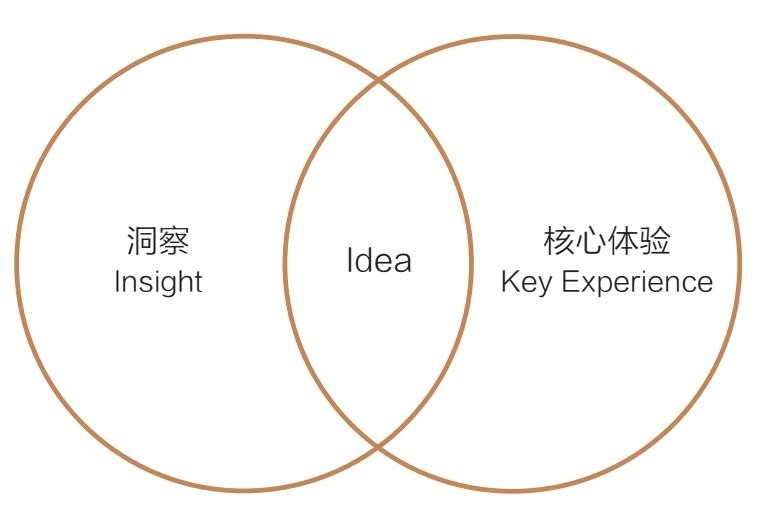

= 问题_(对人_影响对方的看法或感受)_你自己开店_如何用广告行业的方法来影响人
:toc:

---

== 人们做广告的目的是什么? -> 改变他人的 1.看法 或 2. 感受

做广告的目的, 就是至少改变下面两者之一.
[cols="1,4,2"]
|===
|Header 1 |Header 2|如何改变他人的"看法"/"感受"?

|看法
|看法是偏理性的.比如女方觉得你很有钱、有才华，很帅、很体贴、很有趣，反正是对你的某些判断和评价.
|通过"说服"或"启发".

|感受
|感受是感性的. 如, 她觉得跟你在一起就高兴、就愉悦, 就是莫名其妙地愿意接近你。
|通过"感染"或"被打动".

画面的调性, 往往能触发某种感受.
|===

注意: 借助广告, 只能用来改变他人的"理性看法"或"感性感受", 它没有直接改变他人"行为"的能力. 广告从来不直接带来销售. 广告所起的作用, 只能"隔山打牛".

---

==== 调性的弹性是有限的

---

== 你创造一个广告的"整体思考流程"是怎样的? -> 通过什么商业手段来赚钱(business target) => 传播的目的(改变"理性看法"或"感性态度")与方式上的策略 => 要传播的内容idea(广告本身)

==== 步骤1: 通过何种手段来赚钱 / business target

business target 不是一个数字或一个销售额，而应该是实现这个数字或销售额的方法路径. 即, 你通过什么方式, 什么做法, 做哪些事情, 来实现这个销售数字?  +
即: 我想通过 对目标消费者来做...("理性看法"或"感性态度"上的转变) ，来实现我的...(什么目的),...(什么销售额数字)。

例如:

- 为了实现"抵达公司"的目的, 我的business target(策略手段)是通过"搭乘地铁"这种方式.
- 为了实现"卖鞋1000双销量"的目的, A店主的business target(策略手段)是"让这些不穿鞋的野人, 开始穿鞋".

---

==== 步骤2 : 传播策略 / (1)传播目标 (改变"理性看法"或"感性态度")

由于广告只有能改变人们"理性看法"和"感性感受"的作用, 所以广告的传播目标, 也就只在于这两者 -- *传播的目的要么是改变他人的"理性看法", 要么是改变他们的"感性感受".*

business target, 决定了"传播的目标"是什么.

- 为了实现"让你喜欢的女孩和你结婚"的目的, 你的business target(策略手段)是: +
1. 改变她的"理性看法" : 让她理智地认为，你是非常合适的结婚对象(为business target). 接下来，什么理由会让她认为“应该嫁给你”？ +
-> 如果她不选择你是因为觉得你穷(为洞察)，那你就只要向她证明你真的很有钱(为传播目标); +
-> 如果你真的很穷(为洞察)，那就转而让她相信, 你身上有比钱更重要的优点(为传播目标).
2. 改变她的"感性态度" : 让她开始觉得特别喜欢你(为business target). 接下来，什么理由会让她“特别喜欢你”？

business target 和”传播的目标”, 不是一一对应的关系。解决同一个问题，可以有各种不同的方法。 +
但**传播目标和business target之间应该有个因果关系. 即: 一旦消费者有了这样的想法和感受上的改变（传播目标），那他的行为就会有那样的改变（business target），否则这个因果链条就断掉了。**

消费者是你妻子那样的人，不要以为单靠一句花言巧语就能让她买任何东西。*如果你不了解他之前对于这个产品的真实想法跟态度，就不知道该给他一个什么理由让他购买。*

注意: 传播目标，是我们希望受众看过广告之后的反应(改变"看法"或"态度")，而不是他们买过产品、消费之后的反应("产品体验")。两者不可混淆。

---

==== 步骤2 : 传播策略 / (2)核心体验 (1.有价值的、2.独特的体验)

星巴克卖给消费者的到底是什么? 消费者去星巴克买一杯咖啡的时候真正要买的又是什么? 这个才是“核心体验”（key experience）。

- 买电钻A的人, 买的是以最低的成本往墙上钻几个洞。 +
买电钻B的人, 买的是可靠的产品质量. +
买电钻C的人, 买的是大品牌, 售后保障. +
买电钻D的人, 买的是一种身份感、自豪感.

核心体验，是产品或品牌可提供的、1.有价值的、2.独特的体验.

[cols="1,4"]
|===
|核心体验的特点 |Header 2

|有价值
|未必是功能性的利益。感受、情绪上的价值也是价值。

|独特
|也未必是独一无二。相对优势也完全可以接受。
|===

曾有一个非常粗糙的模型叫“品牌三角形”，说一个品牌要考虑这三件事：1.我是谁？2.我为谁存在？3.他们因何购买（我们的产品）？对于一个完全从头塑造品牌的人来说，这三个问题确实是个起点。

广告可以粗略地分为两种，一种是产品传播，一种是品牌传播.

[cols="1,4"]
|===
|Header 1 |Header 2

|产品传播
|

|品牌传播
|那些什么正事也不说，只讨人喜欢(比如只讲一个动人的故事,和产品无关)的广告就很容易解释了——它们就是想讨人喜欢. 我们在对广告作用的定义里，特地把"理性看法"和"感性感受"区分开，就是这个道理。

**品牌的建立只有一条路径，就是拟人化。**拟人化不只是通过广告完成的。品牌平时的一切作为、声音，都会在公众认知中留下犹如对"人性"一样的印象，一点一滴积累.  +
品牌传播，核心目标就是塑造和累积偏好。目的是让受众看了这个广告之后，开始喜欢或更喜欢这个品牌。这种喜欢，可以来自理性，也可以来自感性。
|===

---

==== 步骤2 : 传播策略 / (3)传播人群 (心象)

定义"目标人群"(画像), 采用他们内心的认知——他们的"理性看法"和"感性感受"(心象), 来分类更准确。因为广告只能用来改变别人的看法和感受的. +

- 比如，“16至35岁，月收入8000元左右，女性为主”，就不如“我们的目标消费者是那些有钱出国旅行，也想出国，但因为没出过国而有点害怕的人”更有帮助.

对于演员, **你要想生活于角色，首先要叫角色生活于自己。**先培植出一个心象来，再深入找其情感的基础。

---

==== 步骤2 : 传播策略 / (4)传播媒介

广告是高度依赖媒介的。它所有的"与消费者沟通的策略"和"创意的内容"，都要依媒介特点而定。 +
媒介形式的变化一日千里，广告业，以前那些沟通的原理和办法，被颠覆。

我问TB(奥美大中华区董事长宋秩铭 TB Song), 奥美将向何处去？TB回答，奥美将会有很大的变化，但变成什么样，他也不知道。

---

==== 步骤2 : 传播策略 / (5)传播路径 (规划"如何让他们听到")

对“传播路径”的思索, 关注的是“如何让他们听到”的问题。 +
网络使得信息的传播路径多元化, 在这种情况下，你得思考:**人们为什么要传播你的信息呢？你必须提供给他们一个传播的理由(动机).** 这就需要一种洞察, 他们为什么会被卷入进来? 为什么会参与互动、加入传播的过程?

[cols="1,2a"]
|===
|Header 1 |思考

|1. 观看者
|思考: 他们会被什么"吸引"(因而会观看).

|2. 与传播的人 Target audience (不一定是你的最终消费者)
|思考:  +
-> 从他们的利益角度来说, 他们为什么会参与传播与分享? 什么能使其更积极的参与"互动"(这个很像互联网运营工作的研究内容).  +
-> 从广告主的逻辑角度来说, 就是你的内容必须要有一个被人关注、被人转发、被人谈论的理由.

|3. 目标消费者 target consumer
|思考: "消费者的决策"是怎样的? "消费者的行为"是怎样的? (消费心理学)
|===

比如:

- 冰桶挑战: +
-> 从参与传播的人的利益角度来看 : 1.参与难度不高, 2. 点名下一个人参加，是一个能秀出社交实力的动作. 3. 能引来关注度. +
-> 从观众的利益角度来看: 有乐趣

---

== 人生做事三步曲: challenge、solution、result -> 遇到什么挑战, 采用了什么解决方案, 结果如何

**很多广告大赛，要求你把自己的广告案例分成三个部分来描述，challenge、solution、result **——挑战、解决方案、结果。*即: 品牌遇到了什么挑战？给出的解决方案是什么？得到了什么样的结果？*

中间那部分叫solution，不叫idea。因此, 平时的工作，哪怕被要求“想几个idea”，你要做的也根本不是展示自己的创意能力（creativity），而是想出一个解决办法（solution）。

---

==== 常见的"定义一个概念"的错误方式, 是什么? -> 不定义这件事的本质，而只给你归纳这件事的特征.

比如, 不能用"旧元素的新组合"来定义"创意idea"的意思. 因为"旧元素的新组合"只是创意idea的诸多特征之一，或者说是产出idea的诸多手段之一，单拎出来把它当成定义是不行的。

---

==== idea贯穿在整个"广告思考流程链条"的各个阶段 -> idea金字塔思考模型.

idea是“主意”/“点子”, 而非"创意". I’ve got an idea!

[cols="1a,2a"]
|===
|广告思考流程 |举例: 拒绝象牙交易

|strategic idea，策略idea

- 是改变他人的"理性看法"还是"感性态度"? 要改变的是哪种"理性看法", 哪种"感性态度"?
- 策略idea，这是实现 business target 的“操作办法”。
|- 通过道德自我批判, 来促使人改变态度为: "买象牙不道德".

策略idea最为重要! 策略失败，是靠创意和执行无法弥补的。

- 国民党传单征兵口号 : “国家兴亡，匹夫有责” +
红军传单征兵口号 :“老乡，参加红军可以分到土地”. +
即使你把“国家兴亡，匹夫有责”这个意思说得再动听，把那张传单设计得再漂亮，也无法弥补策略idea上的失败。

有很多广告作品，是"创意"和"执行"层面上的出色，但大多数堪称“伟大”的广告作品，都是"策略"层面的胜出。

- 脑白金的策略idea ——“把保健品当礼品卖”。即, 它不再把重点放在宣传自己的保健功效，而是强调自己的礼品属性，塑造为“节庆送礼硬通货”。 +
有了这个第一层的"策略idea"，那接下来的第二层"创意idea"(提供理由, 为什么保健品要当成礼品才好?)、第三层"执行idea"就当然要追随它、为它服务. +
并且注意: 它是在替礼物的接受者发声，说“收礼只收...”, 而非“送礼只送...”. +

|creative idea，看法理由, 创意idea

- 即提供"为什么人们的看法或理性,应该被改变"的理由
- 是推进“认知改变”的全新理由。
|- 怎样能让人家觉得"买象牙不道德"呢？得给个充分的理由. 比如这个理由: “购买象牙，等于残酷杀戮大象生命”.

- 怎样让学生不要作弊呢? 美国一位大学教授给出的理由是: *作弊最终会把你困在一个自己不擅长也不喜欢的职业，困住你真正的人生追求.*

- Cancer cures smoking. 癌症专治吸烟. <- 提供了新的理由. +
这句话有必要变得更复杂、更花哨吗？也许根本就不用了。正因此, 好的第二层的"看法理由"，是可以不依赖第三层的"执行"的。

- “Meet your alter-ego”, 不管翻译成 “遇见自己”还是“你比我懂我”，都只是在更换同一个看法的不同说法而已; 而“何妨自恋”则是一个新的看法。

*一个更有力的看法(理由)，远胜于一个对俗套看法(理由)的新花哨说法。*

|executional idea，执行idea

- 即表现方式. 用什么内容, 来表达你所说的"理由".
- 执行idea，是对上面"看法"的包装——即, 用这样的方式来说这个理由，这个理由就更会被人接受、认同。它是为更好地表达"看法"而造出的“诉说的方法”。大家说的其实都是同一件事，只是你找到了一个漂亮或新鲜的说法而已。
|- 采用何种方式, 来体现这种杀戮残酷？比如“孤儿小象”“满手鲜血”.

大多数抖机灵型广告也都是在“说法”层面制造趣味，但如果你要做出更加打动人心的广告作品，就得努力往这个“Idea金字塔”的更上层努力。

|===

金字塔自上而下扩展, 而不是收窄，是因为每一层的下一级，都有众多可能。 +
-> 所谓策略，无非是选择。 +
-> 但谈到发想idea，却从没有唯一答案，一个策略idea可以衍生出无数创意idea， +
-> 每个创意idea又有无数种可能的执行、表达方式。

三个层级，每一层都向下不断发散. 每往上一层级，潜在的可能性其实都更少一些。

*Idea金字塔”里呈现的是不同的三个策略高度层级。我们要努力在更高层级上解决问题，因为往往一些颠覆性的、创新的想法,是你只能在更高层级上才能实现的。* +
发想出来的idea层级越高，就越有可能是一个与众不同的解决方案。 +

---

==== 如何判断一个广告内容的好坏? -> 用idea金字塔思考模型来作为评判工具

我们可以用idea金字塔思考模型, 作为工具, 来评判一个广告的好坏. 看它的三层分别对应的是什么东西? 它在三层中的哪一层级上取得了突破?

---

==== 你要的广告内容idea如何诞生? -> 用"洞察"和要传播的"核心体验"去做碰撞试验.

用对"旁观者","传播者","目标消费者"的三种洞察, 与我们要传播的"核心体验"去做碰撞试验，可能会产出各种idea。

---

==== idea中未必需要 creativity(创意)

[cols="1,3"]
|===
|Header 1 |Header 2

|idea中未必需要 creativity
|降价是不是一个idea？是。降价这个idea里没有什么creativity.

|广告也未必有idea
|没有idea的广告也到处都有。街边的五金店挂了个牌子，牌子上写着“销售水泥”，这叫广告，但没有什么idea。

|idea也未必一定是“新”的
|Idea只是解决方案，解决方案不分新旧，(新旧不重要! 有效与否才重要!) 就如同你不能因为某一种药已经被发明出来几十年、被几千万人服用过，就拒绝用它来治你自己的病。

因此有时候，一味"求新"反倒会阻碍创作出一个真正有效的广告来。
|===

---

== 如何引发共鸣/共情? -> 通过"洞察" insight

insight 的定义是什么?

- Discovery is seeing what everybody has seen /and thinking what nobody has thought.（发现，就是看见每个人都看过的事物，但想从没有人想过的东西。）
- You invent nothing. You rediscover what you have forgotten（你什么都没发明。你重新发现了早就遗忘的东西。）

即 : 我们永远不能发明一个洞察，我们只能发现一个洞察。

[cols="1,3a"]
|===
|洞察 |大多数洞察就存在于这两个缝隙里

|1. 一闻此言，恍然而悟
|"认知"与"真相"之间的缝隙.

注意: 洞察不能是一个人人皆知的真相或常识!

|2. 心念已至，口未能及
|"表达"与"认知"之间的缝隙.

注意: 拿一个人人皆知的真相或常识，将其用一个新的表达方式包装起来，冒充是新的发现，这是不行的。这不是"洞察"!   +
精彩的修辞，实际上是“表达与表达之间的缝隙”，换言之，只是把话说得更漂亮了而已。同样, 只是一个新奇的表达. 一个新鲜的比喻、一个新的修辞方式. 都不是"洞察".

- “对于食品来说，品质最重要”, 这是个常识. 但有人会把它包装一下，说“品质是食品的生命，不注重品质的食品，都是没有生命的”，也许你就被这句话骗住了。 +
有的一看到这句话，脑子里就瞬间冒出了一个广告画面或广告脚本…… 这种伪装成洞察的修辞、表达，反而会非常限制接下来的创意发想的。 +
所以, 在广告内容进入真正的执行创作阶段之前，我通常都尽量拒绝各种修辞的过早介入。有时，话说得太漂亮，反倒不容易分辨话语背后真正要表达的东西。尤其是在策略探讨阶段，更该格外注意。

|===

具体到广告中常见的洞察，通常指的是与消费者生活, 和产品/品牌/品类有关的一些“不被察觉的真相”, 但是对他们又很重要的。 +
洞察是“真相”，但并不只是一般的真相或事实。准确的洞察，能够带来两个效果——第一是强烈的新奇感，第二是即时的认同感。.

一般是这四种:

[cols="1,3a"]
|===
|洞察 |Header 2

|未被满足的需求
|

|未被说出的心声
|- 你的孩子很快就长大了”. “孩子的童年十分短暂，所以不能什么事都等以后再说”.

|未被关注的感受
|- 把保险卖给孩子爸妈的时候，效果特别差，爸妈都不买，但要是换个招儿，把保险产品推销给小孩的爷爷奶奶，爷爷奶奶就会非常痛快地掏钱. *这背后的洞察是: 爷爷奶奶觉得自己可能看不到孩子长大。* +
*她想过父母老人跟孩子之间的关系是什么，而这可能就藏着某些未被满足的需求和未被关注的感受。*

- “送礼就要送健康”，是未被关注的感受。原因是发现有些人收礼不那么喜欢烟.

|未被实现的梦想
|- “梦骑士”篇，骑摩托车的那些老头，说的是一些没有被实现的梦想. 每个人心里都有一个狂野的梦想，一个永远年轻的梦想。
|===

你可以拿这四种常见的洞察当一个工具或模型，可以去分别想一想，还有哪些空子可以钻？还有哪些是没被别人说过，没被别人发现过的？ +
满足他们的那些需求，说出他们的那些心声，关注他们的感受，实现他们的梦想——你创作的广告内容里，能帮助他们做到这几点，或者告诉他们你的产品、品牌能帮助他们做到这几点，就可能是一个能打动人的广告。

洞察 -> 能引发共鸣/共情 -> 就能走进对方的心.

走心的文案，未必是真诚的，我可以写我不认同的话, 只要它能走进对方的心坎里.

---

