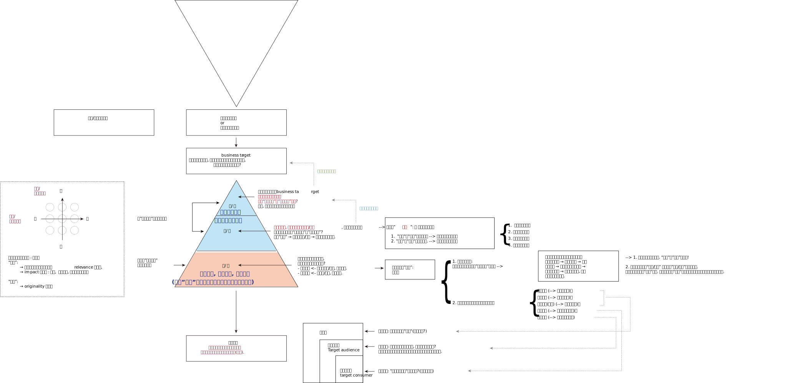
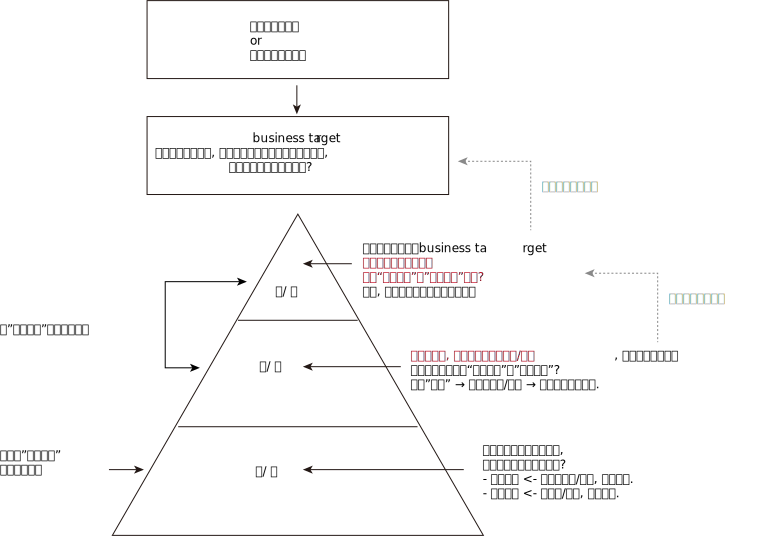

= 问题_(对人_影响对方的看法或感受)_你自己开店_如何用4a广告行业的方法来影响人
:toc:

---

---

== + 人们为什么要做广告? -> "逻辑因果链"是 : 1.是为了实现你的某个商业目的. <- 2.如何实现它? 需要让人们采取某种行动. <- 3.如何让他们采取这种行动? 需要你来先改变他们为什么不行动的"理性看法"和"感性感受"!

[options="autowidth"]
|===
| |倒推出逻辑推理步骤

|
|*你想实现某个销售数字 or 解决某个商业问题*

|人们为什么要做广告? ->
|↑ +
*如何实现这个销售额, 或解决你的商业难题? +
你需要"做某些事"(即 business target), 实施某些"办法", 采取某些"行动".*

business target 不是一个数字或一个销售额，而是实现这个数字或销售额的"方法"路径. 即, 你通过什么方式, 什么做法, 做哪些事情, 来实现这个销售数字? +

如: +
- 为了实现"回到家"的目的, 我的办法(business target) 是通过"乘地铁"这种方式.

|
|↑ +
*如何做成这些"事"(business target)?  +
你需要让消费者(以下简称"他们")采取某种"行动".*

|对/错
|↑ +
*如何让他们采取这种行动?  +
需要你来先改变他们为什么不行动的"理性看法"和"感性感受"!*

这也是"做广告"能起到的唯一作用. 广告无法直接改变他人的行动, 它只能作用于改变人们的某些个"理性看法"或"感性感受". 并"期望"人们的行为,之后可能改变. <- 这个就是它"因果链条"的假设.

- 脑白金的策略idea ——“把保健品当礼品卖”。即, 它不再把重点放在宣传自己的保健功效，而是强调自己的礼品属性，塑造为“节庆送礼硬通货”。

|对/错
|↑ +
*他们为什么要听你的, 来改变他们的某个"理性看法"和"感性感受"? +
需要你给他们提供"利益理由", 和改变的"动机". 即, 你当说客, "利害说辞"是什么?*

- 怎样让学生不要作弊呢? 美国一位大学教授给出的理由是: *作弊最终会把你困在一个自己不擅长也不喜欢的职业，困住你真正的人生追求.*

|无关"对错", 只有"好坏"
|↑ +
*对于你提供的理由, 你采取何种表达(形式)手法, 来陈述它?* +
做出实际的广告内容.  +
创作者永远与观众做着"吸引力"上的博弈. 电视广告(如电影同样)每一小段都承担着一个任务，就是让观众继续看下一段。

注意: 广告中, 创意并不是必须的.

|
|↑ +
*对于你创作出的广告内容, 如何才能精准地传播到目标消费者处? +
你必须提供给人一个愿意参与/传播你内容的"理由/动机". 需要你的"洞察".* +

4种最普适的参与动机： +
- 有关系 : 我们会关注跟我们自身有关系的东西. +
- 有好处 : 令你能趋利避害的东西 +
- 有意思 : 有趣; 有娱乐性. +
- 有期待 : 如同标题党, 或大片电影的预告片, 令你在看之前就对正片有高期望值.

(不过, 多层转发的链条依然随时可能中断. 因为每个人的认知都是不同的. 想让链条一直持续下去, 相当于是在假设所有人都是同一个认知喜好一样.)
|===

所以, 在介入一个新项目时, 广告人会首先同负责客户服务, 及策略的相关人员, 进行沟通，确定已经在"哪些层面上"有了定论，要从哪一层开始工作?

---

== + 如何评判你广告效力的好坏? -> 高维打低维 : 解决你面临的"商业问题"的策略对了, 是最大的好! 策略错, 是最大的坏.

image:img_readBook/奥美_02.svg[]

==== "高层方向错"会抹杀所有的"底层执行上的好"

*广告不是一个可以脱离"它所要解决的实际的商业问题"来讨论的东西。就好像有人拿着一盒药来问医生你，说他吃这药好不好？我真没法判断，因为我连你什么病都不知道。*

*策略的对错最为重要! 策略失败，是靠后面低端的创意和执行无法弥补的。(高维打低维). "方向错"会抹杀所有的"执行上的好"(已经南辕北辙)。*

文案(低维)是对idea(高维)的表达. 神文案救不了烂idea. (*战术的胜利,无法拯救战略的失败!*).  +
很多被夸“神文案”的，其实都不是“好广告”。*广告若不能解决商业问题, 什么都没用.* 广告不是说漂亮话的行业.

很多广告大赛，都要求你把自己的广告行动分成三个部分来描述，challenge、solution、result ——挑战、解决方案/策略、结果。即: 你的品牌遇到了什么挑战？你给出的解决方案（solution）是什么？得到了什么样的结果？

- 国民党传单征兵口号 : “国家兴亡，匹夫有责”.
红军传单征兵口号 :“老乡，参加红军可以分到土地”. +
即使你把“国家兴亡，匹夫有责”这个意思说得再动听，把那张传单设计得再漂亮，也无法弥补顶层策略上的失败。

伟大的广告作品，都是"顶层策略"层面的胜出。而太多的广告, 也只是做到了底层"创意"和"执行"层面上的出色而已. 即, 大家说的其实都是同一件事，只是你找到了一个更漂亮或新鲜的说法而已。

- Cancer cures smoking. 癌症专治吸烟. <- 提供了新的理由. +
这句话有必要变得更复杂、更花哨吗？根本就不用了。所以好的策略，是可以不依赖第三层的"执行"的。(高维打低维)

- “Meet your alter-ego”, 不管翻译成 “遇见自己”还是“你比我懂我”，都只是在更换同一个看法的不同说法而已; 而“何妨自恋”则是一个新的看法。 +
*一个更有力的看法(理由)，远胜于一个对俗套看法(理由)的新花哨说法。 (高维打低维)*

**我们要努力在更高层级上来解决问题，**因为往往一些颠覆性的、创新的想法,是你只能在更高层级上才能实现的。 +
所以**你可以用"策略金字塔思考模型", 作为工具, 来评判一个广告的好坏. 看它的三层分别对应的是什么东西? 它在三层中的哪一层级上取得了突破?**

顶层策略层面,可能有前无古人的原创性做法. 但如果不幸前两层都没有突破，那最后执行idea层面，就一定不能再追风雷同。(同样拍电影一样, 跟风热点题材, 且只copy, 必死.)

---

==== 大多数idea在执行阶段会减分，所以应该努力避免过度依赖于"底层执行", 而应该在"高层策略"上来解决企业的商业问题.

大多数idea在执行阶段会减分，而不是加分。所以为了解决这一点, 更根本的解决办法也是应该努力避免过度依赖于执行. 要从“策略思考金字塔模型”的更高层级去解决问题。一个出色的策略，未必依赖于执行的细节.

- 几个印刷技师，每次调试好新一款包装的颜色就叫我去看，我会将他们印出来的包装与我手里的一个标准版本的颜色做对比。但最后印刷后, 8款包装放到一起，才发现颜色深的深、浅的浅，什么样儿的都有…… +
道理很简单：每个都是跟那个标准版本对比的，而不是8款在互相之间比较. +
我在做这件事情之前，没有认真考虑这件事情应该怎么做, 没有完整地想一遍做这件事的每个细节。

---

== ---------- ----------

---

== 如何发想idea(主意/点子)？-> 有两种思考路径: 1. 逻辑推演，2. 遍历穷举

==== 1. 逻辑推演 (从高维,来思考低维)

*要解决一个维度上的问题, 你永远要在比它更高层的维度上, 来思考. 即, 解决了更高维度的问题后, 低维问题就自然迎刃而解了.*

你想解决的问题是... <- 你的策略是让消费者做... <- 他们为什么要听你的? 你作为说客, 给他们提供的理由是... <- 你采用的表达方式是... +
就像这样, 一层层向上推导: 怎样才能...(How to...)? +

注意, 解决商业问题的"策略"的推导, 必须紧紧依附于该"商业问题"本身. 即, "药"必须是依附于"病"的. 绝不能反过来. 为了某种"创意", 而编造出一个脱离"企业商业问题"的顶层的策略, 就相当于为了推销一种药而胡编病人的化验结果。

---

==== 2.遍历穷举(非逻辑)

*你能随口说出50个圆形的东西吗？一个技巧方法是 : 一定要先设定一条线索, 可供你依附、攀缘的线索。* 这个方法能带给你的好处是: 拒绝乱想，把想象变成联想。

- 比如，可以以自己早上起床开始的动作为线索。早上醒来，睁眼，眼珠是圆的; 起床看闹钟，表盘是圆的; 然后我坐起来了，打个哈欠，嘴是圆的，嗓子眼儿也是圆的。我坐起来穿拖鞋，双拖鞋有印花，波点是圆的; 然后我去刷牙，杯子口是圆的. 拿起牙刷，牙刷毛的截面也是圆的; 打开水龙头，出水口也是圆的……

TVC(电视广告)里可供你调动的元素非常多——场景、人物、情节、对白、音乐、运镜、剪辑、特效、字幕、动画…… 任何一个方面，都可能有新的做法、玩法、新的组合。实际操作中，很多平庸的TVC脚本，都可以用这种加法来加分。

- 比如, 站在自己的鞋店门口，说出鞋子的新年促销消息。如果加上一些手法上的花样，就有可能呈现完全不同的面貌: +
-> 如果把那些促销信息写成绕口令呢？ +
-> 如果他说话时旁边有一个摇滚乐队伴奏呢？ +
-> 如果他装扮成古代武士的样子呢？ +
-> 如果他是倒立着说话呢？

---

==== 头脑风暴法理论为什么破产了? -> 没有经过科学试验的证实

是美国BBDO广告公司（天联广告公司）创始人亚历克斯·奥斯本于1938年首创的。规则是: 整个过程中，无论提出的意见和见解多么可笑、荒谬，其他人都不得打断和批评.

这个拍脑袋的想法, 已被科学证伪: *华盛顿大学心理学家基斯·索耶总结了研究的结果，几十年的研究持续不断地证明,* 头脑风暴这种集体思考法, 比同样的人分别去想，然后再把这些想法说出来，产出的idea少多了。

[options="autowidth"]
|===
|Header 1 |Header 2

|从产出的idea数量来说
|如果一个小时的时间，每人可以产出5个idea来，那么有10个人的话，一个小时就能产出50个idea。但如果把这10个人放在一起来头脑风暴，一小时可能产出50个idea来吗？大约一分钟一个，这可能吗？根本不可能。

|从产出idea的质量来说
| 互相不批评，往往就变成推卸自己责任, 靠别人来想好idea。大家互相指望。三个和尚没水吃.  +
不充分辩论, 导致的结果就是泥沙俱下.

一些甲方乙方、高层低层一起参加的workshop（工作坊）里，这种情况就更加明显。有人因为大家互相不熟悉，碍于面子，而不充分辩论。工作职级比较低的，不敢跟职级高的人辩论；职级高的人，因为要显得自己很民主、很大度，也不会跟职级低的人辩论。 +
很多在三四个人的讨论里直言不讳的反驳和辩论，在十几二十个人同时参与的讨论里是不会被说出口的。

|评判创意方案时，一人一票更是完全不合理的做法。
|每个人不可能都掌握足够的信息，评判的能力也各不相同. 但大家的票数权重如果一样的话，都是一人一票，那么一个总经理的坚持拗不过3个实习生的喜欢, 这是糟糕的。

作家老舍，20世纪五六十年代时，有段时间创作的流程是：写好一个剧本，先油印一批，下发给众多工厂，由各厂组织本厂工人开会研读讨论，大家七嘴八舌地提意见，说应该怎么修改，记下来，汇总交给老舍，老舍再按照工人阶级的想法，进行修改……后来的事情，大家就都知道了。

创作不能“民主”，更与“一人一票”无关。
|===

如果非要头脑风暴的话，我认为三到四个有一定创意经验和对课题充分了解的人，就足够了。3个人的头脑风暴，远比15个人的头脑风暴效率要高。人多的结果, 就是大多数人不能积极参与，20个人开会，1个人说话就有19个人闲着. (*所以, 设计又被排除了!*)

---

== 你想出的解决自己商业问题的idea, 必须要符合哪些硬性标准, 才是好的? ->  ROI标准 (relevance, impact, originality)

==== relevance 相关性(与品牌/产品/消费者相关)

你的idea, 必须与品牌/产品/消费者相关，而且是要同时与这三者相关。

具体地说，要包括: +
- 是否忠于了"品牌主张" +
- 是否展现了"品牌个性" +
- 是否符合"产品特性" +
- 是否有引发消费者共鸣的洞察。

请注意，这个相关是非常深入的、内在的相关，而不是表面的相关. 并不是说你用目标消费者的口头禅、让演员打扮成他们的模样，就叫相关了。很多人对相关的理解非常浅薄——产品是白领用的，所以广告里必须展现白领的生活；饮料是给年轻人喝的，所以广告一定让几个年轻人做主角，得用他们的流行语……

*相关一定是"洞察"上的相关，是能引发消费者的共鸣的。 所以相关性，要从"顶层的策略层面"去建设，而不是在"低端的执行层面"去拼凑*.(所以上面所举例的广告手法都是错的, 它们都只在"底层执行"上来硬凑表现)。

---

==== impact 长期影响力(有洞察)

指 idea的影响力，具体指:

1. 抓人眼球的能力 <- 在观看当时起效
2. 给人留下深刻印象的能力 <- 长期缓释. 有些广告并不是一上来就牢牢地吸引住你的眼球(并不"眼前一亮")，但你看完它后，一辈子也忘不了。 +
如果只求眼前一亮，这其实是简单的。无数新奇的创意手法、视觉方式、怪异的画面，都可以做到这一点，但新奇而速朽的广告太多了.
---

==== originality 原创性

不仅仅是单张广告, 整个品牌的传播, 都要有原创性和独特性，否则就会难以区隔，或者被认为是次等的追随者. (比如华为追APPLE的旗舰店设计)。

不过注意: *idea未必要是“新”的. Idea的本质是解决方案，解决方案只看疗效, 不分新旧，(新旧不重要! 有效与否才重要!)* 如同你不能因为某一种药已经被发明出来几十年、被几千万人服用过，就拒绝用它来治你的病。

因此一味"求新", 反倒会阻碍制造出一个真正有疗效的广告来。

---

== ---------- ----------

---

== + 如何引发共鸣/共情? -> 通过"洞察" insight

洞察，指的是与"消费者生活"和"产品/品牌/品类"有关的一些“不被察觉的真相”, 但是对他们又很重要的。

==== 1. 一闻此言，恍然而悟 <- 存在于"认知"与"真相"之间的gap里

注意: 洞察不能是一个人人皆知的真相或常识!

---

==== 2. 心念已至，口未能及 <- 存在于"表达"与"认知"之间的gap里.

同样, 不要把一个人人皆知的真相或常识，用一个新的"表达方式"包装起来，冒充是"洞察". 精彩的修辞，实际上是“表达与表达之间的gap”而已, 换言之，只是把话说得更漂亮而已。

==== 洞察可在"四种地方处"来发现 : 1.未被满足的需求, 2.未被说出的心声, 3.未被关注的感受, 4.未被实现的梦想

[cols="1,3a"]
|===
|洞察 |Header 2

|未被满足的需求
|

|未被说出的心声
|- 你的孩子很快就长大了”. “孩子的童年十分短暂，所以不能什么事都等以后再说”.

|未被关注的感受
|- 把保险卖给孩子爸妈的时候，效果特别差，爸妈都不买，但要是换个招儿，把保险产品推销给小孩的爷爷奶奶，爷爷奶奶就会非常痛快地掏钱.  +
*这背后的洞察是: 爷爷奶奶觉得自己可能看不到孩子长大。* +
*她想过父母老人跟孩子之间的关系是什么，而这可能就藏着某些未被满足的需求和未被关注的感受。*

- “送礼就要送健康”，是未被关注的感受。原因是发现有些人收礼不喜欢烟.

|未被实现的梦想
|- “梦骑士”篇，骑摩托车的那些老头，说的是一些没有被实现的梦想. 每个人心里都有一个狂野的梦想，一个永远年轻的梦想。
|===

满足他们的那些需求，说出他们的那些心声，关注他们的感受，实现他们的梦想. 做到这几点, 或者告诉他们你的产品、品牌(的功能/核心体验)能帮助他们做到这几点，广告就能"打动人"。

image:img_readBook/奥美_01.jpg[400,400]

我面试别人时, 喜欢问一个问题：“你的爱好是什么？” *其实我并不在乎你喜好的具体内容. 我只是要确认，你是否是一个对生活中的"人,事"有"用心"(喜欢做"洞察")的人.* 所以我会问:"你觉得中国电影有希望吗？", "你觉得户籍制度改革的趋势是什么？", "你觉得现在这些创业公司哪个最有希望？"

---

== ---------- ----------

---

== 品牌(有如生命)活在世上的意义 -> 本质上就是回答这三个问题: 1.我是谁？2.我为谁存在？3.他们因何需要/购买（我们的产品）？

==== 什么使你区隔与其他竞争对手? ->品牌的核心体验 (产品/品牌所提供的 1.有价值的、2.独特的体验)

星巴克卖给消费者的到底是什么? 消费者去星巴克买一杯咖啡的时候真正要买的又是什么? 这个才是“核心体验”（key experience）。

核心体验: 是产品或品牌可提供的 1.有价值的、2.独特的体验.

-> 有价值 : 未必是功能性的利益。感受、情绪上的价值也是价值。 +
-> 独特 : 也未必是独一无二。相对优势也完全可以接受。

品牌(犹如生命)存在于世的意义, 本质上就是回答这三个问题: 1.我是谁？2.我为谁存在？3.他们因何需要/购买（我们的产品）？

---

====  如何塑造品牌? -> 通过"拟人化"的方式的 (品牌即"虚拟的人")

*如果把品牌当作一个人，那他就得有自己独特的价值观, 衣服穿着风格, 说话的声音音调、外在的做事姿态——这些就是品牌的拟人化形象。*

- 那些什么正事也不说，只讲一个动人的故事(和产品无关)的广告, 其目的就是想讨人喜欢(品牌本身). <- 人们对品牌的喜欢，既可以来自理性，也可以来自感性。

- 一个安全套品牌为什么要天天给大家说俏皮话、发有趣的海报? 当它提醒大家下雨时可以在鞋子外头套一个安全套防水的时候，它真是在说自己产品的弹性好、很结实吗？不是的。 +
那些内容是要把自己这个品牌，变成一个天天生活在年轻人身边的、没有任何距离感的、会玩的、有意思的、源源不断带来各种花样的"虚拟的人/朋友". 它真正想灌输给大家的是这个感受. 并想令你觉得相比之下, 别的牌子似乎是没有灵魂的。 +
我们会将公司和品牌, 拟人化.

- 老奶奶在一堆橘子前头立了个牌子，写着“甜过初恋”。并不是说它真的让你觉得这个橘子比别人家的更甜，而是它会让你觉得卖橘子的人有个性、有幽默。

---

==== 你的品牌,跟其他品牌,所区分开来的地方(不同之处/特点), 用"话语"来表示就是什么? -> 就是你的slogan 和 manifesto / 质胜文,则野; 文胜质,则史.

*你创作自己品牌的 slogan 和 manifesto, 目的就是用来定义你的品牌跟其他品牌区分开来的东西。比如: 它(你的品牌)在做什么? 它有着怎样不同的思想价值观点和调性? 它给你带来什么?  +
换言之, 每个slogan都在定义自己与其他品牌的区别之处. 而不在于什么打动人或走心之类.*

有的客户会跟你说，我的"品牌定义"很清楚，就是时尚，就是专业。但这是不够的. 一个品牌,它到底是怎样来看待"时尚"的，它对"时尚"这个概念的独特的解释是什么? 价值观是什么? 它的时尚与其他品牌有什么不同? 这些具体细节, 才是"品牌定义"需要界定的东西。

即 : 别人说他想要的是一个“四足，有毛，赤目黄须”的怪物，你就得努力把那个怪物的面貌形态全都描绘出来。

你不能只换50种说法来讲“这个品牌特别时尚”, 而应该找出50个关于时尚的不同"看法/价值观点"来. 你需要给你眼中的"时尚"概念, 下你自己的"解释和定义".

- 如: “不是所有牛奶都叫特仑苏”, 就全新的定义了什么才是"牛奶"的概念.

[options="autowidth"]
|===
|Header 1 |Header 2

|slogan 品牌口号
|( also NAmE informal ˈtag line ) a word or phrase /that is easy to remember, used for example by a political party /or in advertising /to attract people's attention /or to suggest an idea quickly 标语；口号 +
• an advertising slogan 广告口号 +
• a campaign slogan 竞选口号

slogan 是用简单明了的一句话, 来表达你品牌所拥有的"核心体验".

|brand manifesto 品牌宣言
|a written statement /in which a group of people, especially a political party, explain their beliefs /and say what they will do /if they win an election 宣言 +
• an election manifesto 竞选宣言 +
• the party manifesto 政党宣言

brand manifesto 是用来辅助阐释、界定slogan的 一段话.

可以用下面这个脚手架，来帮你写出 brand manifesto (品牌宣言): +
第一步：我知道你(消费者或受众)如何。 +
第二步：所以我(品牌/产品)如何。 +
第三步：我们(你我的加总)一定可以如何。

如: +
第一步：我(品牌)知道你(消费者)的爸爸妈妈很辛苦，我知道每到节日你就为不知道送什么礼物而焦虑. +
第二步：我(品牌)跟你(消费者)一样，相信亲情是独一无二的，相信每个人都应该得到专属于他们的东西, 而不应该只送千篇一律的大路货(那些网红爆款). 所以我们想尽办法，给你最贴心的礼物选择。 +
第三步：我们(我品牌+你消费者)希望每份真诚的祝福都能被100%地收到.

这样一段宣言，已经可以看出这个品牌与别的品牌相比，更看重哪些价值、更着力于做哪些事情、为消费者提供哪些价值. 已经基本说明了它的独特的价值供给、独特的观点。

当然, 宣言也可以加上文辞. 如, “我们相信，每个人都应该过有创意的生活...", 可以改写成"我们应该做生活的魔法师...".

|===

Slogan和manifesto只是不同形式的表达. 区别只是用一句话来把这个事情表达出来，还是用一段文字把它表达出来. 但作用是一样的, 它们是用来锚定那个定义(define)的 -- 定义你的品牌与其他品牌的区别之处。

如果这个定义恰巧打动人心，固然很好，但只以是否打动人心来评判slogan和manifesto是错误的，这就如同只以造型是否酷炫, 来评判一座发电站的核心价值一样。

因此, 我们应该把slogan写得更清楚一点、更犀利一点、边界更明朗一点，而不是把它变得更模糊、天花乱坠、用多么美好的辞藻，甚至多么动人。一句动人但不清晰的slogan，就已经偏离了slogan存在的本身目的。(文采不重要, 表达清晰最重要!)

子曰：‘*质胜文,则野; 文胜质,则史*，文质彬彬，然后君子。’ +
-> 当你的内容大过于你的表达，或者说你的表达难以传达你的意思，你的表达文采就有欠缺. +
-> 反过来, 如果“文胜质”，你的表达大于你的内容，外在大于本质，你就是浮华的。

如果一个创意想法，在你的脑子里有100分，写到纸上时变成了80分，且别人只能读懂60分，那显然就是没有“达”。

“禁止吸烟”是好文案吗？是! 干脆清楚。如果非要把它写成像情诗一样软绵绵的东西、没法让人瞬间看懂, 或是毫无威慑力，那就是错的. 就没有“达”。

网上经常能看见把“You say that you love rain, but you open your umbrella when it rains. You say that you love the sun, but you find a shadow spot when the sun shines”之类的英文翻译成“你说烟雨微芒，兰亭远望；后来轻揽婆娑，深遮霓裳”什么的，题目还叫作“看，中文真是太强大了”。你可千万别觉得这是好文字，我们要努力把话说清楚、而不是更加模糊。“文胜质则史”，这种不知所云的文字，就是“史”。

所以那些要让人像谜语一样要努力猜度、费心揣摩才能领会的广告文案，那些作者不知是出于什么心态创作出来的?!

---

==== 用什么来展现品牌性格? -> 如同人一样, 用调性

性格有的时候是要通过语气来定义的.

“我的地盘，听我的”，本身就定义了一种年轻的张扬性格.  +
“因爱而生”, 这个语气定义了一种文艺, 端庄的姿态. +
非要把“我的地盘，听我的”写成“卓越不凡，自有主张”; 非要把“因爱而生”写成“生下来，只为我的爱！”，品牌角色性格就完全不对味了。

---

== ---------- ----------

---

== 你如何解决广告骚扰人的原罪? → 让其能带给人"真正的价值"(审美价值、娱乐价值、情感价值(动心)、知识价值、社交价值)!

有两种观点:

1.反正你怎么做都是打扰，不管怎样用心，人家都还是讨厌你。既然把人家按在那了，就赶紧把活做完. 别来那些假模假式的花招了.

2.既然做这个东西是打扰别人，我们就应该:

==== 1. 提供足够的娱乐性, 制造糖衣炮弹

提供足够的娱乐性, 愉悦感. 让它不那么讨人厌. 即, 我们是在制造糖衣炮弹. 广告即糖衣. 在这种思路下, *如何找到那个最讨人喜欢的打扰别人的方式，就是创意人员的职责。*

---

==== 2. 提供任何真正有价值的东西

“讨人喜欢”未必要靠提供娱乐性实现。*人们讨厌广告, 是因为它没有提供任何真正有价值的东西。* +
在此思路下, 那么解决办法，就是要把广告变成有价值的内容:

[options="autowidth"]
|===
|对who提供 |提供what价值

|旁观者
|<- 审美价值、娱乐价值、情感价值(动心)

|参与传播者
|<- 社交价值(能为你的社交关系和社交行为, 提供某些帮助)

|目标消费者
|<- 知识价值
|===

你的广告不能变成菜肴里的沙子，而必须变成一种好吃的主食(和广告主的商品共同并列为"主角"). 一流的炮弹不需要糖衣，一流的糖衣本身就是另一种"炮弹"。

- 大卫·奥格威曾为健力士啤酒创作过一组广告，主题分别为“The Guinness Guide to Oysters”（健力士生蚝指南）、“The Guinness Guide to Cheese”（健力士奶酪指南）、“The Guinness Guide to Steaks”（健力士牛排指南），内容是为当时的广告读者介绍不同的食材特性和口味，并且指出，这些食材搭配健力士啤酒会带来更加美妙的美食享受。 +
这些食材指南，完全是靠"知识价值"来讨人喜欢。

- Chivas Regal（芝华士）的父亲节广告“To Dad”（致父亲），则完全是以情感价值, 让一篇广告文案变成了触动人心的杰作。来拉住人. +
致父亲—— +
因为那天，那辆红色的Rudge牌自行车让我成了整条街上最开心的小男孩。 +
因为无数个深夜，我在床上安睡，你还在案头工作。 +
因为你钱包里还放着那张褪色的剪报，上头是我拿到学位的消息。 +
因为你38年来，每一年都记得我的生日，一共38次。 +
因为你的白发实在太多了，而我知道它们因何而来。 +
因为你是个好爷爷。 +
因为我对你说“谢谢”说得太少了。 +
因为今天是父亲节。 +
因为，如果你还配不上这瓶Chivas Regal，还有谁配呢？

这些经典的广告，其实已经完全是"内容营销".

事实上, 你只要做广告, 也必须让它对观众有"价值收获". 烂广告会让人们讨厌广告, 甚至会让人瞧不起广告这个行业. 而做"好的广告", 能让人们感到广告有魅力, 才会开始喜欢广告这种东西.

生产糖衣的人，有时候也会"反客为主".  他们仇恨炮弹, 他们太喜欢自己做出来的糖衣了，觉得炮弹很多时候反而就成了累赘, 要是没有中间那个炮弹多好. 这也会导致广告主抵触你的那层糖衣, 不想花钱给你自己带私货。

---

== ---------- ----------

---

== "创意"的存在/活着意义是什么?

==== 创意的功效是什么? ->

The truth isn’t the truth /until people believe you,
and they can’t believe you /if they don’t know what you’re saying,
and they don’t know what you’re saying /if they don’t listen to you,
and they won’t listen to you /if you’re not interesting,
and you won’t be interesting /unless you say things imaginatively,originally and freshly.

即: 只有你用有想象力的、原创的、新鲜的方式来讲述 → 才会有趣味 → 人们才会听你 → 才能知道你说的内容 → 才可能相信你 → 大家都相信后, 才能变成了大家的真相.

*但问题是, 这个因果链假说, 第一环和最后一环, 其逻辑关系, 有经过心理学家验证么?*

---

==== 创意的缺陷是什么? ->  创意不需要"改变"什么, 而广告需要改变消费者的"理性/感性"态度.

-> 创意: 不一定需要"改变"什么.创意只是用来"表达"的，表达某种思想、某种观点、某种感觉.

-> 广告 : 不只是表达，而是要说服，影响消费者的; 是要促成消费者"理性/感性态度"改变的。 +
*如果你的广告没有造成他们认知上的任何改变，则你的广告就是失败的.*

---

==== idea中 不一定需要 creativity(创意)

idea中未必需要 creativity :
降价是不是一个idea？是。降价这个idea里没有什么creativity.

Advertising is the attempt /to change people’s behavior /by changing the way they think and feel /with the creation and distribution of content. +
广告，就是创作并传播内容，来改变他人的看法或感受，以促成其行为的改变。 +
这句话里并没有出现“创意”这个词。我们说“传播内容”，而不是“通过传播有创意的内容”. 区别在于，这个内容是不是“有创意”，有的时候其实并不重要。

---

== ---------- ----------

---

== 你的目标消费者, 以什么来分类? -> 他们的共同心理需求(欲望), 而非外在表面参数(年龄/职业等).

定义"目标人群"(画像), 应该采用他们的内心认知——他们的"理性看法"和"感性感受"(心象), 来分类更准确。因为广告只能用来改变他人的看法和感受的.

比如，“16至35岁，月收入8000元左右，女性为主”，就不如“我们的目标消费者是那些有钱出国旅行，也想出国，但因为没出过国而有点害怕的人”更有用.

对于演员, 你要想生活于角色，首先要叫角色生活于自己。先培植出一个心象来，再深入找其情感的基础。

演员的任务不是演出剧本上写出来的那些台词，而是演出潜台词, 演的是表面台词里没有写出来的东西。如果一个剧本只写着——×××说“那我走了”，然后流下泪来。演员真正要演的恰恰是那句话、那个动作背后蕴藏的、没有被写出来的内心部分。

---

== 传统做广告的方法, 被革命的原因是什么? -> 哪些是不变的?(人心心理学), 哪些是会变的?(广告的媒介载体)

广告是高度依赖媒介的。它所有的为了解决商业问题, 而与消费者沟通的策略, 和所创作出来的广告内容，都要依媒介特点而定。 而 媒介形式的变化一日千里，导致广告业，以前那些沟通的原理和办法，被颠覆。

我问TB(奥美大中华区董事长宋秩铭 TB Song), 奥美将向何处去？TB回答，奥美将会有很大的变化，但变成什么样，他也不知道。

时代变了, 抬头比低头更重要. 飞机腾空的年代，你不能只是更卖力地鞭打拉车的黄牛。《神鞭》里, “鞭剪了，神留着！祖宗的玩意儿再好，该扔还是得扔；洋人的玩意儿再坏，该学还是得学。无论怎么变，也难不倒咱，无论什么咱都能玩儿神了，一亮，还就得是绝活儿！” +
我们都要思考一下，做这一行，能不受时代限制的 最宝贵的能力、价值是什么?

你做广告,*比的是在同一条道路上, 谁能更快地找到那条"正确的路"，找到抵达正确终点"最快、最有效的路径"。这不是马拉松。* +
*如果你真觉得自己每天在跑马拉松，那你要好好反思一下，你所处的工作环境(公司文化本身)，你的工作方法，是不是哪里出了什么问题。*

好的营销人，最重要的一点是什么？"快。**我总能比别人更快地看清状况，更快地找到答案，**更快地做出符合标准,甚至超出标准的东西。*这让我做这一行做得既比别人轻松，也比别人好，否则我不会在这个行业做这么多年的。*"

---

==

